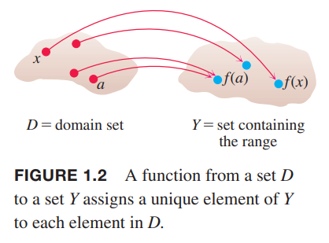

函数是描述真实世界的数学工具。一个函数可以用方程、图、数值表或者文字描述来表示。

### 函数；定义域和值域
变量$y$的值，取决于另一个变量$x$的值，那么我们说$y$是$x$的函数，记作
$$y=f(x)$$
$f$表示函数，自变量$x$(`independent variable`)表示$f$的输入，因变量$y$(`dependent variable`)表示$f$的输出。

**定义：函数(`function`)在集合$D$和$Y$之上建立了一个对应关系，$Y$中有唯一(`unique`)的值$y(x)$对应于$D$中的每一个$x$。**

所有输入值的集合$D$是函数的定义域(`domain`)，所有$x$对应的输出$f(x)$的集合是函数的值域(`range`)。值域不必包含$Y$的每一个元素。定义域和值域可以是任意对象的集合，不过微积分中，它们往往是实数集，表示线上的点，或者是平面、空间的点。  
通常，使用公式表示的函数描述了给定一个输入如何计算输出。比如$A=\pi r^2$是计算已知半径$r$如何计算圆的面积$A$。当定义一个函数$y=f(x)$，但是没有显式的指定定义域或者上下文没有对其有约束，那么定义域是所有能够使$y$是实数的$x$的值的集合，这也被称为自然定义域(`natural domain`)。如果我们想要限制定义域的话，需要显式指定。比如，$y=x^2$的定义域是实数集，可以限制其是正数集合$y=x^2,x>0$。  
改变定义域的同时，值域通常也会发生变化。$y=x^2$的值域是$[0, \infty)$，而$y=x^2,x\geq 2$的值域是$[4, \infty)$，也可以写作$\{x^2|x\geq 2\}$或$\{y|y\geq 4\}$。  
当一个函数的值域是实数时，被称为实值函数(`real-valued`)。我们这里研究的大部分实值函数的定义域和值域往往是一个区间或多个区间。有时，函数的值域是不太容易找到的。  
函数$f$就像是一个机器一样，把输入$x$放进入，产出输出$f(x)$。计算器上的函数键就是实例。比如我们输入一个非负数$x$，然后按$\sqrt{x}$键，就会得到它的输出，平方根。  
函数也可以如下图表示成箭头图(`arrow diagram`)。每一个箭头将$D$中的一个元素和$Y$中的一个元素关联起来。比如下图就是把$f(a)$关联到$a$，$f(x)$关联到$x$等等。值得注意的是，不同值可以对应到同一个输出值上（比如这里的$f(a)$），但是每一个输入$x$只能有一个输出$f(x)$。  
  
例1：验证以下函数的定义域和值域。$x$的定义域是使得公式有意义。  
| 函数 | 定义域（$x$） | 值域（$y$） |
|--|--|--|
| $y=x^2$ | $(-\infty, \infty)$ | $[0, \infty)$ |
| $y=1/x$ | $(-\infty, 0)\cup (0, \infty)$ | $(-\infty, 0)\cup (0, \infty)$ |
| $y=\sqrt{x}$ | $[0, \infty)$ | $[0, \infty)$ |
| $y=\sqrt{4-x}$ | $(-\infty, 4]$ | $[0, \infty)$ |
| $y=\sqrt{1-x^2}$ | $[-1, 1]$ | $[0, 1]$ |

解：$y=x^2$，对于任意实数$x$，都有一个实数$y$与之对应，所以定义域是$(-\infty, \infty)$，任意实数的平方是非负数并且，每一个非负数$y$都是它的平方根的平方，即$y=(\sqrt{y})^2$。  
除了$x\neq 0$之外，每一个$x$都有一个$y$对应。被除数不能为零。$y=1/x$的值域是所有非零实数的倒数，也是非零实数，这是因为$y=1/(1/y)$，对于$y\neq 0$，数$x=1/y$是对应输出$y$的输入。  
对于方程$y=\sqrt{x}$，如果$x\geq 0$，那么就有一个实数$y$与之对应。因为每一个非负数是某个数的平方根（其实就是自身平方的平方根），所以$y$的值域是$[0, \infty)$。  
$4-x$不能是负数，所以定义域是$x\leq 4$。值域仍旧是所有的非负数。  
$1-x^2\geq 0$，所以$-1\leq x\leq 1$。在这个范围以外，平方根不是实数。$1-x^2$的范围就是$[0, 1]$，值域也是同样的区间。

### 函数的图像
$f$是定义在定义域$D$的函数，
