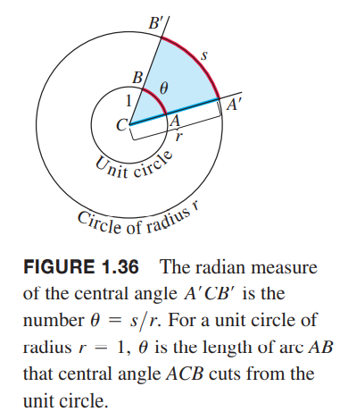
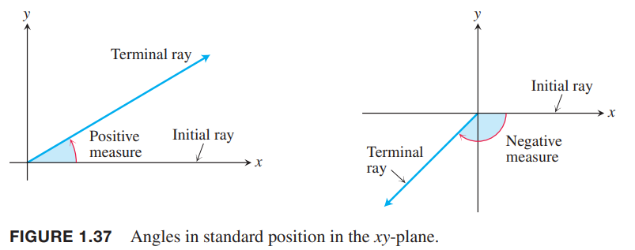
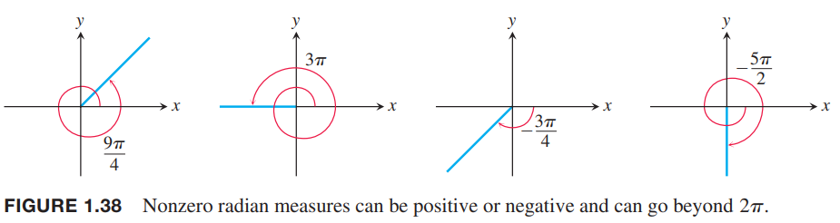
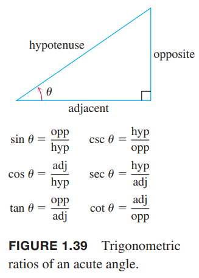
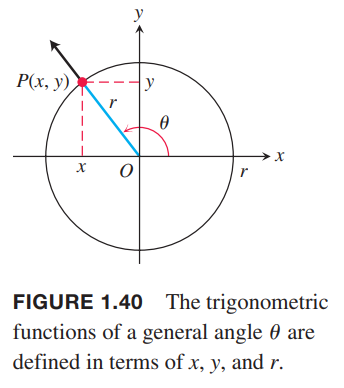

### 角
角可以用度（`degree`）或者弧度（`radian`）表示。如下图所示，在半径为$r$的圆心角$A'CB'$对应的弧度是圆心角所对的弧$s$的长度比半径的长度$r$。用$\theta$表示圆心角，那么$\theta=s/r$或
$$s=r\theta\tag{1}$$
  
对于半径$r=1$的单位圆来说，用弧度表示角$\theta$的话，其值就是对应的弧长。一个圆周对应于$360\degree$或弧度$2\pi$，所以
$$\pi \text{radians}=180\degree\tag{2}$$
$$1 \text{ radian}=\frac{180}{\pi}(\approx 57.3)\text{ degrees}$$
$$1 \text{ degree}=\frac{\pi}{180}(\approx 0.017)\text{ radians}$$
下表展示了一些基本角度的对应关系：  
|||||||||||||||||
|--|--|--|--|--|--|--|--|--|--|--|--|--|--|--|--|
| Degrees | $-180$ | $-135$ | $-90$ | $-45$ | $0$ | $30$ | $45$ | $60$ | $90$ | $120$ | $135$ | $150$ | $180$ | $270$ | $360$ |
| U (radians) | $-\pi$ | $\frac{-3\pi}{4}$ | $\frac{-\pi}{2}$ | $\frac{-\pi}{4}$ | $0$ | $\frac{\pi}{6}$ | $\frac{\pi}{4}$ | $\frac{\pi}{3}$ | $\frac{\pi}{2}$ | $\frac{2\pi}{3}$ | $\frac{3\pi}{4}$ | $\frac{5\pi}{6}$ | $\pi$ | $\frac{3\pi}{2}$ | $2\pi$ |

如果一个角的顶点位于坐标系原点并且起始边和$x$轴重合，那么我们称这个角在标准位置（`standard position`）。从$x$轴逆时针的角度为正，顺时针为负。如下图所示：  
  
逆时针的角度的大小可以任意大，远超$2\pi$，类似的，顺时针的角度也可以任意大。如下图所示：  
  
本书后面默认使用弧度表示，除非特别说明。当我们提及$\pi/3$的时候，指的是角度弧度是$\pi/3$（也就是$60\degree$）而不是$\pi/3 \degree$。

### 六种基本的三角函数
锐角的三角函数定义如下图所示：  
  
我们把角放到坐标系的标准位置，可以扩展三角函数的定义到钝角和负角。我们用角的终止边和圆的交点$P(x,y)$来定义三角函数
$$\begin{aligned}
\text{sine}&&\sin\theta=\frac{y}{r}&&\text{cosecant}&&\csc\theta=\frac{r}{y}\\
\text{cosine}&&\cos\theta=\frac{x}{r}&&\text{secant}&&\sec\theta=\frac{r}{x}\\
\text{tangent}&&\tan\theta=\frac{y}{x}&&\text{cotangent}&&\cot\theta=\frac{x}{y}
\end{aligned}$$
  
这个扩展定义和锐角中的定义是一致的。  
当商有意义的前提下，有如下相等关系：  
$$\begin{aligned}
\tan\theta=\frac{\sin\theta}{\cos\theta}\\
\cot\theta=\frac{1}{\tan\theta}\\
\sec\theta=\frac{1}{\cos\theta}\\
\csc\theta=\frac{1}{\sin\theta}
\end{aligned}$$
