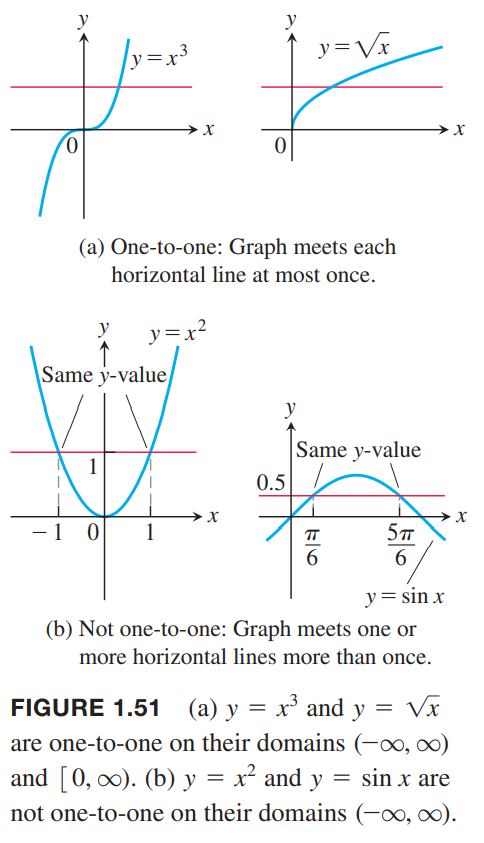

### 一对一函数
函数是对定义域的每个值都有一个值域的值与之对应。一些函数对于定义域中的不同值对应的是同一个值域的值。比如$f(x)=x^2$，对于自变量$1,-1$都对应值$1$。类似的对于正弦函数，$\pi/3,2\pi/3$都对应值$\sqrt{3}/2$。还有一些函数值域的值就对应不多于一个定义域的值。平方根函数和立方函数总是用不同的数来对应不同的输入。

**定义** 定义域$D$中两个值$x_1\neq x_2$，如果$f(x_1)\neq f(x_2)$，那么函数$f(x)$是一对一函数。

例1 一些函数在整个定义域上都是一对一函数，其他一些函数在定义域上不是一对一函数，但是把定义域限制到一个更小的范围的时候，可以得到一个一对一函数。原始函数和限制了定义域的函数由于定义域不同，所以不是同一个函数。不过这两个函数在小的定义域上值都一样。  
（a）$f(x)=\sqrt{x}$是一对一函数，因为对于不同的$x_1\neq x_2$都有$\sqrt{x_1}\neq\sqrt{x_2}$。  
（b）$g(x)=\sin x$在区间$[0,\pi]$上不是一对一函数因为$\sin(\pi/6)=\sin(5\pi/6)$。在区间$[0, \pi/2)$的任意$x_1$都有一个区间$(\pi/2, \pi]$的$x_2$使得$\sin x_1=\sin x_2$。正弦函数在区间$[0,\pi/2]$上是一对一函数，对于不同的输入会得到不同的输出。  
一对一函数$f(x)$和水平线最多有一个交点。如果交点大于一个，意味着对于同一个$y$对应至少两个不同的$x$，那么就不是一对一函数。如下图所示：  

**水平线测试法** 函数$f(x)$是一对一函数，等价于它的图像和每一个水平线最多有一个交点。

### 反函数
由于对于每一个输入，一对一函数输出唯一的值，对于反函数就是将输出还原得到输入。

**定义** 给定函数$f$是定义域$D$上的一对一函数，其值域是$R$。反函数$f^{-1}$定义如下
$$f^{-1}(b)=a \text{ if } f(a)=b$$
$f^{-1}$的定义域是$R$，值域是$D$。

$f^{-1}$中的$-1$不是指数。$f^{-1}(x)$也不是$1/f(x)$。根据上面的定义，$f$和$f^{-1}$的定义域和值域互换了。  
例2 给定一对一函数$f(x)$的函数表格如下：
| $x$ | 1 | 2 | 3 | 4 | 5 | 6 | 7 | 8 |
|--|--|--|--|--|--|--|--|--|
| $f(x)$ | 3 | 4.5 | 7 | 10.5 | 15 | 20.5 | 27 | 34.5 |

那么交换$f$的输入输出就可以得到反函数$f^{-1}$的函数表格：
| $y$ | 3 | 4.5 | 7 | 10.5 | 15 | 20.5 | 27 | 34.5 |
|--|--|--|--|--|--|--|--|--|
| $f^{-1}(y)$ | 1 | 2 | 3 | 4 | 5 | 6 | 7 | 8 |

函数$f$将输入$x$映射为输出$f(x)$，$f^{-1}$将输入$f(x)$映射为$x$。类似地，取$f$值域的某个值$y$，把应用反函数$f^{-1}$得到值作为函数$f$的输入，最后得到的是$y$。将函数和其反函数组合在一起，得到原来的输入
$$(f^{-1}\circ f)(x)=x, \text{ 对所有$f$定义域的$x$成立}$$
$$(f\circ f^{-1})(y)=y, \text{ 对所有$f^{-1}$定义域的$y$成立，即$f$的定义域}$$
只有一对一函数有反函数。因为如果存在不同的输入$x_1,x_2$有$f(x_1)=y,f(x_2)=y$，那么$f^{-1}(y)$会对应两个值$f^{-1}(f(x_1))=x_1,f^{-1}(f(x_2))=x_2$。  
函数在某个区间是递增的或者是递减的，那么有反函数。既不递增也不递减也许有反函数，比如函数$f(x)=1/x, \text{ for } x\neq 0; f(0)=0$是定义在$(-\infty,\infty)$的函数，能够通过水平线测试法。
