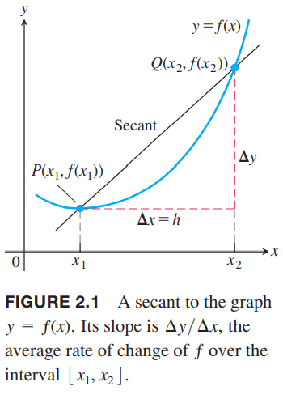
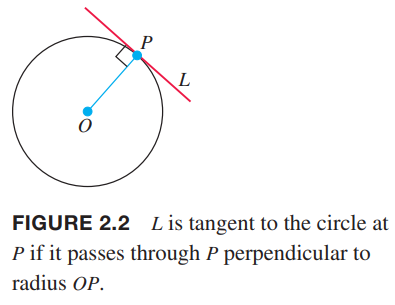

### 平均速度和瞬时速度
十六世纪，伽利略发现物体下落的距离和时间的平方成正比，被称为自由落地（`free fall`）定律。它忽略空气阻力，只有重力是唯一做功的力。如果用$y$表示$t$秒物体下落的距离，那么伽利略定律表示为
$$y=4.9t^2$$
这里4.9是一个近似常数。  
更一般地，一个移动的物体在时间$t$是移动的距离是$f(t)$。在时间段$[t_1,t_2]$物体的平均速度（`average speed`）定义为移动的距离$f(t_2)-f(t_1)$除以$t_2-t_1$。单位可以是千米每小时或者米每秒。  
例1 一个石头从斜塔上下落，求下面时间段的平均速度  
（a）前两秒  
（b）第一秒到第二秒这一秒  
解：用$\Delta y$表示一段时间物体移动的距离，$\Delta t$表示这段时间的长度。这个问题距离单位是米，时间单位是秒。  
（a）
$$\frac{\Delta y}{\Delta t}=\frac{4.9(2)^2-4.9(0)^2}{2-0}=9.8 \text{ } m/s$$
（b）
$$\frac{\Delta y}{\Delta t}=\frac{4.9(2)^2-4.9(1)^2}{2-1}=14.7 \text{ } m/s$$
我们想要找到一种计算$t_0$时物体瞬时速度的方法。我们考虑计算从$t_0$时开始区间段的平均速度，然后使得区间越来越短。下一个例子就解释了这一点。正式讨论会在第三章。  
例2 求例1中$t=1,t=2$时物体的速度。  
解：我们可以计算在区间$[t_0,t_0+h]$上的平均速度，那么$\Delta t=h$，因此有
$$\frac{\Delta y}{\Delta t}=\frac{4.9(t_0+h)^2-4.9(t_0)^2}{h}\tag{1}$$
我们不能用这个公式来计算瞬时速度，因为$h$不能为零。我们可以计算从$t_0=1,t_2$开始的很小的时间段的平均速度。很简单，减少$h$即可。
| $h$ | $t_0=1$ | $t_0=2$ |
|--|--|--|
| 1 | 14.7 | 24.5 |
| 0.1 | 10.29 | 20.09 |
| 0.01 | 9.849 | 19.649 |
| 0.001 | 9.8049 | 19.6049 |
| 0.0001 | 9.80049 | 19.60049 |

随着区间的减小，$t_0=1$开始的区间的平均速度的极限很可能是 9.8，那么这暗示着$t_0=1$的瞬时速度是 $9.8 \text{ } m/s$。下面通过代数运算来说明这一点。  
将$t_0=1$代入公式$(1)$可以得到
$$\begin{aligned}
\frac{\Delta y}{\Delta t}&=\frac{4.9(1+h)^2-4.9(1)^2}{h}\\
&=\frac{4.9(1+2h+h^2)-4.9}{h}\\
&=9.8+4.9h
\end{aligned}$$
$h$从0开始，当$h$趋于0的时候，平均速度的极限值是$9.8+4.9(0)=9.8 \text{ } m/s$。  
将$t_0=2$代入公式$(1)$可以得到
$$\frac{\Delta y}{\Delta t}=19.6+4.9h$$
随着$h$越来越趋于0，$t_0=2$的平均速度的极限值是19.6 m/s，这和上面的表格一致。  
自由落体的平均速度是更一般的情况——平均变化率——的具体例子。

### 平均变化率和割线
给定函数$y=f(x)$，$x$变化区间是$[x_1,x_2]$，对应$y$的变化是$\Delta y=f(x_2)-f(x_1)$，那么平均变化了是$\Delta y$除以$\Delta x=x_2-x_1=h$。后面使用$h$简化$x$的变化$\Delta x$。

**平均变化率** 在$[x_1,x_2]$上$y=f(x)$的平均变化率（`average rate of change`）是
$$\frac{\Delta y}{\Delta x}=\frac{f(x_2)-f(x_1)}{x_2-x_1}=\frac{f(x_1+h)-f(x_1)}{h},h\neq 0$$

从几何角度看，平均变化率是通过点$P(x_1,f(x_1)),Q(x_2,f(x_2))$的直线的斜率。如下图所示。几何学中，和曲线有两个交点的直线称为割线（`secant line`）。  
  
因此，区间$[x_1,x_2]$上的平均变化率是割线$PQ$的斜率。随着点$Q$沿着曲线接近$P$，$h$越来越接近0。我们将会看到这就是曲线在某点处斜率的定义。

### 定义曲线的斜率
直线的斜率表示线性函数的变化率。曲线上点$P$的斜率是什么意思呢？就像圆的切线一样，曲线在点$P$处也有一条切线，它的斜率就是曲线在点$P$的斜率。我们还会看到，这个直线是在该点处的最佳近似。我们现在需要一个方法来得到曲线在某一点处的切线。  
圆的切线是非常直观的。圆上点$P$的切线$L$就是通过点$P$且垂直于经过$P$的半径$OP$。如下图所示。曲线上点$P$的切线$L$表示什么呢？  
  
为了定义相切，我们用移动割线$PQ$的点$Q$使之移向$P$的方法来分析。如下图所示。我们可以计算割线$PQ$的斜率。  

