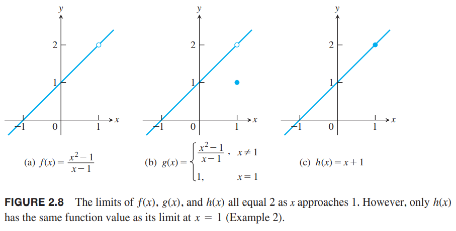

上一小节中，我们看到在寻找瞬时变化率和切线斜率时极限是如何出现的。这一节首先会给出极限的非正式定义和描述极限行为的规律。这些规律能帮助我们快速计算各种函数的极限。下一节会给出正式定义。

### 函数值的极限
研究函数$y=f(x)$时，我们会对特殊点$c$附近的行为感兴趣，而不是$c$点的函数值。一个特殊的情况就是在$c$点出现除0，这是未定义行为。上一节寻找$y$在某点瞬时速度就会遇到$\Delta y/h$，而这里的$h$就会趋于0。  
例1 描述函数在$x=1$附近的情况。
$$f(x)=\frac{x^2-1}{x-1}$$
解：函数的定义域是$x\neq 1$，排除这一点之后，我们可以化简函数
$$f(x)=\frac{(x+1)(x-1)}{x-1}=x+1,x\neq 1$$
图像如下图所示，和$y=x+1$不同的是点$(1,2)$被移除了。尽管函数在$x=1$处无定义，但是我们可以清楚的看到随着$x$越来越接近1，$f(x)$的值会越来越接近2。下面的表也能说明这一点。  
  
| $x$ | $f(x)=\frac{x^2-1}{x-1}$ |
|--|--|
| 0.9 | 1.9 |
| 1.1 | 2.1 |
| 0.99 | 1.99 |
| 1.01 | 2.01 |
| 0.999 | 1.999 |
| 1.001 | 2.001 |
| 0.999999 | 1.999999 |
| 1.000001 | 2.000001 |

### 函数极限的非正式描述
假设$f(x)$在$c$附近的开区间（排除$c$自身）是有定义的。如果对于$x$越来越接近$c$（不是$c$本身），$f(x)$任意接近数$L$，那么我们说$x$趋于$c$时$f$趋于极限（`limit`）$L$，记作
$$\lim_{x\to c}f(x)=L$$
例1中随着$x$趋于1时$f(x)$趋于2，写作
$$\lim_{x\to 1}f(x)=2$$
在这个非正式定义中，我们无须考虑函数在$c$点的值。  
这个定义是非正式的原因是任意接近、无限靠近这些都是不精确的描述，依赖于上下文。比如机械工程的接近是毫米量级而天文学家的接近指的是数千光年。不过，这个定义可以帮助我们计算许多函数的极限值。下一节会给出精确定义并证明关于极限的理论、学习更复杂的函数。下面给出更多的例子来阐述极限的思想。  
例2 函数的极限不依赖于函数在考察点的定义。参考下图。函数$f$在$x=1$处无定义，但是极限是2。函数$g$在$x=1$处的极限是2，但是不等于$g(1)$。函数$h$在$x=1$处的极限是2且刚好等于$h(1)$。最后这个相等$\lim_{x\to 1}h(x)=h(1)$有重要意义。这体现出了连续的概念，我们在2.6节学习连续。  
  
计算极限的过程可以分解成一系列涉及基本函数的极限和一些简单操作的步骤。下面是两个基本函数。  
例3 计算恒等函数和常值函数$x$趋于$c$时的极限。  
解：如下图（a）所示，对于恒等函数$f(x)=x$，任意$c$都有
$$\lim_{x\to c}f(x)=\lim_{x\to c}x=c$$
  
如上图（b）所示，对于常值函数$f(x)=k$，任意$c$都有
$$\lim_{x\to c}f(x)==\lim_{x\to c}k=k$$
举两个具体的例子
$$\lim_{x\to 3}x=3$$
$$\lim_{x\to -7}(4)=\lim_{x\to 2}(4)=4$$
