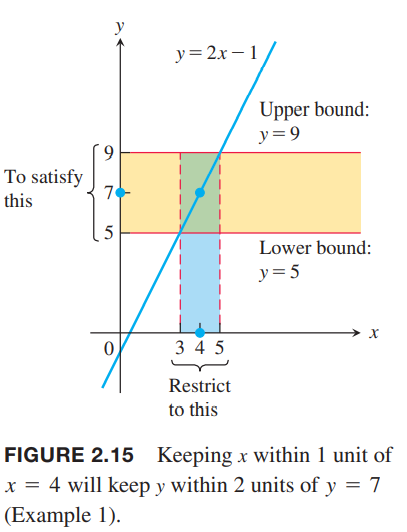

现在我们学习极限的定义。对于严格的定义而言，避免使用任意接近这种描述性的语言。  

例1 思考$y=2x-1$在$x=4$附近的情况。直觉上有$\lim_{x\to 4}f(x)=7$。考虑$x=4$附近，$x$是多么靠近4使得$y=2x-1$和7的差距是小于两个单位长度？  
解：问题本质就是使得$|y-7|<2$？
$$|2x-1-7|=|2x-8|<2$$
那么
$$\begin{aligned}
|2x-8|&<2\\
-2&<2x-8&<2\\
3&<x&<5\\
-1&<x-4&<1
\end{aligned}$$
$x$在4附近一个单位长度的范围使得$y$在7附近两个单位长度以内。如下图所示  

上面这个例子给了一个示例，$x$必须多么接近$c$才能保证$f(x)$在极限值$L$附近的指定区间。为了证明$x\to c$时$f(x)$的极限是$L$，我们必须能够证明$f(x)$和$L$之间的距离可以小于任意指定的误差，不管这个误差多小，总是可以通过$x$接近$c$来做到。为了描述任意指定的误差，引入两个常量，用$\delta$和$\epsilon$。这两个量通常用于表述很小的变化。

### 极限的定义
