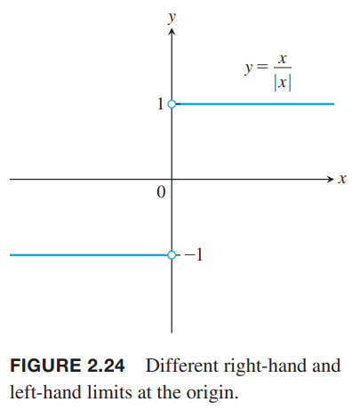
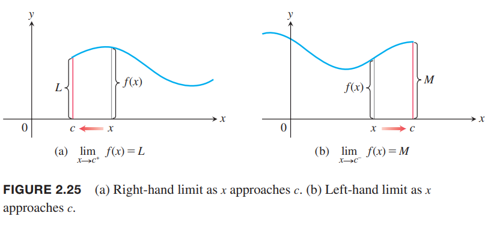
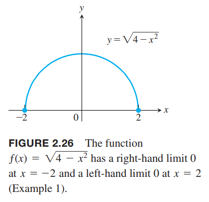

这一节会介绍单侧极限，$x$从左边靠近$c$或者是$x$从右边靠近$c$。这使得我们可以在同一个点有不同的极限，还使得在函数定义域的端点处有极限。

### 单侧极限
假设函数$f$在包含点$c$两边的区间上有定义。当$x\to c$，极限是$L$，那么从任意一边趋于$c$，极限都是$L$，因此，我们说极限是双边的（`two-sided`）。  
如果函数$f$在$c$处没有双边极限，还是有可能有单侧极限的，也就是说，从某一边靠近该点存在极限。如果是从右边趋于$c$，那么是右极限（`right-hand limit`, `limit from the right`），反之是左极限（`left-hand limit`, `limit from the left`）。  
函数$f=x/|x|$（如下图所示）的右极限是1，左极限是-1。由于两个单侧极限值不同，那么在$x\to 0$时不是一个极限值，所以不存在极限（双边）。  
  
直观地，我们只考虑区间$(c, b), c<b$的函数值$f(x)$，随着$x$接近$c$，$f(x)$无限接近$L$，那么$f$在$c$的右极限是$L$，写作
$$\lim_{x\to c^+}f(x)=L$$
$x\to c^+$表示我们只考虑大于$c$的$x$。  
类似的，左极限可以记作
$$\lim_{x\to c^-}f(x)=M$$
非正式的单侧极限定义如下图所示。  
  
图2.24对应的函数$f(x)=x/|x|$左右极限是
$$\lim_{x\to 0^+}f(x)=1,\lim_{x\to 0^-}f(x)=-1$$

我们现在给出函数在定义域边界点处的极限。这个定义和区域和空间的边界点的定义是一致的，这些第13章会讨论。当$f$定义域是在$c$的左边，比如$(a,c)$或$(a,c]$，如果在$c$处有左极限，那么我们说在$c$处有极限。类似的，定义域在$c$右边，比如$(c,b)$或$[c,b)$，如果在$c$处有右极限，那么我们说在$c$处有极限。

例1 $f(x)=\sqrt{4-x^2}$的定义域是$[-2,2]，图像是如下图所示的半圆。那么
$$\lim_{x\to -2^+}f(x)=0, \lim_{x\to 2^-}f(x)=0$$
函数在$(-2,2)$上有双边极限。$x=2$处有左极限没有右极限，$x=-2$处有右极限没有左极限。在$-2,2$两个端点没有双边极限，因为$f$在点两旁没有定义。但是这些端点处有单侧极限，所以$f$在$x=-2,x=2$有极限
$$\lim_{x\to -2}f(x)=0, \lim_{x\to 2}f(x)=0$$

2.2节的定理1对单侧极限也成立。两个函数的右极限的和是两个函数和的右极限，等等。夹逼定理也是成立的。单侧极限和极限有如下内在关系。

### 单侧极限的精确定义

### $(\sin\theta)/\theta$的极限
