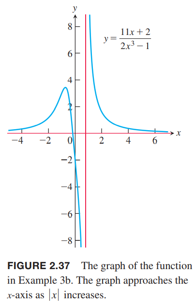

### $x\to\plusmn\infty$时的极限
无穷符号$\infty$不表示任何一个实数。比如函数$f(x)=1/x,x\neq 0$的定义如下图。当$x$增大时，$1/x$减小。当$x$是负数且数值增加时类似。也就是说当$x\to\infty$或$x\to 0\infty$时，$f(x)=1/x$的极限是0。或者说0是$f(x)=1/x$在无穷处和负无穷处的极限。  

**定义**  
如果对于所有$\epsilon>0$，都有对应的$M$使得对于$f$定义域所有的$x$都有
$$|f(x)-L|<\epsilon, \text{ whenever } x>M$$
那么我们说$x$趋于无穷时，$f(x)$的极限是$L$，写作
$$\lim_{x\to\infty}f(x)=L$$
如果对于所有$\epsilon>0$，都有对应的$N$使得对于$f$定义域所有的$x$都有
$$|f(x)-L|<\epsilon, \text{ whenever } x<N$$
那么我们说$x$趋于负无穷时，$f(x)$的极限是$L$，写作
$$\lim_{x\to -\infty}f(x)=L$$

直观地，如果$\lim_{x\to\infty}f(x)=L$，那么当$x$移动的离原点越来越远，$f(x)$无限接近$L$。类似地，$\lim_{x\to-\infty}f(x)=L$，那么当$x$沿着负半轴移动的越来越远，$f(x)$无限接近$L$。  
计算$x\to\infty$或$x\to-\infty$的极限的策略和2.2节类似，那一节中我们先找到$y=x,y=k$的极限，然后应用定理1进行拓展。这里我们也要先找到$y=1/x,y=k$的极限。  
$$\lim_{x\to\plusmn\infty}k=k,\lim_{x\to\plusmn\infty}\frac{1}{x}=0\tag{1}$$

例1 证明  
（a）$\lim_{x\to\infty}\frac{1}{x}=0$  
（b）$\lim_{x\to-\infty}\frac{1}{x}=0$  
证明：  
（a）令$\epsilon>0$，我们必须找到一个$M$使得
$$|\frac{1}{x}-0|=|\frac{1}{x}|<\epsilon, \text{ whenever } x>M$$
那么$M=1/\epsilon$或者任意更大的正数。如下图所示：  
  
（b）令$\epsilon>0$，我们必须找到一个$N$使得
$$\bigg|\frac{1}{x}-0\bigg|=\bigg|\frac{1}{x}\bigg|<\epsilon, \text{ whenever } x<N$$
那么$N=-1/\epsilon$或者任意小于$1-\epsilon$的负数。

**定理8** 定理1的所有法则对$x\to\infty,x\to-\infty$时同样适用。

例2 计算下面两个极限值。  
（a）
$$\begin{aligned}
\lim_{x\to\infty}(5+\frac{1}{x})&=\lim_{x\to\infty}5+\lim_{x\to\infty}\frac{1}{x}
\\&=5+0=5
\end{aligned}$$
（b）
$$\begin{aligned}
\lim_{x\to -\infty}\frac{\pi\sqrt{3}}{x^2}&=\lim_{x\to -\infty}\pi\sqrt{3}\frac{1}{x}\frac{1}{x}\\
&=\lim_{x\to -\infty}\pi\sqrt{3}\cdot\lim_{x\to -\infty}\frac{1}{x}\cdot\lim_{x\to -\infty}\frac{1}{x}\\
&=\pi\sqrt{3}\cdot 0\cdot 0\\
&=0
\end{aligned}$$

### 实数函数在无穷处的极限
为了计算$x\to\plusmn\infty$时实数函数的极限，首先分子分母除以分母的最高次幂。结果就取决于多项式的幂次。

例3 按照上述方法计算下面两个函数的极限。  
（a）如下图所示
$$\begin{aligned}
\lim_{x\to\infty}\frac{5x^2+8x-3}{3x^2+2}&=\lim_{x\to\infty}\frac{5+(8/x)-(3/x^2)}{3+(2/x^2)}\\
&=\frac{5+0-0}{3+0}\\
&=\frac{5}{3}
\end{aligned}$$
  
（b）
$$\begin{aligned}
\lim_{x\to -\infty}\frac{11x+2}{2x^3-1}&=\lim_{x\to -\infty}\frac{(11/x^2)+(2/x^3)}{2-(1/x^3)}\\
&=\frac{0+0}{2-0}=0
\end{aligned}$$

### 渐近线
图像上一个点随着距离原点越来越远，它距离某固定线的距离接近于零，我们称这个图像渐近接近这条线，这条直线是图像的渐近线（`asymptote`）。  
$x$轴是$f(x)=1/x$图像的渐近线因为
$$\lim_{x\to\infty}\frac{1}{x}=0$$
且
$$\lim_{x\to -\infty}\frac{1}{x}=0$$
我们称$x$轴是水平渐近线（`horizontal asymptote`）。

**定义** 如果
$$\lim_{x\to\infty}f(x)=b$$
或
$$\lim_{x\to -\infty}f(x)=b$$
那么$y=b$是$f(x)$的水平渐近线。

函数图像可能有零、一、二个水平线，这取决于随着$x\to\infty$或$x\to -\infty$时函数的极限。  
图 2.36 的函数
$$f(x)=\frac{5x^2+8x-3}{3x^2+2}$$
的渐近线是$y=5/3$因为
$$\lim_{x\to\infty}f(x)=\frac{5}{3},\lim_{x\to -\infty}f(x)=\frac{5}{3}$$

例4 求下面函数图像的水平渐近线
$$f(x)=\frac{x^3-2}{|x|^3+1}$$
解：求$x\to\plusmn\infty$时函数极限  
$x\geq 0$时
$$\lim_{x\to\infty}\frac{x^3-2}{|x|^3+1}=\lim_{x\to\infty}\frac{x^3-2}{x^3+1}=\lim_{x\to\infty}\frac{1-2/(x^3)}{1+1/(x^3)}=1$$
$x<0$时
$$\lim_{x\to\infty}\frac{x^3-2}{|x|^3+1}=\lim_{x\to\infty}\frac{x^3-2}{(-x)^3+1}=\lim_{x\to\infty}\frac{1-2/(x^3)}{-1+1/(x^3)}=-1$$
那么水平渐近线是$y=1,y=-1$，如下图所示：  

例5 $x$轴是函数$y=e^x$的水平渐近线因为
$$\lim_{x\to -\infty}e^x=0$$
下面进行证明。令$\epsilon>0$，我们必须找到一个常量$N$使得
$$|e^x-0|<\epsilon, \text{ whenever } x<N$$
由于$|e^x-0|=e^x$，那么当$x<N$时，需满足条件
$$e^x<\epsilon$$
由于$e^x$是递增函数，那么$e^N=\epsilon,N=\ln \epsilon$或者更小能满足上述条件。如下图所示  

例6 求  
（a）$\lim_{x\to\infty}\sin(1/x)$  
（b）$\lim_{x\to\plusmn\infty}x\sin(1/x)$  
解：  
（a）令$t=1/x$，那么$x\to\infty$等价于$t\to 0^+$。因此
$$\lim_{x\to\infty}\sin(1/x)=\lim_{t\to 0^+}\sin t=0$$
（b）现在计算$x\to\infty,x\to -\infty$
$$\lim_{x\to\infty}x\sin(1/x)=\lim_{t\to 0^+}\frac{\sin t}{t}=1$$
$$\lim_{x\to -\infty}x\sin(1/x)=\lim_{t\to 0^-}\frac{\sin t}{t}=1$$
如下图所示  
  
类似的，通过研究$y=f(t),t\to\plusmn\infty$，可以知道函数$y=f(1/x),x\to 0$的行为。

例7 求
$$\lim_{x\to 0^-}e^{1/x}$$
解：令$t=1/x$，那么$x\to 0^-$等价于$t\to -\infty$，因此
$$\lim_{x\to 0^-}e^{1/x}=\lim_{t\to -\infty}e^t=0$$
如下图所示：  

