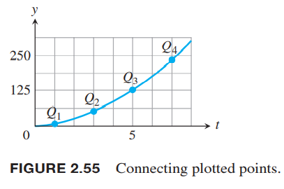

我们根据函数值画图像的时候，往往使用连续的曲线把各个点连起来，以此那些没有测量的点也有了对应的值，如下图所示。使用连续函数意味着输出是规则的、连续的，没有突然跳跃的点。直观地，任意图像在定义域连续运动的函数$y=f(x)$都是连续函数。这些函数在研究微积分及其应用时很有用。  

### 指定点处的连续性
回到2.4节研究的例2，如下图所示。  

例1 上图中的$f$有哪些不连续的点？为什么？其他点呢？  
解：首先我们只考虑在其定义域$[0,4]$上的点。从图像可以观察得到图像在$x=1,x=2,x=4$处不连续。$x=1$处函数图像有一个跳跃，称为跳跃间断点（`jump discontinuity`）。因为可以通过改变一个点处的函数值使得函数连续，$x=2$处称为可去间断点（`removable discontinuity`）。类似的，$x=4$也是可去间断点。  
在$x=1$处，函数没有极限。左极限$\lim_{x\to 1^-}=0$，右极限$\lim_{x\to 1^+}=1$，两者不相同，结果是图像上有一个跳跃。函数在$x=1$处是不连续的。不过由于$f(1)=1$和右极限相等，那么从$x=1$开始向右是连续的。  
$x=1$处，函数存在极限$\lim_{x\to 2}=1$，但是不等于$f(2)=2$，即极限值不等于函数值。因此在$x=2$处不连续。  
$x=4$处，
