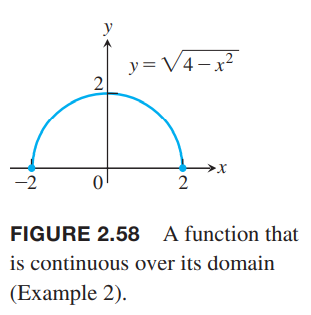
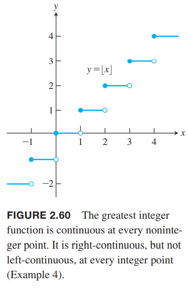
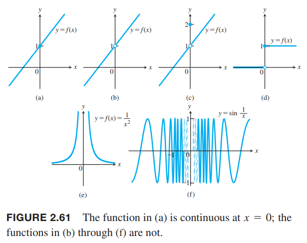

我们根据函数值画图像的时候，往往使用连续的曲线把各个点连起来，以此那些没有测量的点也有了对应的值，如下图所示。使用连续函数意味着输出是规则的、连续的，没有突然跳跃的点。直观地，任意图像在定义域连续运动的函数$y=f(x)$都是连续函数。这些函数在研究微积分及其应用时很有用。  

### 指定点处的连续性
回到2.4节研究的例2，如下图所示。  

例1 上图中的$f$有哪些不连续的点？为什么？其他点呢？  
解：首先我们只考虑在其定义域$[0,4]$上的点。从图像可以观察得到图像在$x=1,x=2,x=4$处不连续。$x=1$处函数图像有一个跳跃，称为跳跃间断点（`jump discontinuity`）。因为可以通过改变一个点处的函数值使得函数连续，$x=2$处称为可去间断点（`removable discontinuity`）。类似的，$x=4$也是可去间断点。  
在$x=1$处，函数没有极限。左极限$\lim_{x\to 1^-}=0$，右极限$\lim_{x\to 1^+}=1$，两者不相同，结果是图像上有一个跳跃。函数在$x=1$处是不连续的。不过由于$f(1)=1$和右极限相等，那么从$x=1$开始向右是连续的。  
$x=1$处，函数存在极限$\lim_{x\to 2}=1$，但是不等于$f(2)=2$，即极限值不等于函数值。因此在$x=2$处不连续。  
$x=4$处，是函数右端点，所以没有右极限。左极限$\lim_{x\to 4^-}f(x)=1$，但是函数值$f(4)=\frac{1}{2}$，和左极限不一样。  
在$x=3$，函数极限$\lim_{x\to 3}f(x)=2$。这和函数值$f(x)=2$一致，所以在此处函数是连续的。  
$x=0$处，这是函数的左端点，所以不存在左极限。右极限$\lim_{x\to 0^+}f(x)=1$和函数值$f(0)=1$一致。所以函数从$x=0$右边是连续的。  
在其余各点，极限值和函数值都是相等的，所以函数在这些地方也都是连续的。

**定义** 令$c$是函数$f$定义域上的内部点或者端点.  
如果
$$\lim_{x\to c}f(c)=f(c)$$
那么函数$f$在$c$处是连续的。  
如果
$$\lim_{x\to c+}f(c)=f(c)$$
那么函数在$c$处是右连续的。  
如果
$$\lim_{x\to c^-}f(c)=f(c)$$
那么函数在$c$处是左连续的。

回到例1，函数$f$在定义域$[0, 4]$上除了$x=1,2,4$之外的其他点都是连续的。$x=1$是右连续但不是左连续，$x=2$处既不是左连续也不是右连续，在$x=4$是左连续的。  
根据定理6可知如果在某点处左连续且右连续，那么就是连续的。如果一个函数在闭区间$[a,b]$上有定义，且在$a$处右连续，在$b$处左连续，在其余点连续，那么这个函数在该闭区间上是连续的。这个定义可以拓展到无限闭区间$[a,\infty)$或$(-\infty,b]$。

例2 函数$f(x)=\sqrt{4-x^2}$在定义域$[-2,2]$上是连续的。如下图所示。$x=-2$处是右连续，在$x=2$处是左连续。  

例3 单位阶跃函数$U(x)$如下图所示，在$x=0$处是右连续，但是不是左连续，所以不是连续的。这个点是跳跃间断点。  

**连续性测试** 函数$f(x)$是在$c$处是连续的等价于满足下面三个条件
1. $f(c)$存在
2. $\lim_{x\to c}f(x)$存在
3. $\lim_{x\to c}f(x)=f(c)$

如果是单边连续性，那么条件2和条件3改为单边极限即可。

例4 函数$y=\lfloor x\rfloor$如下图所示。  
  
在每个正数的地方都是不连续的，因为当$x\to n$时左极限不等于右极限。
$$\lim_{x\to n^-}\lfloor x\rfloor=n-1,\lim_{x\to n^+}\lfloor x\rfloor=n$$
但是在每个$n$处是右连续的。  
同时，在其他地方都是连续的，因为当$n-1<c<n$时，有
$$\lim_{x\to c}\lfloor x\rfloor=n-1=\lfloor c\rfloor$$

下图展示了几种常见的不连续的情况。  
  
（a）在$x=0$处是连续的。（b）在$x=0$处不连续，因为没有定义。（c）在$x=0$处的值是1而不是2的话就是连续的，所以是可去间断点。也就是在这个点极限是存在的，只要让函数值等于极限值就能使之连续，去除不连续性。（d）$x=0$处不连续的，因为极限不存在。当左极限不等于右极限的时候，是跳跃间断点。（e）$f(x)=\frac{1}{x^2}$在$x=0$处是无穷间断点（`infinite discontinuity`）。（f）函数有振荡间断点（`oscillating discontinuity`）：因为$x\to 0$时函数值在$[-1,1]$来回振荡无数次。

### 连续函数
