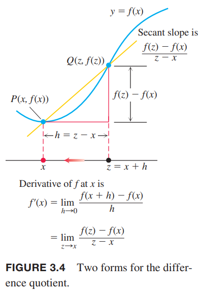

上一节中我们定义在$x=x_0$处函数$y=f(x)$的导数是
$$f'(x_0)=\lim_{h\to 0}\frac{f(x_0+h)-f(x_0)}{h}$$
现在我们要研究$f$的导数作为函数的情况，前提是对应$x$是在$f$的定义域且极限存在。

**定义** 假定极限存在。对应变量$x$，$f(x)$的导数是函数$f'$，在$x$处的值是
$$f'(x)=\lim_{h\to 0}\frac{f(x+h)-f(x)}{h}$$

定义中使用$f(x)$而不是之前的$f(x_0)$是为了强调$f'$是自变量$x$的函数。$f'$的定义域是在$f$定义域中使得极限存在的点，所以$f'$的定义域小于等于$f$的定义域。如果对于某个$x$，$f'$存在，那么我们称在$x$处$f$是可微的（`differentiable`），或可微分的、可导的。如果在$f$整个定义域上$f'$都有定义，那么称函数$f$是可导的。  
如果令$z=x+h$，那么$h=z-x$并且$h$趋于0等价于$z$趋于$x$。因此，可以得到下图所示的等价定义。这个公式有的时候会更方便。  

**公式**
$$f'(x)=\lim_{z\to x}\frac{f(z)-f(x)}{z-x}$$

### 使用定义计算导数
为了强调求导是对函数$y=f(x)$做某种操作，我们使用记号
$$\frac{d}{dx}f(x)$$
来表示导数$f'(x)$。3.1节的例1阐述了$x=a$处$y=1/x$的求导过程，用$x$表示在定义域上的任意一点，可以记作
$$\frac{d}{dx}(\frac{1}{x})=-\frac{1}{x^2}$$

例1 求$f(x)=\frac{x}{x-1}$的导数。  
解：使用定义来求解。
$$\begin{aligned}
f'(x)&=\lim_{h\to 0}\frac{f(x+h)-f(x)}{h}\\
&=\lim_{h\to 0}\frac{\frac{x+h}{x+h-1}-\frac{x}{x-1}}{h}\\
&=\lim_{h\to 0}\frac{1}{h}\cdot\frac{(x+h)(x-1)-x(x+h-1)}{(x+h-1)(x-1)}\\
&=\lim_{h\to 0}\frac{1}{h}\cdot\frac{-h}{(x+h-1)(x-1)}\\
&=\lim_{h\to 0}\frac{-1}{(x+h-1)(x-1)}\\
&=\frac{-1}{(x-1)^2}
\end{aligned}$$

例2  
（1）求导$f(x)=\sqrt{x},x>0$  
（2）求在$x=4$处$f(x)=\sqrt{x}$对应点的切线  
解：（1）使用第二个定义的公式
$$\begin{aligned}
f'(x)&=\lim_{z\to x}\frac{f(z)-f(x)}{z-x}\\
&=\lim_{z\to x}\frac{\sqrt{z}-\sqrt{x}}{z-x}\\
&=\lim_{z\to x}\frac{\sqrt{z}-\sqrt{x}}{(\sqrt{z}-\sqrt{x})(\sqrt{z}+\sqrt{x})}\\
&=\lim_{z\to x}\frac{1}{\sqrt{z}+\sqrt{x}}\\
&=\frac{1}{2\sqrt{x}}
\end{aligned}$$
（2）$x=4$时
$$f'(4)=\frac{1}{2\sqrt{4}}=\frac{1}{4}$$
那么点$(4,2)$上的切线斜率是$1/4$，方程是
$$y=2+\frac{1}{4}(x-4)=\frac{1}{4}x+1$$

### 记号
有许多记号表示函数$y=f(x)$的导数。常用的有
$$f'(x)=y'=\frac{dy}{dx}=\frac{df}{dx}=\frac{d}{dx}f(x)=D(f)(x)=D_xf(x)$$
