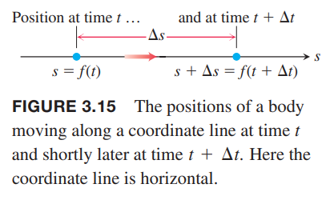
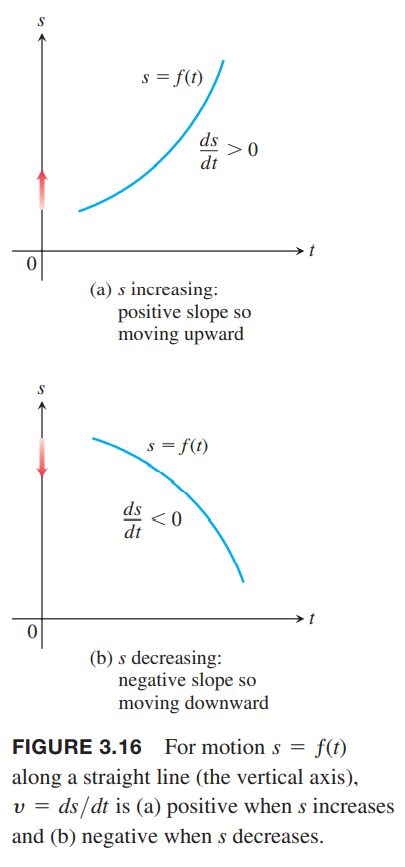
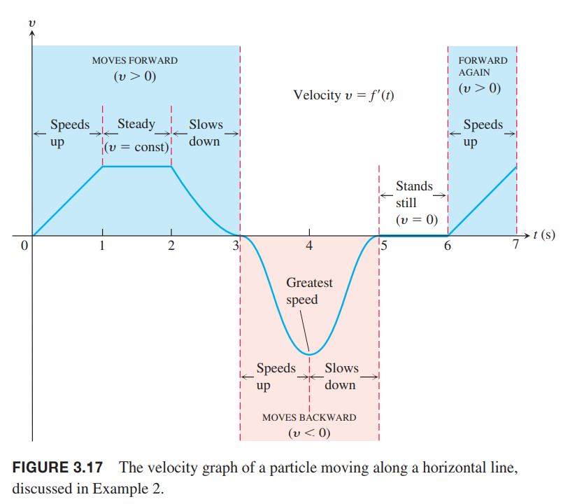

### 瞬时变化率
**定义** 在极限存在的前提下，$f$在$x=x_0$处的瞬时变化率是在该点的导数
$$f'(x_0)=\lim_{h\to 0}\frac{f(x_0+h)-f(x_0)}{h}$$

瞬时变化率是平均变化率的极限值。  
有时为了讨论方便，说变化率指的就是瞬时变化率。

例1 圆的直径和面积的关系是
$$A=\frac{\pi}{4}D^2$$
当直径是10米的时候，随着直径的增加，面积增加多快？  
解：变化率是
$$\frac{dA}{dD}=\frac{\pi}{4}\cdot 2D=\frac{\pi D}{2}$$
当$D=10\text{m}$时，变化率是$(\pi/2)10\approx 15.71\text{m}^2/\text{m}$，含义是直径增加一米，面积增加15.71平方米。

### 沿直线运动：位移，速度，速率，加速度，
假设一个物体沿坐标轴$s$运动，那么在坐标轴的位置$s$是时间的函数
$$s=f(t)$$
时间$t$到$t+\Delta t$物体有一段位移，
$$\Delta s=f(t+\Delta t)-f(s)$$
如下图所示：  
  
那么这一段时间的平均速度是
$$v=\frac{\Delta s}{\Delta t}=\frac{f(t+\Delta t)-f(t)}{\Delta t}$$
求在$t$时的瞬时速度，就是求$\Delta t$趋于0时的极限。

**定义** 速度是关于时间的位置函数的导数。如果$t$时位置是$s(t)$，那么此时的速度是
$$v(t)=\frac{ds}{dt}=\lim_{\Delta t\to 0}\frac{f(t+\Delta t)-f(t)}{\Delta t}$$

速度除了能告诉我们移动的快慢，还能告诉我们移动的方向。当正向移动时（$s$增加），速度是正的，否则是负数。下图表示随着时间的变化位置的变化，注意，竖轴是$s$轴，横轴是$t$，描绘的不是运动的轨迹。  

**定义** 速率是速度的绝对值。
$$\text{Speed}=|v(t)|=\bigg|\frac{ds}{dt}\bigg|$$

例2 下图是粒子沿着横轴移动的速度$v=f'(t)$和时间$t$的关系图。  
  
在速度函数的图像中，不是曲线的斜率说明沿着直线前进还是后退，而是正负号表示这一点。前三秒是前进的，接下来两秒后退，静止了一秒之后继续前进。在第一秒，速度越来越快，说明粒子是在加速运动，第二秒保持速度不变，第三秒速度越来越慢直到零。在$t=3$时，物体瞬间是静止的，因为瞬时速度是零，然后反向运动。接着反向速度越来越快，到$t=4$时速度达到最高。之后还是后退，但是速度越来越慢，直到$t=5$时停了下来。粒子保持静止了一秒，在$t=6$时开始前进，最后一秒速度越来越快。

速度的瞬时变化率是加速度，表示速度以多快或多慢加速或者减速。第十二章我们会讨论在平面和空间运动的情况，那时，加速度也会是有方向的。  
加速的变化称为 jerk（没有找到对应中文，后文写作“加速度变化率）。
