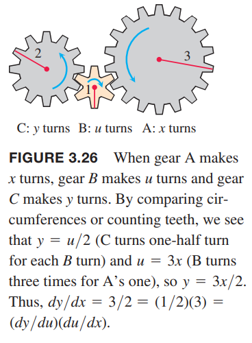
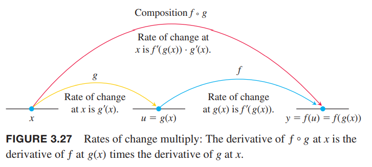

### 组合函数的导数
函数$y=\frac{3}{2}x=\frac{1}{2}(3x)$可以看作是函数$y=\frac{1}{2}u,u=3x$的组合函数。我们有
$$\frac{dy}{dx}=\frac{3}{2},\frac{dy}{du}=\frac{1}{2},\frac{du}{dx}=3$$
由于$\frac{3}{2}=\frac{1}{2}\times 3$，我们可以得到
$$\frac{dy}{dx}=\frac{dy}{du}\times\frac{du}{dx}$$
如果把导数看作是变化率，那么这个关系是非常直观的。如果$y=f(u)$变化是$u$的一半，$u=g(x)$的变化是$x$变化的三倍，那么$y$的变化是$x$变化的二分之三倍。这就像多级齿轮传动一样。如下图所示：  

例1 函数
$$y=(3x^2+1)^2$$
可以看作是$y=f(u)=u^2,u=g(x)=3x^2+1$的组合函数。模仿上面的规则计算导数得到
$$\begin{aligned}
\frac{dy}{du}\cdot\frac{du}{dx}&=2u\cdot 6x\\
&=2(3x^2+1)\cdot 6x\\
&=36x^3+12x
\end{aligned}$$
通过展开$(3x^2+1)^2=9x^4+6x^2+1$也可以得到导数
$$\frac{dy}{dx}=\frac{d}{dx}(9x^4+6x^2+1)=36x^3+12x$$
结果是一致的。

组合函数$f(g(x))$的导数等于$f$在$g(x)$处的导数乘以$g$在$x$处的导数。如下图所示：  

**定理2 链式法则** 如果$f(u)$在点$u=g(x)$处可导且$g(x)$在$x$处可导，那么组合函数$f\circ g=f(g(x))$在$x$处可导，且有
$$(f\circ g)'(x)=f'(g(x))\cdot g'(x)$$
使用莱布尼茨表示法是
$$\frac{dy}{dx}=\frac{dy}{du}\cdot\frac{du}{dx}$$
链式法则的一种情况的证明。  
令$\Delta u$是对应$x$变化$\Delta x$时$u$的变化
$$\Delta u=g(x+\Delta x)-g(x)$$
相应的
$$\Delta y=f(u+\Delta u)-f(u)$$
如果$\Delta u\neq 0$，我们可以把$\Delta y/\Delta x$写作
$$\frac{\Delta y}{\Delta x}=\frac{\Delta y}{\Delta u}\cdot\frac{\Delta u}{\Delta x}$$
取$\Delta x\to 0$的极限
$$\begin{aligned}
\frac{dy}{dx}&=\lim_{\Delta x\to 0}\frac{\Delta y}{\Delta x}\\
&=\lim_{\Delta x\to 0}\frac{\Delta y}{\Delta u}\cdot\frac{\Delta u}{\Delta x}\\
&=\lim_{\Delta x\to 0}\frac{\Delta y}{\Delta u}\cdot \lim_{\Delta x\to 0}\frac{\Delta u}{\Delta x}\\
&=\lim_{\Delta u\to 0}\frac{\Delta y}{\Delta u}\cdot \lim_{\Delta x\to 0}\frac{\Delta u}{\Delta x}\\
&=\frac{dy}{du}\cdot\frac{du}{dx}
\end{aligned}$$
如果$g(x)$在$x$附近振荡，那么当$\Delta x\neq 0$时，$\Delta u$可能为零，那么之前说$\Delta u\neq 0$就不成立。3.11小节会给出另外一种证明方式来规避这个问题。
