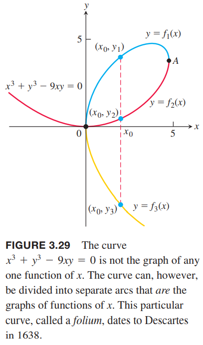
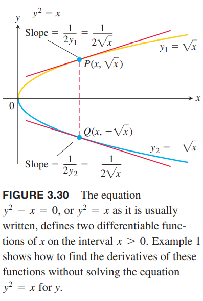

我们现在处理的大部分函数的形式均为$y=f(x)$，显式的使用变量$x$表示$y$，并且我们已经学了很多关于这种形式的函数的求导方法。除此之外，我们还可能会遇到形如
$$x^3+y^3-9xy=0,y^2-x=0,x^2+y^2-25=0$$
下图是第一个函数的图像  
  
这些方程给出了$x$和$y$之间的隐式关系。有的时候我们无法解出显式的方程。当我们不能把方程$F(x,y)=0$写作$y=f(x)$进而求导的时候，我们需要使用隐式求导的方式来求解。

### 隐式定义的函数
我们先看几个可以将隐式函数写作显式函数的例子，先使用常规方法求导，再使用隐式求导的方法。我们可以看出，这两种方法得到的答案是一致的。下面这些例子隐含着$dy/dx$是存在的这一条件。

例1 $y^2=x$，求$dy/dx$。  
解：方程$y^2=x$定义了两个可导函数分别是$y_1=\sqrt{x},y_2=-\sqrt{x}$，如下图所示：  
  
我们可以得到$x>0$时的导数
$$\frac{dy_1}{dx}=\frac{1}{2\sqrt{x}},\frac{dy_2}{dx}-\frac{1}{2\sqrt{x}}$$

