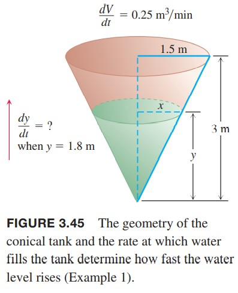

这一节我们会研究两个或多个相关变量变化的问题。确定其中一个量变化是如何影响对其他量的变化的问题称为相关变化率问题（`related rates problem`）。

### 相关变化率方程
假设我们往一个气球里面注入空气。体积和半径都随时间而增加。如果某个时刻体积是$V$，半径是$r$，那么
$$V=\frac{4}{3}\pi r^3$$
应用链式法则，两边对$t$求导，得到$V$和$r$相关变化率的方程
$$\frac{dV}{dt}=\frac{dV}{dr}\frac{dr}{dt}=4\pi r^2\frac{dr}{dt}$$
如何我们知道半径$r$和体积增加的速率$dV/dt$，那么就可以求出那个时刻半径的变化率$dr/dt$。测量体积的变化率（注入气体体积）比测量半径的变化率要容易。  
求相关变化率的问题的关键是找出变量之间的关系，如下例。

例1 向圆锥罐注水速度是$0.25m^3/min$。圆锥高3m，底半径1.5m。求水深1.8m时水位的变化率。  
  
解：如上图所示。$V,x,y$分别是$t$时刻的体积、水面半径和水深，并且对时间$t$可导。那么已知
$$y=1.8m,\frac{dV}{dt}=0.25m^3/min$$
锥体体积是
$$V=\frac{1}{3}\pi x^2y$$
但是题目没有给出$x$和这一时刻的$dx/dt$，不过通过相似三角形可以得到
$$\frac{x}{y}=\frac{1.5}{3}$$
$$x=\frac{y}{2}$$
消除$x$得到
$$V=\frac{1}{3}\pi(\frac{y}{2})$$
