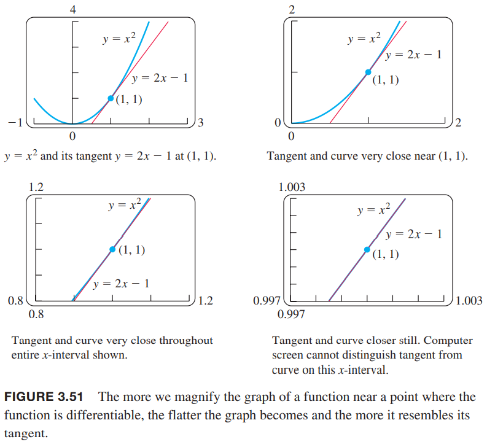
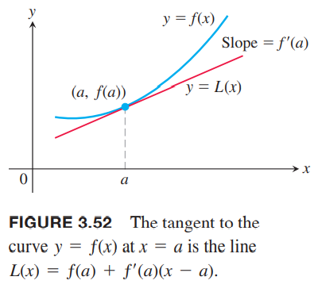
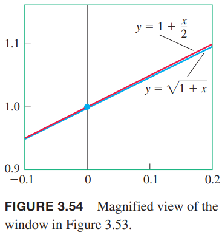

### 线性化
看下图，$y=x^2$的切线在切点附近非常接近曲线。在切点任意一边的区间，切线的$y$值是曲线$y$值的足够好的近似。下图的后面是放大的图像，区间很小时，值非常接近。这一点不仅对多项式曲线成立，对任意曲线都成立。  
  
一般地，如果$f$是可导函数，在$x=a$处，$y=f(x)$的切线通过点$(a,f(a))$，点斜式方程式
$$y=f(a)+f'(a)(x-a)$$
切线就是线性方程
$$L(x)=f(a)+f'(a)(x-a)$$
的图像。稍微离开接触点，$L(x)$是$f(x)$的近似。  

**定义** 如果$f$在$x=a$处可导，近似方程
$$L(x)=f(a)+f'(a)(x-a)$$
是$f$在$a$处的线性化（`linearization`）。近似
$$f(x)\approx L(x)$$
是$f$在$a$处的标准线性近似（`standard linear approximation`）。点$a$是近似中心。

例1 求$f(x)=\sqrt{1+x}$在$x=0$处的近似。如下图。  
  
解：由
$$f'(x)=\frac{1}{2}(1+x)^{-1/2}$$
我们有$f(0)=1,f'(0)=1/2$，那么线性方程是
$$L(x)=f(a)+f'(a)(x-a)=1+\frac{x}{2}$$
如下图所示。  

下面的表展示了$\sqrt{1+x}\approx 1+(x/2)$的在0附近的精确度，如果离0很远的话，那么就不准确了。比如$x=2$，线性化的近似是2，实际值是$\sqrt{3}$，准确度差很远。
| Approximation | True value | True value − approximation |
|--|--|--|
| $\sqrt{1.005}\approx 1+\frac{0.005}{2}=1.0025$ | $1.002497$ | $0.000003 < 10^{-5}$ |
| $\sqrt{1.05}\approx 1+\frac{0.05}{2}=1.025$ | $1.024695$ | $0.000305 < 10^{-3}$ |
| $\sqrt{1.2}\approx 1+\frac{0.2}{2}=1.1$ | $1.095445$ | $0.004555 < 10^{-2}$ |

不要这个例子误导了，以为线性化是为了更好的计算某个值。实际中，我们不会用线性化来求具体的某个平方根。线性化的作用是在很小的值区间上用简单函数替换复杂函数。如果我们需要在0附近用到函数$\sqrt{1+x}$并且可以容忍一些误差，那么可以用$1+(x/2)$替代。当然，我们需要知道误差有多少。第九章会讨论这个事情。  
线性近似离开中心点之后会不准确。如图3.53，近似$\sqrt{1+x}\approx 1+(x/2)$在$x=3$就会差距太大。我们需要在$x=3$处从新做线性化。

例2 求$f(x)=\sqrt{1+x}$在$x=3$处的近似。  
解：
$$f(3)=2,f'(3)=\frac{1}{2}(1+x)^{-1/2}\bigg|_{x=3}=\frac{1}{4}$$
所以
$$L(x)=2+\frac{1}{4}(x-3)=\frac{5}{4}+\frac{x}{4}$$
比如$x=3.2$，近似值是
$$\sqrt{1+x}=\sqrt{1+3.2}\approx \frac{5}{4}+\frac{3.2}{2}=2.05$$
而$\sqrt{4.2}\approx 2.04939$，差距小于千分之一。如果用例子的线性化近似值是
$$\sqrt{1+x}=\sqrt{1+3.2}\approx 1+\frac{3.2}{2}=2.6$$
差距超过了25%。

例3 求$f(x)=\cos x$在$x=\pi/2$处的近似。  
解：$f(\pi/2)=\cos(\pi/2)=0,f'(\pi/2)=-\sin(x)=-\sin(\pi/2)=-1$，那么在$a=\pi/2$处的线性化方程是
$$\begin{aligned}
L(x)&=f(a)+f'(a)(x-a)\\
&=0+(-1)(x-\frac{\pi}{2})\\
&=-x+\frac{\pi}{2}
\end{aligned}$$

下面是一个重要的近似
$$(1+x)^k\approx 1+kx$$
要求$x$在0附近，对任意$k$都成立。
这个近似有广泛的应用。比如，当$x$很小时有
$$\begin{aligned}
\sqrt{1+x}&\approx 1+\frac{1}{2}x&&k=1/2\\
\frac{1}{1-x}&= (1-x)^{-1}\approx 1+(-1)(-x)=1+x&&k=-1,x\larr -x\\
\sqrt[3]{1+5x^4}&=(1+5x^4)^{1/3}\approx 1+\frac{1}{3}5x^4=1+\frac{5}{3}x^4&&k=1/3,x\larr 5x^4\\
\frac{1}{\sqrt{1-x^2}}&=(1-x^2)^{-1/2}\approx 1+(-\frac{1}{2})(-x^2)=1+\frac{1}{2}x^2&&k=-1/2,x\larr -x^2
\end{aligned}$$

### 微分
我们有时使用莱布尼茨记号$dy/dx$表示$y$的导数，并不表示比值。限制引入两个变量$dx,dy$，它们是成比例的，值等于导数。

**定义** 令$f(x)$是可导函数。微分$dx$是自变量，微分$dy$是
$$dy=f'(x)dx$$

$dx$是自变量，$dy$是应变量，依赖于$x,dx$的值。给定$dx$和$f$定义域中的某个$x$值，就决定了$dy$的值。$dx$有时记作$\Delta x$，表示$x$的变化。

例4  
（a）求函数$y=x^5+37x$的导数$dy$  
（b）当$x=1,dx=0.2$，求$dy$的值。  
解：  
（a）$dy=(5x^4+37)dx$  
（b）代入$x=1,dx=0.2$得到
$$dy=(5(1)^4+37)(0.2)=8.4$$
