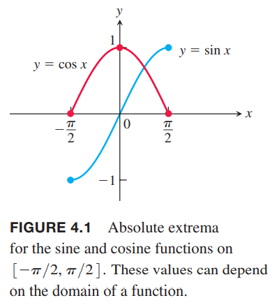
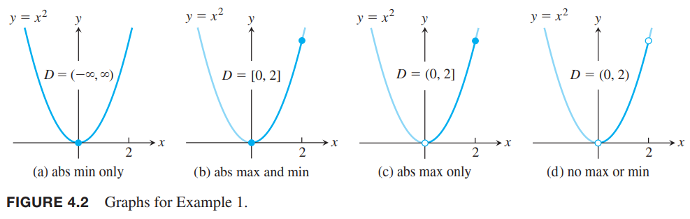
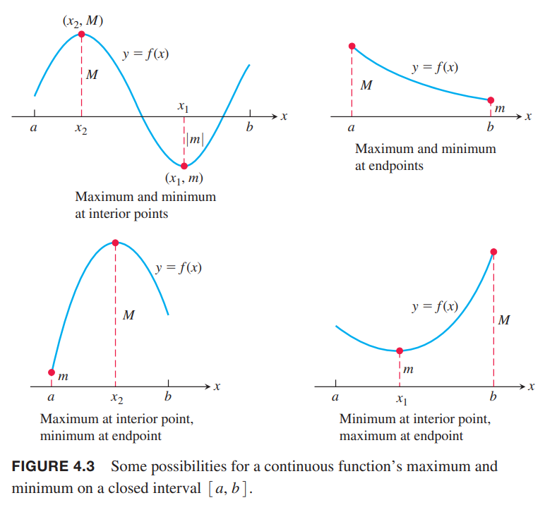
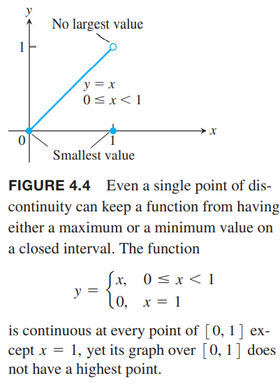
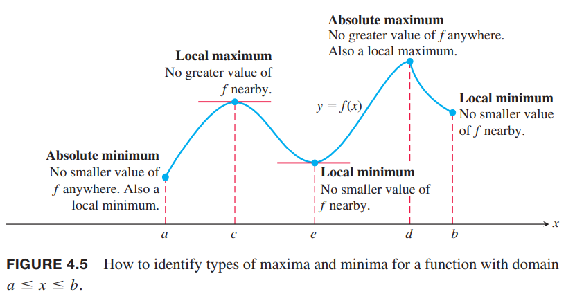
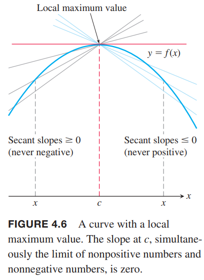

**定义** 令$f$是定义域$D$上的函数。如果$D$上有一点$c$满足
$$f(x)\leq f(c), \text{ for all $x$ in } D$$
那么$f$在$D$上有（绝对）最大值。类似的如果有点$c$满足
$$f(x)\geq f(c), \text{ for all $x$ in } D$$
那么有（绝对）最小值。

（绝对）最大值和最小值也称作$f$的（绝对）极值（`extreme values`）。后续简称最大值和最小值。  
比如在区间$[-\pi/2,\pi/2]$上，函数$f(x)=\cos x$有最大值1（一次）和最小值0（两次），函数$f(x)=\sin x$有最大值1和最小值-1。如下图所示。  
  
有相同表达式的函数如果定义域不同，可能有不同的极值。如果定义域无界或者不包含端点，函数可能没有最大值或最小值。

例1 下面函数的极值如下图所示。每个函数方程都是$y=x^2$，但是定义域不同。  
  
| 函数方程 | 定义域 $D$ | 极值 |
|--|--|--|
| $y=x^2$ | $(-\infty, \infty)$ | 没有最大值，最小值是0，此时$x=0$ |
| $y=x^2$ | $[0, 2]$ | 最大值是4，此时$x=2$，最小值是0，此时$x=0$ |
| $y=x^2$ | $(0,2]$ | 最大值是4，此时$x=2$，没有最小值 |
| $y=x^2$ | $(0, 2)$ | 没有最大值和最小值 |

上面的例子中没有最大值或者最小值。下面的定理告诉我们一个函数在闭区间$[a,b]$上连续，那么一定有最大值和最小值。

**定理1 极值定理**  
如果函数$f$在闭区间$[a, b]$上连续，那么一定有最大值$M$和最小值$m$。也就是说，在闭区间$[a, b]$上存在$x_1, x_2$使得$f(x_1)=m,f(x_2)=M$，且区间上其他$x$都满足$m\leq f(x)\leq M$。

定理的证明超出了需要更多实数系统的知识。下图展示了极值可能出现在闭区间的不同位置。观察之前$f=\cos x$的图，最小值可以在不同位置出现多次。  
  
定理1要求函数是连续的且区间是闭区间且有界。例1展示了区间不是闭合区间或者无界的情况下，极值不存在。指数函数$y=e^x$，定义域为$(-\infty,\infty)$，说明在无限区间上没有极值。下图说明连续的必要性。  

### 局部极值
下图展示了函数在区间$[a,b]$上有五个不同类型极值。函数的最小值在$a$处，尽管$e$处的值比其邻居要小。$c$点附近有左边曲线上升右边曲线下降，所以$f(c)$局部最大。在$d$有最大值。  

**定义** 如果在定义域内某个包含$c$的开区间上有$f(x)\leq f(c)$，那么在定义域$D$上函数$f$在$c$处有局部最大值。  
类似的，如果在定义域内某个包含$c$的开区间上有$f(x)\geq f(c)$，那么在定义域$D$上函数$f$在$c$处有局部最小值。

如果函数$f$的定义域是闭区间$[a, b]$，如果在左闭右开区间$[a, a+\delta),\delta>0$上的$x$都有$f(x)\leq f(a)$，那么$f$在端点$x=a$处有局部最大值。类似的，如果开区间$(c-\delta,c+\delta),\delta>0$上所有$x$都有$f(x)\leq f(c)$，那么$f$在内部点$x=c$处有局部最大值；如果在左开右闭区间$(b-\delta, b],\delta>0$上的$x$都有$f(x)\leq f(b)$，那么$f$在端点$x=b$处有局部最大值。对于局部最小值，不等式方向相反。如上图，函数在$c,d$上有局部最大值，在$a,e,b$上有局部最小值。局部极值也称为相对极值。有些函数即使在有限区间内也有无限多局部极值。比如函数$f(x)=\sin (1/x),x\in(0,1]$。  
全局最大值也是局部最大值。如果最大值存在，那么一定是局部最大值的一个，类似的，如果最小值存在，也一定是局部最小值其中的一个。

### 求极值
**定理2 局部极值的一阶导定理**  
如果函数$f$在内部点$c$处局部最大或最小，且如果$f'$在$c$处存在，那么
$$f'(c)=0$$
证明：我们证明的方法是证明$f'(c)$不为负数也不为正数，那么就只能是零。  
如下图所示我们先假设$f$在$x=c$处有局部最大值。那么对于$c$充分近的$x$有$f(x)-f(c)\leq 0$。  
  
$c$是内点，所以存在双边极限
$$\lim_{x\to c}\frac{f(x)-f(c)}{x-c}$$
那么从两边分别讨论
$$f'(c)=\lim_{x\to c^+}\frac{f(x)-f(c)}{x-c}\leq 0$$
$$f'(c)=\lim_{x\to c^-}\frac{f(x)-f(c)}{x-c}\geq 0$$
那么$f'(c)=0$。  
如果$c$是局部最小值，即$f(x)\geq f(c)$，后续证明不等号方向相反。

