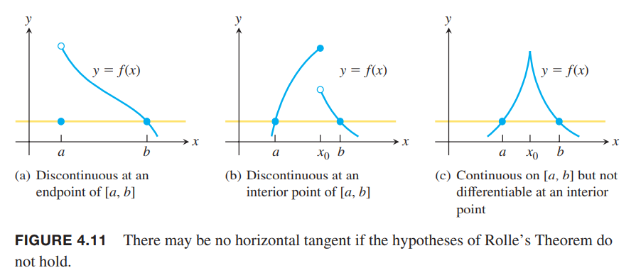
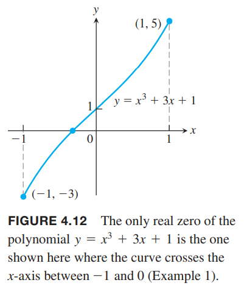

### 罗尔中值定理
如果可导函数穿过一水平线的不同两点，那么在这两点之间有一点的切线式水平的，即导数为零。如下图所示。  

**定理3 罗尔中值定理（`Rolle's Theorem`）**  
函数$y=f(x)$在区间$[a,b]$上连续在内部每点都可导，如果$f(a)=f(b)$，那么至少有一点$c\in (a,b)$，有$f'(c)=0$。

证明：定理1告诉我们闭区间$[a,b]$上一定有最大值和最小值。且只能出现在三个位置：
* 内部$f'$为零的点
* 内部$f'$不存在的点
* 端点$a, b$

根据题设，$f$在内部每点处都可导，所以排除第二条。  
如果$c\in (a,b)$处有最大值或最小值，那么根据定理2，其导数$f'(c)=0$。  
如果没有内部点有最大值或最小值，那么端点同时是最大值和最小值，但是$f(a)=f(b)$，那么说明任意一点$x\in [a, b]$都有$f(x)=f(a)$，是常值函数，那么内部各点处均有$f'(c)=0$。  
定理3的各个前提假设都是必要条件。下面是三种不满足条件的情况，不存在导数为零的内部点。  
  
罗尔中值定理和连续函数的中间值定理联合起来，可以判定方程$f(x)=0$有唯一解。

例1 证明
$$x^3+3x+1=0$$
只有一个实数解。  
证明：定义如下函数
$$f(x)=x^3+3x+1$$
由于$f(-1)=-3,f(0)=1$，中间值定理告诉我们函数在开区间$(-1,0)$上和$x$轴有交点。如下图所示。  
  
如果有两点$a,b$使得$f(x)=0$，那么存在在区间内有$x=c$使得$f'(c)=0$。对函数求导
$$f'(x)=3x^2+3>0$$
因此，没有两个点使其值为零。

### 中值定理
