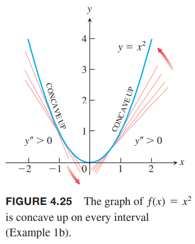

函数的一阶导会告诉我们哪里递增哪里递减，在临界点有无极值。这一节我们会看到二阶导会告诉我们可导函数是怎么弯曲的。再结合对称性和渐近线等信息，我们就可以精确的画出函数的图像。

### 凹凸性
如下图所示，$y=x^3$随$x$增加而增加，但是在$(-\infty,0),(0,\infty)$弯向不同的方向。从左边接近原点，曲线弯向右侧，并且切线在图像上方。在区间$(-\infty,0)$上曲线斜率递减。从原点向右，曲线弯向左侧，并且图像在切线上方。在区间$(0,\infty)$上曲线斜率递增。弯曲的行为定义为曲线的凸凹性（`concavity`）。  

**定义** 可导函数$y=f(x)$的图像是
1. 上凹（`concave up`）的，如果$f'$在区间$I$上递增
2. 下凹（`concave down`）的，如果$f'$在区间$I$上递减

这里的上和下指的是开口方向，上凹对应着下凸（向下凸），下凹对应着上凸。  
如果$y=f(x)$有二阶导，在一阶导函数上应用推论3，得到

**对凸凹性的二阶导测试**  
令$y=f(x)$在$I$上可二阶导，那么
1. 在$I$上$f''>0$，那么$f$在$I$上上凹
2. 在$I$上$f''<0$，那么$f$在$I$上下凹

例1  
（a）$y=x^3$在$(-\infty,0)$上下凸，此时$y''=6x<0$，在$(0,\infty)$上上凸，此时$y''=6x>0$  
（b）$y=x^2$在$(-\infty,\infty)$上上凸，因为二阶导$y''=2$始终大于零。如下图所示。  

例2 确定$y=3+\sin x$在$[0,2\pi]$上的凸凹性。  
解：一阶导$y'=\cos x$，二阶导$y''=-\cos x$。在$(0,\pi)$上，$y''<0$，所以是下凹的，在$(\pi,2\pi)$上，$y''>0$，所以是上凹的。如下图所示。  

### 
