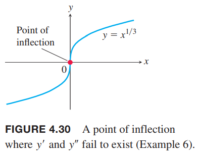

函数的一阶导会告诉我们哪里递增哪里递减，在临界点有无极值。这一节我们会看到二阶导会告诉我们可导函数是怎么弯曲的。再结合对称性和渐近线等信息，我们就可以精确的画出函数的图像。

### 凹凸性
如下图所示，$y=x^3$随$x$增加而增加，但是在$(-\infty,0),(0,\infty)$弯向不同的方向。从左边接近原点，曲线弯向右侧，并且切线在图像上方。在区间$(-\infty,0)$上曲线斜率递减。从原点向右，曲线弯向左侧，并且图像在切线上方。在区间$(0,\infty)$上曲线斜率递增。弯曲的行为定义为曲线的凸凹性（`concavity`）。  

**定义** 可导函数$y=f(x)$的图像是
1. 上凹（`concave up`）的，如果$f'$在区间$I$上递增
2. 下凹（`concave down`）的，如果$f'$在区间$I$上递减

这里的上和下指的是开口方向，上凹对应着下凸（向下凸），下凹对应着上凸。  
如果$y=f(x)$有二阶导，在一阶导函数上应用推论3，得到

**对凸凹性的二阶导测试**  
令$y=f(x)$在$I$上可二阶导，那么
1. 在$I$上$f''>0$，那么$f$在$I$上上凹
2. 在$I$上$f''<0$，那么$f$在$I$上下凹

例1  
（a）$y=x^3$在$(-\infty,0)$上下凸，此时$y''=6x<0$，在$(0,\infty)$上上凸，此时$y''=6x>0$  
（b）$y=x^2$在$(-\infty,\infty)$上上凸，因为二阶导$y''=2$始终大于零。如下图所示。  

例2 确定$y=3+\sin x$在$[0,2\pi]$上的凸凹性。  
解：一阶导$y'=\cos x$，二阶导$y''=-\sin x$。在$(0,\pi)$上，$y''<0$，所以是下凹的，在$(\pi,2\pi)$上，$y''>0$，所以是上凹的。如下图所示。  

### 拐点
例2中的曲线$y=3+\sin x$在点$(\pi,3)$改变了凸凹性。由于一阶导$y'=\cos x$对所有$x$都存在，那么在点$(\pi,3)$处的切线斜率是-1。这个点我们成为拐点（`point of inflection`）。上图可以看出图像在该点处跨过了切点，同时$x=\pi$时，二阶导$y''=-\sin x$值为零。一般地

**定义** 图像在点$(c,f(c))$上存在切线，并且凸凹性发生了变化，那么该点成为拐点。

一般地，如果二阶导在拐点存在，那么$f''(c)=0$。这是因为当$f''$在包含点$x=c$区间上改变了符号。即使不连续，如果二阶导存在的话，$f''(c)=0$仍然成立。由于该点处必须有切线，那么一阶导$f'(c)$存在或者有垂直切线。垂直切线意味着一阶导和二阶导均不存在。总结下

在拐点$(c,f(c))$处，要么$f''(c)=0$，要么$f''(c)$不存在。

例3 确定下面函数的凸凹性以及求拐点：
$$f(x)=x^3-3x^2+2$$
解：求导
$$f'(x)=3x^2-6x$$
$$f''(x)=6x-6$$
所以$x<1$时，二阶导是负数，$f$图像下凹，$x>1$时，二阶导是正数，$f$图像上凹。$x=1$时，二阶导是零，同时$(1,0)$点也是拐点。  
图像如下所示。我们不需要函数图像也可以判断处上述信息。  
  

下面的例子解释在拐点处，一阶导存在而二阶导不存在。  
例4 函数$f(x)=x^{5/3}$的图像在原点处有水平切线，因为$f'(x)=(5/3)x^{2/3}=0,x=0$，但是二阶导
$$f''(x)=\frac{10}{9}x^{-1/3}$$
在$x=0$处不存在。但是，$f''(x)<0,x<0$且$f''(x)>0,x>0$，那么二阶导在$x=0$处改变了符号，原点是拐点。图像如下所示。  

下面的例子说明即使一阶导和二阶导都存在且二阶导为零，也可以不是拐点。  
例5 曲线$y=x^4$在原点处不存在拐点。尽管二阶导$y''=12x^2$在原点处为零，但是符号没有发生改变。曲线总是上凹的。如下图所示。  

下面的例子说明拐点可以出现在垂直切线处，这里一阶导和二阶导均不存在。  
例6 图像$y=x^{1/3}$在原点处出现了拐点因为$x<0$时二阶导为正而$x>0$时二阶导为负。
$$y''=\frac{d^2}{dx^2}(x^{1/3})=\frac{d}{dx}(\frac{1}{3}x^{-2/3})=-\frac{2}{9}x^{-5/3}$$
在$x=0$处一阶导和二阶导都不存在，并且在原点处有垂直切线。如下图所示。  

4.1节例4的函数$f(x)=x^{2/3}$在$x=0$处不存在二阶导，并且由于在$x=0$处没有改变凸凹性，所以不是拐点。结合上个例子，二阶导不存在和拐点是否存在无关。如果一阶导或二阶导在某点处不存在，那么要小心的去判定函数的行为。这些点处可能是垂直切线、拐角、尖角或不连续等等。

例7 粒子沿着水平坐标轴运动，位置方程是
$$s(t)=2t^3-14t^2+22t-5,t\geq 0$$
求速度，加速度，描述运动行为。  
解：速度是
$$v(t)=s'(t)=6t^2-28t+22=2(t-1)(3t-11)$$
加速度是
$$a(t)=v'(t)=12t-28=4(3t-7)$$
当$s(t)$增加时，粒子向右运动，反之向左运动。  
一阶导$v(t)$为零的点是临界点$t=1,t=11/3$
|  |  |  |  |
|--|--|--|--|
| 区间 | $0<t<1$ | $1<t<11/3$ | $11/3<t$ |
| $v$的符号 | + | - | + |
| $s$的变化 | 增加 | 减少 | 增加 |
| 粒子的运动 | 向右 | 向左 | 向右 |

在$t=1,t=11/3$粒子短暂的静止。  
当$t=7/3$时$a(t)=0$
|  |  |  |
|--|--|--|
| 区间 | $0<t<7/3$ | $7/3<t$ |
| $a$的符号 | - | + |
| $s$的图像 | 下凹 | 上凹 |

粒子向右运动，速度越来越慢，在$t=1$时开始反向向左运动，这是因为加速度在$[0,7/3)$上向左。在$t=3$时，加速度开始反向向右，但是粒子仍旧向左运动，但是速度越来越慢。在$t=11/3$时，接着开始向右运动，由于加速度向右，那么速度越来越快。

### 对局部极值的二阶导测试
