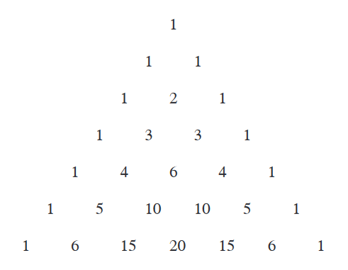

## The Binomial Theorem
**Theorem 4.1** [二项式定理(`Binomial Theorem`)] 对于所有非负整数$n$有
$$(x+y)^n=\sum_{k=0}^n\begin{pmatrix}
n\\k
\end{pmatrix}x^ky^{n-k}$$
**Proof.** 略。

**Theorem 4.2.** 对于所有正整数$n$，二项式系数$\begin{pmatrix}n\\k\end{pmatrix}$的交替和为$0$。
$$\sum_{k=0}^n(-1)^k\cdot\begin{pmatrix}
n\\k
\end{pmatrix}=0$$
**Proof.** 令$x=-1,y=1$即可。

**Theorem 4.3.** 对于所有非负整数$n$和$k$，
$$\begin{pmatrix}
n\\k
\end{pmatrix}+\begin{pmatrix}
n\\k+1
\end{pmatrix}=\begin{pmatrix}
n+1\\k+1
\end{pmatrix}$$
**Proof.** 略。

**Theorem 4.4.** 对于所有非负整数$n$，
$$2^n=\sum_{k=0}^n\begin{pmatrix}
n\\k
\end{pmatrix}$$
**Proof.** 左右两边都是$n$个元素的集合的子集个数。左边是直接计算；右边是得到$k$个元素的子集个数，再相加。  
**Proof 2.** 利用二项式定理，令$x=y=1$即可。

第一个方法是证明组合恒等式的经典方法：利用不同的方法来对同一些对象计数。

帕斯卡三角(`Pascal triangle`):  

**Theorem 4.5.** 对于所有非负整数$n$和$k$，
$$\begin{pmatrix}
k\\k
\end{pmatrix}+\begin{pmatrix}
k+1\\k
\end{pmatrix}+\begin{pmatrix}
k+2\\k
\end{pmatrix}+\cdots\begin{pmatrix}
n\\k
\end{pmatrix}=\begin{pmatrix}
n+1\\k+1
\end{pmatrix}$$
**Proof.** 右边是$n+1$个元素的集合的$k+1$个元素的子集的个数。左边也是计算子集的个数，但是是分成了$n-k+1$个部分，左边第一项是最大的元素是$k+1$的子集个数，第二项是最大元素是$k+2$的子集个数，$\begin{pmatrix}k+i\\k\end{pmatrix}$是$n+1$个元素的集合的最大值是$k+i+1$的$k+1$个元素的子集个数，其中$i\leq n-k$。  
这个定理也意味着我们从帕斯卡三角的第$k$行的最右的元素开始，然后往左下前进，到某个元素终止。路径上的元素之和等于终止元素的下一行右边那个元素。

**Theorem 4.6.** 对于所有非负整数$n$，
$$\sum_{k=1}^nk\begin{pmatrix}
n\\k
\end{pmatrix}=n2^{n-1}$$
**Proof.** 公式两边都是在从$n$个人中选择一个委员会，并选举一个主席。左边的思路是先选择$k$个人组成委员会，再从$k$个人中选择一个当选主席；右边的思路是先从$n$个人中选出一个主席，再从$n-1$个人中选出一些人和主席组成委员会。  
**Proof 2.** 利用二项式定理，令$y=1$
$$(x+1)^n=\sum_{k=0}^n\begin{pmatrix}
n\\k
\end{pmatrix}x^k$$
对$x$求导
$$n(x+1)^{n-1}=\sum_{k=1}^nk\begin{pmatrix}
n\\k
\end{pmatrix}x^{k-1}$$
再令$x=1$即可。
