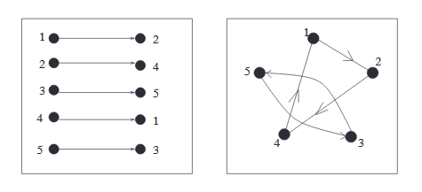

排列不仅仅可以看作不同物体排成一列，还能看作是集合$[n]$到$[n]$的函数(`functions`)。一个排列$p=p_1p_2\cdots p_n$能看作是为一个唯一的函数$p:[n]\to[n]$，其$p(i)=p_i$。

**Example 6.1.** 排列312可以看作是一个函数$f:[3]\to [3]$，其$f(1)=3,f(2)=1,f(3)=2$。

进而，我们可以把函数组合起来的方式来定义集合$[n]$上的两个排列的乘积。

**Example 6.2.** 令$f=312,g=213$。$(f\cdot g)(1)=g(f(1))=g(3)=3,(f\cdot g)(2) =g(f(2))=g(1)=2,(f\cdot g)(3)=g(f(3))=g(2) =1$。所以$fg=321$。  
**Example 6.3.** $f$和$g$定义如上例。$(g\cdot f)(1)=f(g(1))=f(2)=1,(g\cdot f)(2)=f(g(2))=f(1)=3,(g\cdot f)(3)=f(g(3))=f(3)=2$。因此$gf=132$。  
从上面两个例子我们可以看出排列的乘法不满足交换律，也就是说$fg=gf$不一定成立。

排列的乘法操作涉及到了排列群(`permutation groups`)的主题。

## Cycles in Permutations
取一个排列321564，它可以被看作是$[6]\to[6]$上的函数$g$。$g(2)=2$，2是排列$g$上的固定点(`fixed point`)。$g(1)=3,g(3)=1$，进而$g^2(1)=1,g^2(3)=3,g^3(1)=3,g^3(3)=1,\cdots$，也就是说，重复应用函数$g$，元素1和3会相互替换，不会出现其他元素。$g^2$在元素1和3上的效果和恒等排列$123\cdots n$一样，但是$g$不是这样的。对于$g$而言，1和3是$2$-cycle。类似的，$g(4)=5,g(5)=6,g(6)=4$，迭代一次，$g^2(4)=6,g^2(5)=4,g^2(6)=5$，再迭代一次，$g^3(4)=4,g^3(5)=5,g^3(6)=6$。$g^3$在元素4，5，6上和恒等排列一样，而$g$和$g^2$不满足。对于$g$而言，4，5和6是$3$-cycle。

**Lemma 6.4.** $p$是$[n]\to[n]$的一个排列，$x\in[n]$，一定存在某个正整数$i$，$1\le i\le n$，满足$p^i(x)=x$。  
**Proof.** 考虑$p(x), p^2(x), \cdots, p^n(x)$，如果某个等于$x$，证毕。如果没有，根据鸽巢原理，那么至少有两个值是相等的，不妨设$p^j(x)=p^k(x)$，两边同时应用$p^{-1}$，得到$p^{j-1}(x)=p^{k-1}(x)$，重复这个步骤$j-1$次，得到$x=p^{k-j}(x)$。

下面我们给出cycle(循环，这里都用cycle)的定义。  
**Definition 6.5.** $p$是$[n]\to[n]$的一个排列，$x\in[n]$，$i$是最小的满足$p^i(x)=x$的正整数，我们称$x,p(x), p^2(x), \cdots, p^{i-1}(x)$是排列$p$的一个$i$-cycle。

**Corollary 6.6.** 所有的排列能够分成若干个不相交的循环子集。  
**Proof.** **Lemma 6.4**展示了每个项都是某个cycle的一员，cycle的定义就说明它们不可能相交。

**Example 6.7.** 排列$321564$的循环可以分为$(31), (2), (564)$。

通过$(31), (2), (564)$可以很容的逆向构造出原始的排列。  
排列$f$分解成若干个循环是唯一的，但是同样的循环可以写成不同的形式。通常，我们把同一个循环写在同一个括号内。我们采用规范循环格式(`canonical cycle form`)来写，每个循环是最大的数字在最前面，不同循环按照首个数字进行递增排列。比如$(241)(35)$和$(53)(412)$表示相同的排列，但是其规范写法是$(412)(53)$。

将排列$f:[n]\to[n]$写做一个`list`或`linear order`，$f(1)f(2)\cdots f(n)$，也称为`one-line notation`。  
**Example 6.8.** $(412)(53)$用`one-line notation`写法可以写作24513。

下图展示了2种不同的方式来思考同一个排列。  

本节余下内容都是在集合$[n]$上的排列，简写为$n$-排列。所有$n$-排列的集合记作$S_n$。在群论中称之为对称群(`symmetric group`)。

**Theorem 6.9** $a_1,a_2,\cdots,a_n$是非负整数，且满足$\sum_{i=1}^n i\cdot a_i=n$，那么有$a_i$个长度为$i$的循环的$n$-排列的数量是
$$\frac{n!}{a_1!a_2!\cdots a_n!\cdot 1^{a_1}2^{a_2}\cdots n^{a_n}}$$
**Proof.** 将集合$[n]$写作一行，然后从左往右加括号，先构造$a_1$个1-cycle，然后构造$_2$个2-cycle，等等。这种方式构造出循环长度非递减的一个排列。  
集合$[n]$写作一行有$n!$种不同的方式。但是很多不同的$n$个数的写法会产生同一个排列。  
在长度为$i$的循环内部，不管怎么循环，对应的排列是同一个，所以重复了$i$次，有$a_i$个长度为$i$的循环，重复了$i^{a_i}$次。  
对于$a_i$个长度相同的循环，这些循环置换位置，对应的排列是同一个，所以重复了$a_i!$次。

$n$-排列$p$有$a_i$个长度为$i$的循环，那么$(a_1,a_2,\cdots,a_n)$是$p$的类型(`type`)或循环类型(`cycle type`)。**Theorem 6.9** 提供了一个公式用于计算给定类型的排列的个数。  
**Example 6.10.** 只有一个循环，也就是说对那个类型是$(0,0,\cdots,1)$，其$n$-排列的数量是$(n-1)!$。  
上面这个例子其实说的是$n$个人围着一个桌子坐，共有$(n-1)!$种不同的坐法。

**Definition 6.11.** 有$k$个循环的$n$-排列的个数称之为第一类无符号斯特林数(`signless Stirling number of the first kind`)，记作$c(n,k)$。$s(n,k)=(-1)^{n-k}c(n,k)$称之为第一类斯特林数(`Stirling number of the first kind`)。

$n>0$时，$c(n,0)=0$因为非空的排列一定会有循环。习惯上，我们设$c(0,0)=0$，$c(n,k)=0,n<k$，以和第二类斯特林数保持一致。

$c(n,k)$也满足一个简单的递归关系。  
**Theorem 6.12.** $n$和$k$是正整数且$n\ge k$，有
$$c(n,k)=c(n-1,k-1)+(n-1)c(n-1,k)$$
**Proof.** 分两种情况讨论右边等价于有$k$个循环的$n$-排列的个数。  
(1) 第$n$个元素自成一个循环，那么剩余$n-1$有$k-1$个循环即可，这是右边的第一项  
(2) 第$n$个元素不能自己形成一个环，那么需要剩余$n-1$有$k$个循环，即$c(n-1,k)$，第$n$个元素可以插入每一个循环的各个元素的后面，来组成一个新的循环，增加了$n-1$倍。

下面分析第一类斯特林数和第二类斯特林数的关系。  
**Lemma 6.13.** $n$是一个正整数，有
$$\sum_{k=0}^n c(n,k)x^k=x(x+1)\cdots (x+n-1)\tag{1}$$
**Proof.** 我们先证明$x^k$的系数也满足**Theorem 6.12.** 的递归关系，再说明其初始值和$c(n,k)$的初始值一样。  
令
$$G_n(x)=x(x+1)\cdots (x+n-1)=\sum_{k=0}^na_{n,k}x^k$$
有
$$\begin{aligned}
G_n(x)&=(x+n-1)G_{n-1}(x)\\
&=(x+n-1)\sum_{k=0}^{n-1}a_{n-1,k}x^k\\
&=\sum_{k=1}^{n}a_{n-1,k-1}x^k+(n-1)\sum_{k=0}^{n-1}a_{n-1,k}x^k
\end{aligned}$$
所以
$$\sum_{k=0}^na_{n,k}x^k=\sum_{k=1}^{n}a_{n-1,k-1}x^k+(n-1)\sum_{k=0}^{n-1}a_{n-1,k}x^k$$
多项式相等意味着对应次幂的系数相等，则
$$a_{n,k}=a_{n-1,k-1}+(n-1)a_{n-1,k}$$
这个递归关系和**Theorem 6.12.** 一样。同时，$c(0,0)=a_{0,0}=1$，且$c(n,0)=a_{n,0}=1$。

将$(1)$中的$x$替换为$-x$，并且两边同乘$(-1)^n$，得到
$$\sum_{k=0}^ns(n,k)x^k=(x)_n\tag{2}$$
从这里我们可以看出为什么定义中要包含$(-1)^{n-k}$了。  
这个公式和**Corollary 5.10.**
$$x^n=\sum_{k=0}^nS(n,k)(x)_k$$
相比有一种“反转”的感觉。  
$B=\{1,x^1,x^2,\cdots\}$是向量$V$的基，$B'=\{1,(x)_1,(x)_2,\cdots\}$也是向量$V$的基。将$S$是一个矩阵，在$(n,k)$处的值是$S(n,k)$，$s$也类似。那么$(2)$说明$s$是$B$到$B'$的转移矩阵，**Corollary 5.10.** 对应的公式说明$S$是$B'$到$B$的转移矩阵。

**Theorem 6.14.** 矩阵$S$和$s$互为逆矩阵，也就是说$Ss=sS=I$。

## Permutations with Restricted Cycle Structure
**Lemma 6.15 (Transition Lemma)** $p:[n]\to[n]$是写作规范循环格式的排列，$g(p)$是把$p$的括号去掉写作一行的排列，$g$是从$[n]$的所有排列的集合$S_n$到$S_n$的双射。

**Example 6.16.** $p=(412)(53)$，那么$g(p)=41253$。

**Proof.** 很明显，从$p$到$g(p)$是满射。反之就不太明显了。已知$g(p)$，需要证明通过加括号得到$p$且只有一种加括号的方法。  
令$q=g(p)=q_1q_2\cdots q_n$，第一个左括号在$q_1$左边，第一个右括号在哪里呢？若$i$是最小的值使得$q_1<q_i$，那么右括号在$q_i$之前；从另一个方面来看，对于$j<i$，第二个循环不能从$q_j$开始，因为规范循环格式要求每个循环的第一项是递增的。所以第一个循环只有一种方法。以此类推到所有的循环。也就是说，$q$的原像$g^{-1}(q)$是唯一的。

**Example 6.17.** 4356172的原像是(43)(5)(61)(72)。

$q$的某项比其左边的任一项都大，称为从左至右最大值(`left-to-right maxima`)。如果$q$有$t$个从左至右最大值的话，那么$g^{-1}(q)=p$有$t$个循环。值得注意的是，$q$的第一个从左至右最大值是$q_1$，最后一个从左至右最大值是元素$n$。

**Proposition 6.18.** $[n]$中两元素$i$和$j$，所有$n$-排列中恰有一半满足$i$和$j$在同一循环中。  
**Proof.** 我们可以给元素重新贴标签，将$n$和$i$对换，$n-1$和$j$对换，那么问题变成了所有$n$-排列中恰有一半满足$n$和$n-1$在同一循环中。由**Lemma 6.15**，$p$等价于$q=q_1q_2\cdots q_n$，$n$一定是最右的从左至右最大值，那么$n-1$是否和$n$同一个循环，等价于$n-1$是否在$n$的右边。$n-1$在$n$右边恰好占所有$n$-排列的一半。

下面的引理说明$i$在某个$k$循环中的可能性与$k$无关，其值是$1/n$。  
**Lemma 6.19.** $i\in [n]$，对于任意$k\in[n]$，有$(n-1)!$个排列有长度为$k$且包含$i$的循环。  
**Proof.** 同**Proposition 6.18.** 的证明，将$n$和$i$对换，不妨令$q_j=n$，包含$n$的循环长度是$n-j+1$，进而$j=n+1-k$。$n$要处于某个指定的位置，其余元素可以任意排列，所以有$(n-1)!$个排列。

**Theorem 6.9** 提供了一个公式用于计算给定类型的排列的个数。有时候我们不知道其类型，但知道一些其他信息，那么对于很多情况，我们也能计算出排列的个数。  
我们使用$\text{ODD}(m)$表示$m$-排列的循环长度都是奇数，$\text{EVEN}(m)$类似。

**Lemma 6.20.** 对所有正整数$m$，都有$|\text{ODD}(2m)|=|\text{EVEN}(2m)|$。  
**Proof.** 在两者之间建立双射。令$\pi\in\text{ODD}(2m)$，那么有$2k$个长度为奇数的循环。（$2m$是偶数，必定有偶数个奇数相加才能得到偶数）。按照规范循环格式写作$C_1,C_2,\cdots,C_{2k}$，对于所有$1\le i\le k$，将$C_{2i-1}$的最后一个元素放到$C_{2i}$的最后，得到$2k$个偶数循环。
