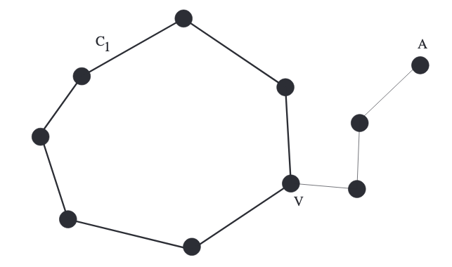

18世纪，柯尼斯堡市由一些岛组成，Pregel河的两个支流在那里汇合。如下图所示，七个桥连接着各个岛。这个单纯的事实极大的增进了近几个世纪数学的发展。1736年，有史以来最富有创造性的数学家莱昂哈德 欧拉（`Leonhard Euler`）对下述问题很感兴趣。能否从某一个岛开始走过整个城镇回到该岛，且每个桥只经过一次。  

## The Notion of Graphs. Eulerian Trails
河流和岛的形状不会影响这个问题的答案。这个问题只和这些对象的连通性相关，也就是有哪些桥和这些桥连接了哪些岛。所以地图可以简化为下图  
  
线表示桥，点表示岛。进而欧拉的问题转化为能否从一点开始，一笔画出整个图且回到该点，每条线只画（经过）一次。  
像这样的有一些点和连接这些点的线组成的图形被称为图（`graph`）。这些点被称之为图的顶点（`vertices`），线被称之为图的边（`edges`）。本书只讨论有限个点和有限个边的图。连接到一个顶点$A$的边的数量被称之为$A$的度（`degree`）。  
这个简单的模型非常有用。图论是组合学的一部分，有许多各种不同的问题可以通过这个简单模型来解决。在这本书会阐述这些不同的问题。首先，介绍一些基本术语。  
在一个图中，多条边能够连接同一对点，或者一些边能从同一个点开始并结束。如果一个图$G$没有环，没有有多条边连接同一对点，那么这个图被称为简单图（`simple graph`）。  
如果能够沿着一系列不同的边$e_1,e_2,\cdots e_k$在图上连续的“走”，那么可以称之为轨迹（`trail`）。$e_i$的终点是$e_{i+1}$的起点。连续的“走”就是之前说的笔不拿起的情况下画出这些边。`walk`和`trail`类似，但是不要求边是不同的。  
如果起点和终点是同一个顶点，那么称$e_1,e_2,\cdots e_k$是闭合轨迹（`closed trail`）。如果一个`trail`使用了图的所有边，那么就是欧拉轨迹（`Eulerian trail`）。如果一个轨迹没有接触任意一个点两次，那么称它为路径（`path`）。  
如果把两个或多个图放到一次，合并起来还是称之为图。显然，这个图没有之前的各个图好，因为存在两个点，无法找到一个路径从一个点到另一个点。这是一个很重要的差别。

**Definition 9.1.** 如果一个图$G$的任意两个顶点$x,y$之间都有一条路径连接两者，那么$G$是连通图（`connected graph`）。

如果一个图$H$的点是图$G$的点的子集，边也是其边的子集，那么$H$是$G$的子图（`subgraph`）。进一步，如果$G$中的点对$(x,y)$在$H$中并且其对应边也在$H$中，那么$H$是$G$的导出子图（`induced subgraph`）。

如果$G$不是连通的，令$k$是组成$G$的连通图的个数的最小值，那么说$G$有$k$个连通分量（`connected component`）。如果有一条路径连接$u$和$v$，那么$u$和$v$在同一个连通分量。话句话说，这些连通分量是图$G$的最大连通子图。

**Theorem 9.2.** 一个连通图$G$有闭合欧拉轨迹等价于所有点的度都是偶数。  
**Proof** 假设有闭合欧拉轨迹$W$，令$A$是非起点外的一点，访问$A$点$a$次，意味着进入$A$点$a$次并且离开$A$点$a$次，$W$是轨迹，必须是不同的边，那么$A$点至少有$2a$条边。同时，$W$包含了$G$的所有的边，$A$不能再有其他边了，所有$A$点有$2a$条边。起点$S$同时也是终点，假设访问它$t$次，那么$S$有$1+2t+1$次。所以所有点的度都是偶数。  
下面从$G$的所有点的度都是偶数入手。从任意点$S$开始，沿着边$e_1$到点$A_1$，然后再沿着$A_1$的其他边$e_2$前往其他点，直到回到起点形成一个闭合轨迹$C_1$。因为度是偶数，所以到底一个点之后肯定有新的边离开，所以不会在某个点卡主。如果$C_1=G$，证毕。如果不是，选择$C_1$上的一点$V$，要求$C_1$不包含其所有相邻的边。  
为什么总能找到这个点呢？反证法。假设$C_1$包含了其轨迹上所有点的所有邻边，$C_1$的边比$G$少，那么$C_1$没有$G$的所有点，令其中一个是点$A$。由于$G$是连通图，$A$总是可以和$C_1$相通的。假设某条和$C_1$连通的路径和$C_1$的第一个交点是$V$，那么$V$在$C_1$里但是$C_1$没有包含其所有的边。下图说明了这种情况  
  
从$G$中删除$C_1$的所有边，剩余的图的所有点的度还是偶数。从$V$开始，构造闭合轨迹$C_2$。通过结合$C_1$和$C_2$，能构成一个新的闭合轨迹。从$C_1$的起点出发到达$V$，进入$C_2$，回到$V$之后再回到$C_1$的起点。如果新的轨迹$C_1 \cup C_2$是$G$，那么证毕。否则的话，重复上述过程。由于$G$是有限图，那么最终能找到一个闭合轨迹$C_1 \cup C_2 \cup \cdots \cup C_k$。

通过这个定理可知本章开始的七桥问题的答案是否。

如果我们放宽起点和终点必须是同一点的限制，会得到如下推论。  
**Corollary 9.3.** 图$G$是连通图，$G$有从$S$开始到另外一点$T$的闭合欧拉轨迹等价于$S,T$的度是奇数而其他点的度是偶数。  
**Proof**在$S$和$T$之间增加一条边，得到的新图满足**Theorem 9.2.**。

下面也是一个关于度的奇偶定理。  
**Theorem 9.4.** 在一个没有环的图$G$中，度为奇数的点的个数是偶数。  
**Proof** 设有$e$条边，$n$个顶点的度分别是$d_1, d_2, \cdots, d_n$，那么
$$d_1+d_2+\cdots+d_n=2e$$
度是偶数的顶点的个数没影响，那么度是奇数的顶点个数必须是偶数，才能保证等式成立。

## Hamiltonian Cycles
一条闭合轨迹除起点外不访问任意顶点两次，该轨迹被称为环（`cycle`）。这意味着一个有$k$个点的环有$k$条边。如果一个环包含所有顶点，被称为哈密顿环或哈密顿回路（`Hamiltonian cycle`），类似的，包含所有顶点的路径成为哈密顿路径（`Hamiltonian path`）。  
举一个和哈密顿环相关的例子。一个聚会有很多人坐在一个圆桌上，能保证每个人都和邻近的两个人认识吗？  
这个问题等价于构建一个图，每个人是顶点，如果两人任何，则有一条边连接这两个点。问题等价于哈密顿环是否存在。  
当然是否存在哈密顿环依赖于图本身。如果有人谁都不认识，显然不存在。如果没有这样的人，但是图不是连通图，那么也不存在哈密顿环。如果所有人都互相认识，很明显，哈密顿环是存在的。  
这些都非常特殊的例子。给定任意一个图，能快速判断是否存在哈密顿环吗？  
答案是不能。
