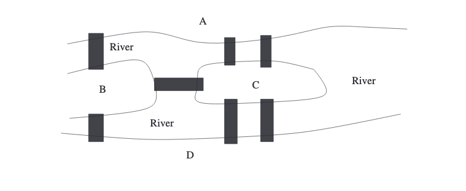
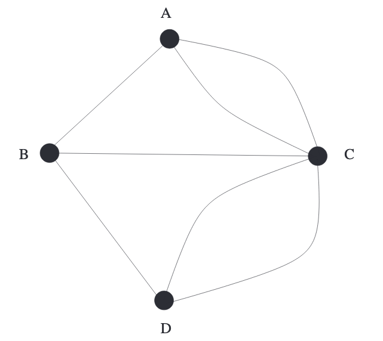

18世纪，柯尼斯堡市由一些岛组成，Pregel河的两个支流在那里汇合。如下图所示，七个桥连接着各个岛。这个单纯的事实极大的增进了近几个世纪数学的发展。1736年，有史以来最富有创造性的数学家莱昂哈德 欧拉（`Leonhard Euler`）对下述问题很感兴趣。能否从某一个岛开始走过整个城镇回到该岛，且每个桥只经过一次。  

## The Notion of Graphs. Eulerian Trails
河流和岛的形状不会影响这个问题的答案。这个问题只和这些对象的连通性相关，也就是有哪些桥和这些桥连接了哪些岛。所以地图可以简化为下图  
  
线表示桥，点表示岛。进而欧拉的问题转化为能否从一点开始，一笔画出整个图且回到该点，每条线只画（经过）一次。  
像这样的有一些点和连接这些点的线组成的图形被称为图（`graph`）。这些点被称之为图的顶点（`vertices`），线被称之为图的边（`edges`）。本书只讨论有限个点和有限个边的图。连接到一个顶点$A$的边的数量被称之为$A$的度（`degree`）。
