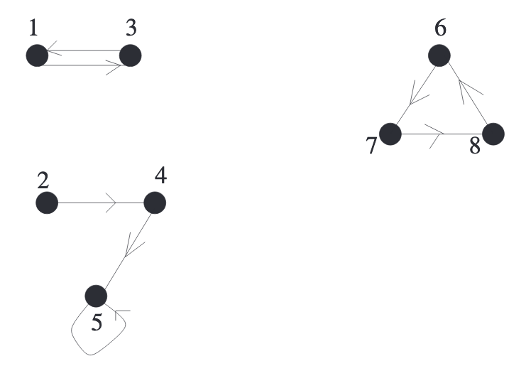
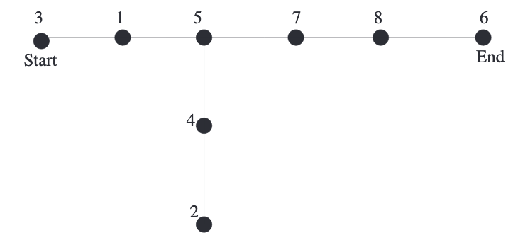

## Minimally Connected Graphs
**Theorem 10.1.** $G$是一个$n$个顶点的简单连通图，那么下面两者是等价的。  
(1) $G$是最小连通的，也就是说，去掉任意一条边之后的图不再是连通图。  
(2) $G$不包含环。  
**Proof** $(1)\Rightarrow(2)$ 假设$G$是最小连通的，但是包含环。移除环$C$的一条边$ab$得到图$G'$，$G$上任意一对顶点$xy$，由于$G$是连通的，那么有一条路径$p$连接$xy$，如果$p$不包含$ab$，那么$xy$是连通的，如果$p$包含，那么把$ab$换成$ab$相对的一段弧，那么$xy$还是连通的，也就是$G'$是连通图，和最小连通的概念矛盾。  
$(2)\Rightarrow(1)$ 证明其逆否命题成立。假设$G$不是最小连通图，那么存在一条边$AB$，移除之后的$G'$仍然是连通的。也就是说存在一条路径$P$能够从$B$到$A$，结合去掉的边$AB$，那么原图$G$存在一个环。

**Definition 10.2.** 一个简单连通图$G$满足**Theorem 10.1**的话被称之为树(`tree`)。

**Corollary 10.3.** 一个连通图$H$是树等价于每一个点对$(x,y)$都有且只有一条路径将其相连。  
**Proof.** 每一个点对$(x,y)$都有且只有一条路径将其相连，那么$H$是最小连通的。假设移除一条边$rs$之后还能得到一个连通图，那么对应于原图$H$，有两条路径连接$r$和$s$。  
反过来，如果$H$是树，但是有两条路径连接$XY$，一条是$P$，另一条是$Q$，那么$P$和$Q$的对称差(`symmetric difference`)构成了环，假设不成立。

**Theorem 10.4.** 所有$n$个点的树有$n-1$条边。相反，有$n-1$条边$n$个顶点的连通图是树。

**Lemma 10.5.** $T$是一棵$n,n\geq 2$个顶点的树，那么$T$至少有两个顶点的度是1。  
**Proof.** 令$p$是$T$中最长的路径，那么$p$的终点必然是叶子节点。反证法。若终点$a$不是叶子节点，那么$p$可以从$a$扩展出去，得到更长的路径。

**Proof.** (**Theorem 10.4**) 归纳法。$n=1$时，只有一个点，没有边，显然成立。假设对$n$个顶点的树也成立。考虑$n+1$时的情况。找个$T$的叶子节点$l$，删除$l$和其唯一的边$e$得到新的树$T'$（$T'$是连通的且无环）。新的树$T'$有$n$个顶点，那么有$n-1$条边，所以$T=T'\cup e$有$n$条边。

和自然界一样，树的集合被称之为森林(`forest`)。森林是每个连通分量都是树的图。

**Proposition 10.6.** 森林$F$有$n$个顶点和$k$个连通分量，那么有$n-k$条边。  
**Proof.** 对于每个连通分量而言，顶点都比边多一个，总共多$k$个。

有$n$个顶点的树有多少种呢？和上一章一样，有两种方式解释。一种是不区分顶点，那么下图两棵树是一样的；一种是区分顶点的，这种情况是对集合$[n]$组成的顶点计算树的数目。在后者的情况下，下图两棵树是不一样的。  
  
集合$[1]$上有一种树，集合$[2]$上也是一种树，集合$[3]$上有三种，集合$[4]$上有16种。通过这几个数字，可以归纳出对于集合$[n]$而言，有$n^{n-2}$种树。列举的数字有点少，这个看似优雅结论是正确的吗？令人敬畏的“小数定律(`Law of Small Numbers`)”说的是如果知道一个序列的很少的一些项，总能总结出一个漂亮的公式，但是往往是错误的。然而，这次是个例外。

**Theorem 10.7 凯莱公式(`Cayley's formula`).** 对于任意正整数$n$，集合$[n]$上所有树的个数是$A_n=n^{n-2}$。  
**Proof** 对于$A_n$个$[n]$上的每棵树取两个点，定义为起点和终点，两者可以是同一个，当然也可以不是。这种树称之为双根树(`doubly rooted trees`)。要证明有$n^n$个这种树。  
方法是找到一个从从$[n]$到$[n]$的所有的函数到$[n]$上的双根树的双射。  
令$f$是从$[n]$到$[n]$的函数。$C\subseteq [n]$是$f$作用下的环的元素集合，也就是说存在某个正整数$i$有$f^i(x)=x$。令$C=\{c_1<c_2<\cdots <c_k\}, d_i=f(c_i)$，将$d_1,d_2,\cdots,d_k$依次写下组成$k$个顶点的线，且令$d_1,d_k$分别为起点和终点。  
如果$j\in[n],j\notin C$，那么将点$j$连接到点$f(j)$上。通过这些操作，得到了一棵树。通过起点-终点这条线连接所有的点，同时无环，因为环对应那条线。同时，这棵树是双根树，因为标记了起点和终点。  
反方向。用起点-终点这条路径来构建环对应的$f$。不在路径上的点，和上述反向操作即可。

**Example 10.8.** 令$n=8;f:[n]\rightarrow[n]$，有$f(1)=3,f(2)=4,f(3)=1,f(4)=5,f(5)=5,f(6)=7,f(7)=8,f(8)=6$。$f$如下图所示：  
  
函数$f$制造了三个环$(1,3)(5),(6,7,8)$，所以$C=\{1,3,5,6,7,8\}$，那么$d_1=3,d_2=1,d_3=5,d_4=7,d_5=8,d_6=6$，那么起点-终点线上的点分别是$3,1,5,7,8,6$。由于$f(2)=4,f(4)=5$，所以把点2连接到点4上，点4连接到点5上。最终构成了下图：  
  

和双根树类似的，有根树(`rooted trees`)可以定义为有一个顶点被称之为根的树。集合$[n]$上的不同有根树的数量是$n^{n-1}$。有根森林(`rooted forest`)是各个连通分量都是有根树的森林。

**Corollary 10.9.** 对于所有正整数$n$，集合$[n]$上不同有根森林的数目是$(n+1)^{n-1}$。  
**Proof.** 将有根树都连接到点$n+1$上。这是一个集合$[n]$上的有根森林到任意一颗$[n+1]$树的双射。反向的，将点$n+1$的相邻点都设为根，然后去掉点$n+1$和它们相连的边，得到若干个有根树，构成了$[n]$上的某个有根森林。从**Theorem 10.7**得到$[n+1]$上不同的树的数量是$(n+1)^{n-1}$。

## Minimum-weight Spanning Trees.  Kruskal’s GreedyAlgorithm
