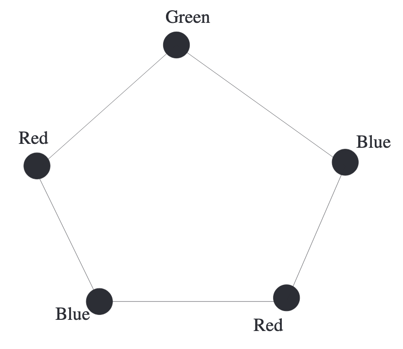
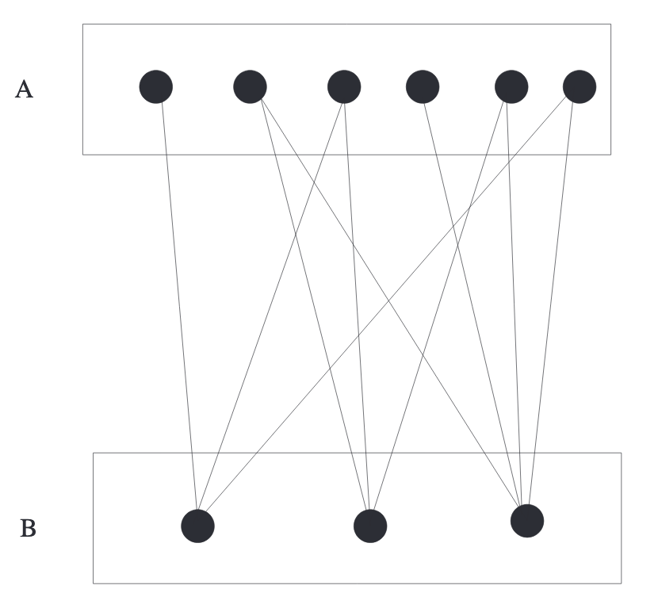
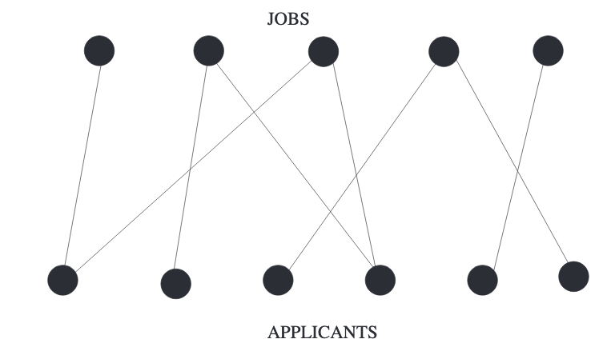
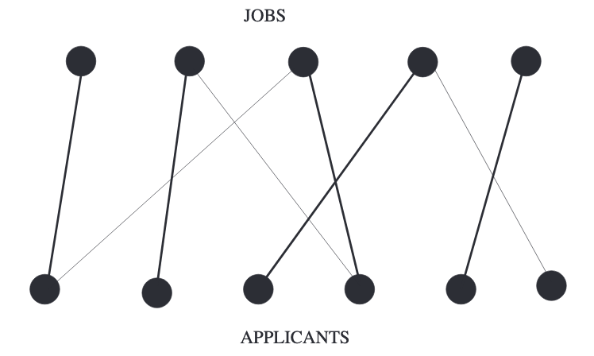

## Introduction
一个移动网络运营商提供4种不同频率的服务。现在要去扩展业务，在选定的十个地方建立基站。两个频率相同的基站距离必须大于50公里。给定这些信息，存在一种合适的分配方式吗？  
现在需要转化成数学问题。基站的位置是顶点，两点之间右边意味着这两点之间的距离不大于50公里。  
但是频率这个信息如何表示呢？染色。我们分配不同的颜色给各个顶点。比如频率1是红色，频率2是绿色等等。  
下面这个命题是这个问题的数学表述。

**Proposition 11.1.** 令$C$是十个塔的集合，$G$是如上描述的图。能够安排四种不同的频率的方式等价于使用四种颜色对$G$染色且没有相邻点是同色的。

**Definition 11.2.** 一个图$H$的色数(`chromatic number`)$\chi(H)$表示最小的整数$k$，满足如下条件：图$H$能够被$k$种颜色染色且相邻顶点一定是不同颜色。

图的顶点的着色，其中相邻的顶点具有不同的颜色，称为适当顶点着色(`proper vertex coloring`)，或适当着色(`proper coloring`)。  
如果一个图的顶点能够被$k$种颜色着色且没有相同颜色的邻接点，称为可$k$着色(`k-colorable`)。

**Example 11.3.** 五边形的色数是3，两种是不行的。如下图所示。  

## Bipartite Graphs
$k$着色问题的最重要的特例是$k=2$。这个无处不在的特例有一个属于自己的名字。

**Definition 11.4.** 可2着色的图称为二分图(`bipartite`)。$G$存在互不相连的两个部分$A,B$，$G$的每一条边都是连接$A$的一点和$B$的一点。

下图是典型的二分图，注意，在同色的类内部是没有边的。  

所有的树是二分图，从根开始，比如染成红色，邻接点染成绿色，再接着的邻接点染成红色，依次下去。正方形、六边形、八边形等也是二分图。  
显然，三角形不是二分图，一个点染成红色，一个点染成绿色，第三个点必然和其中一个颜色相同。进而，如果一个图包含三角形，那么肯定不是二分图。  
不包含三角形就是二分图了吗？五边形是一个很好地反例。进而，有长度是奇数的环的图，都不是二分图。  
下面的定理是上述的概括。

**Theorem 11.5.** 图$G$是二分图，当且仅当不包含长度是奇数的环。  
**Proof.** 图$G$是二分图，那么不包含长度是奇数的环，这个容易证明。反证法。假设有环$A_1A_2\cdots A_{2m+1}$。用红色和蓝色染色。不失一般性地用红色染第一点，那个$A_2$必须是蓝色，$A_3$是红色，依次，$A_{2m+1}$是红色，但是$A_1A_{2m+1}$是一条边，两个顶点必须是不同颜色。  
现在证明另外一个方向。图$G$不包含长度是奇数的环，那么$G$是二分图。从某一个点$V$开始，染色成蓝色，对于其他某点$W$，如果$W$到$V$的最短路径是奇数，染成红色，如果是偶数，染成蓝色，这样是符合题意的染色方式。假定$P$和$Q$是同色的，同时有一条边相连。令$p,q$分别是两点到$V$的最短路径，由于这两点同色，那么$p$和$q$的长度同为奇数或者同为偶数，加上边$PQ$，构成了长度为$p+q+1$的环，由于$p,q$同奇偶，那么环的长度是奇数，与前提假设矛盾，所以不存在这样的点$P,Q$，所以$G$是二分图。

$n$个顶点的简单图$G$是二分图，能有多少条边呢？这里想要求的是上限。树有$n-1$条边，那么答案线性于$n$，或者是$n^\alpha,1<\alpha<2$，或者是$\begin{pmatrix}n\\2\end{pmatrix}$的若干分之一？下面的定理给出了答案，边数更接近图的边的最大值。  
**Theorem 11.6.** 图$G$是$n$个顶点的简单二分图。如果$n$是偶数，那么最多有$n^2/4$条边；$n$是奇数，最多有$(n^2-1)/4$条边。  
**Proof** 令$a,b$是两种颜色的点数，那么边数最大值是$ab=a(n-a)$，那么这个问题转换成了求解二次函数的最大值问题。

在上述证明中，构造了一个非常重要的二分图种类，完全二分图(`complete bipartite graphs`)。如果完全二分图的两种点数分别是$a,b$，记作$K_{a,b}$。  
令$H$是一个$2m$个顶点的简单图$H$，如果$H$有$m^2$条边，那么$H$可能是一个二分图，因为它可能是$K_{m,m}$。如果$H$有$m^2+1$条边，那么根据**Theorem 11.6**它不是二分图，且有一个长度是奇数的环。下面的引理是一个更强的命题。

**Lemma 11.7.** 令$H$是$2m,m\geq 2$个顶点的简单图，并且至少有$m^2+1$条边，那么$H$包含三角形。  
**Proof.** 对$m$进行递归来证明。如果$m=2$，那么$H$是$K_4$的有至少五条边的子图，根据上面的定理，$H$必然有一个长度是奇数的环，又因为只有4个点，所以环的长度是3。  
$F,G$是图$H$两个相连的点。如果两者的度之和大于$2m$，那么有公共顶点$T$，那么$TFG$组成了一个三角形。如果度之和最大是$2m$，删除这两点之后，度最多会减少$2m-1$（$F,G$之间度算了两次）。删除后，得到一个顶点数是$2m-2$的图，至少有$m^2+1-(2m-1)=m^2-2m+2=(m-1)^2+1$条边，由递归可知这个删除了两个点的图包含三角。

下面要给出一个更强的定理。  
**Theorem 11.8.** 令$H$是$2m,m\geq 2$个顶点的简单图，并且至少有$m^2+1$条边，那么$H$包含$m$个三角形。  
如果$H$有$m^2$条边，可以是完全二分图，一个环都没有，但是只要再加上一条边，就会出现$m$个三角形！树不是这样的，$m$个顶点的树有$m-1$条边，再加一条边会形成一个长度不定的环（取决于树和新加的边）。  
**Proof.** 假定只有$m^2+1$条边。  
$m=2$时，$K_4$去掉一条边，很显然，有两个三角形。  
假设对所有小于$m$的情况都成立。现在考虑$m$就好。**Lemma 11.7**是说有一个三角形$ABC$了，还要找到剩下的$m-1$个三角形。  
基于除$ABC$之外的点连接到三角形$ABC$的点的边数分成三类讨论。先证明如果边数是$2m-3+x$条边，那么有$x$个三角形。如果外部顶点(`outside vertex`)和$ABC$任意两个顶点相连，就会形成一个三角形。有$2m-3$个外部顶点，根据鸽巢原理，则有$x$个三角形。  
后续证明主要思路是如果很多边和$ABC$相连，那么会产生会多三角形，另一方面，如果边很少的话，那么这些点之间会有很多三角形。  
(1) $x\geq m-1$，那么就找到了$m-1$个三角形。  
(2) $1\leq x<m$，那么$ABC$和外部点的边最多是$2m-3+m-2=3m-5$。由于$ABC$包含三条边，那么其他$2m-3$个顶点组成的子图$R$至少有$m^2+1-(3m-5)-3=m^2-3m+3=(m-1)(m-2)+1$条边。再去掉一个度最少的点，形成的$2m-4$个顶点的子图$R'$的边大于
$$(m-1)(m-2)\frac{2m-4}{2m-3}=(m-2)^2\frac{2m-2}{2m-3}>(m-2)^2$$
$R'$有$2(m-2)$个顶点，至少有$(m-2)^2+1$条边，根据递归假设，$R'$有$m-2$个三角形，加上$x\geq 1$的至少一个三角形，找到了剩余的$m-1$个三角形。  
(3) $x\leq 0$，也就是$ABC$和外部顶点的边最多$2m-3$条；最少有一条，否则子图$R$有$m^2-2$条边，和$ABC$任意一点构成的图有$m^2-2\leq (m-1)^2+1$条边，$2(m-1)$个顶点，根据递归假设，$m-1$个三角形。那么$R$内部的边数最少是$m^2+1-(2m-3)-3=(m-1)^2$，加上连接到$ABC$的某条边和对应顶点构成了$2m-2$个顶点和$(m-1)^2+1$条边的图，这个图有$m-1$个三角形。

## Matchings in Bipartite Graphs
二分图在生活中有很多应用。考虑$m$个开放的职位和$n$个候选人。定义一个$m+n$个顶点的图$G$，前$m$个顶点表示职位，后$n$个顶点表示候选人。当且仅当一个候选人申请了某个职位且符合要求(`qualified`)，那么有一条边连接这两个顶点。$G$显然是一个二分图，因为所有的边都是连接前$m$个顶点和后$n$个顶点，而每个集合内部没有边。如下图所示。  
  
整个招聘过程就是双方匹配的过程。如果职位$A$招聘了候选人$a$，将边$Aa$加粗，等等。随着招聘的进行，有越来越多的边被加粗，但是在整个过程中，加粗的边都是不相交顶点的边(`vertex-disjoint edges`)组成，因为没有一个能能被两个职位录取，反过来，一个职位也不能招聘两个人。  
如果招聘过程结束，$m$个职位都被填满了，那么会有$m$条粗体的边。如果少于$m$个职位招聘到了合适的候选人，说明找不到合格的候选人，那么没有$m$条粗体的边，不过它们都是不相交顶点的边。

**Proposition 11.9.** 令$S$是这个招聘问题，$m$个开放职位和$n$个候选人。能够填充满$m$个职位等价于能在上述的图$G$中找到$m$条顶点不相交的边。

下图展示了某种可能的最后结果。  

**Definition 11.10.** 令$G$是任意一个图，令$S$是$G$的边的集合，且没有两条边有共同顶点。$S$是图$G$的匹配(`matching`)。如果图$G$的每个顶点都被$S$的边覆盖，那么称为完美匹配(`perfect matching`)。  
匹配也被称为边的独立集(`independent set of edges`)。上述定义不要求$G$是二分图。不过后续讨论都是基于二分图的。

**Definition 11.11.** 令$G=(X, Y)$是一个二分图。当$S$是$G$的匹配且覆盖$X$的所有点时，$S$是$X$到$Y$的完美匹配。  
如果不关心$S$只关心$X$到$Y$的完美匹配，称$X$有一个到$Y$的匹配，或$X$能被匹配到$Y$。

### Bipartite Graphs with Perfect Matchings
$G=(X, Y)$是一个二分图。有两个问题，$X$有到$Y$的完美匹配吗（对应前面的例子就是职位都填满了）？如何找到最大匹配？  
先考虑第一个问题。$|X|\leq |Y|$是一个必要条件。如果$X$中的两个点$a,b$的度都是1，但是都和$y\in Y$相连，那么显然不存在完美匹配。  
泛化上述的条件。如果$T\subseteq X$是$X$的点的子集，令$N(T)$是$T$的所有邻接点。$y\in Y$是$N(T)$的元素，当且仅当存在某个点$x\in T$，$xy$是一条边。邻接点集合$N(T)$与匹配有关，因为如果只想将$T$匹配到$Y$，那么可以将注意力集中在二分图$(T, N(T))$上。  
如果上下文有歧义，使用符号$N_G(T)$来表示。

**Proposition 11.12.** 令$G=(X, Y)$是一个二分图。$X$能被完美匹配到$Y$，当且就当对于所有的$T\subseteq X$都满足$|T|\leq |N(T)|$。
