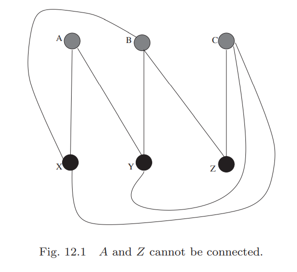

## Euler's Theorem for Planar Graphs
考虑三个房子和三个水井，假设三个房子住的人互相看不上，那么我们需要修九条连通三个房子和三个水井，要求九个路线不交叉以避免他们遇见。  
图12.1是一个失败的尝试。  
  
这个问题是无解的，后面会给出证明。  
这一章会聚焦于新的问题：边不相交。

**Definition 12.1.** 图$G$能够被画在平面上且任意两条边都不相交，那么$G$被称为平面图(`planar graph`)。  
图$G$的边把平面划分成若干区域，这些区域是$G$的面(`face`)。图12.2是一个例子。  
  
平面图的面的个数和图的顶点、边的数量一样重要。下面的定理表明了三者的关系。  
**Theorem 12.2 (Euler's Theorem on Planar graphs).** 图$G$是一个有$V$个顶点、$E$条边、$F$个面的连通平面图，那么$V+F=E+2$。  
**Proof.** 基于$E$递归。$E=1$时，$G$要么是一个只有一条边的树，那么$V=2,F=1$；要么是一个点加一个环的图，那么$V=1,F=2$，都有$V+F=E+2$。  
假设对于所有有$E-1$条边的连通平面图都成立，考虑有$E$条边的图$G$。分两种情况讨论。  
1) 移除$G$的一条边$e$新生成的图$G'$仍旧连通，那么$e$在一个环上。环将$G$分割称两个面，但是去掉边$e$后，两个面变成了一个面。所以$G'$有$E-1$条边、$V$个顶点和$F-1$个面。由递归假设知$V+F-1=E-1+2$，所以$V+F=E+2$。  
2) 如果不存在上面所说的边$e$，那么$G$无环，即一棵树。由**Theorem 10.4**有$V=E+1$，又因为只有一个面$F=1$，所以命题成立。

