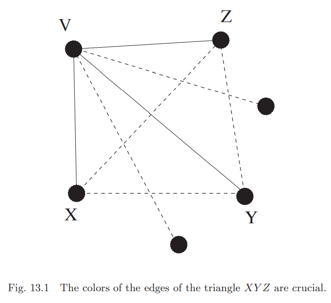

这一章对边染色而不是顶点染色。这将引入一系列完全不同的问题。这一章也会第一次涉及无限图(`infinite graphs`)。

## Ramsey Theory for Finite Graphs
**Example 13.1.** 六个人在酒店的大堂。求证其中有三个人互相认识或者其中有三个人互不认识。  
**Solution.** $K_6$，每个顶点代表一个人。如果$A,B$认识，那么将边$AB$染成红色，否则染成蓝色。对15条边依次处理完。求证的内容等价于找到一个单色的三角形。  
取任意顶点$V$，因为$V$的度是5，那么至少有三个邻接顶点同色的。不失一般性，令三个顶点是$X,Y,Z$，边的颜色是红色。下图红色是黑色的线，蓝色是虚线。  
  
如果三角形$XYZ$有一边是红色，那么这两个点和点$V$的三角形就是同色三角形；否则$XYZ$三角形是蓝色的。

这是`Ramsey theory`的第一个例子。`Frank Plumpton Ramsey`是第一个研究该领域的人。  
这个例子的条件非常严苛，如果是五个人，那么命题不成立。对于$K_5$，外围的五角星染成红色，对角线组成的五角星染成蓝色，那么任意一个三角形都不是单色的。  
将例子中的$K_6$替换成普通的六个顶点的图$H$，构造方式相同，不同的是$H$的边只有$K_6$的红色边，而$H$的补集是蓝色的边。一个完全子图称为团(`clique`)。那么**Example 13.1**可以转化成：如果$H$是六个顶点的简单图，那么$H$或者$H$的补集至少有一个包含一个大小为三的团。  
**Example 13.1**的证明也强烈依赖于参数三。如果把三替换成更大的数字会怎么样呢？如果有充分多的人，那么一定有$k$个人互相认识或者互相不认识吗？

**Theorem 13.2 (Ramsey theorem for graphs).**
