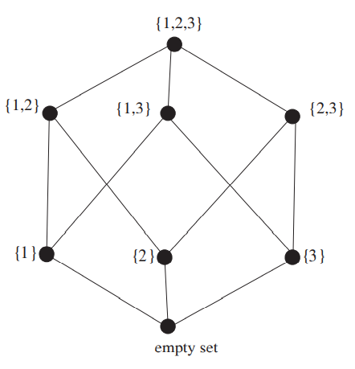

##  The Notion of Partially Ordered Set
假设你正在看航空公司的机票。除了机票的价格，时间也是需要考虑的因素。如果$X$航空公司提供的机票相较于$Y$航空公司的机票而言，既便宜时间又短，那么显然$X$是更好的选择。  
假设有如下五个航空公司的票可以选择
```
A 600 dollars, 9 hours 20 minutes,
B 650 dollars, 8 hours 40 minutes,
C 550 dollars, 9 hours 10 minutes,
D 575 dollars, 8 hours 20 minutes,
E 660 dollars, 9 hours 5 minutes.
```
$D$相比$E$是更好的选择，但是$C$和$D$之间就没有那么容易比较了。我们可以把整个场景表示成如下的图  
  
如果$X$比$Y$好，那么$X$在$Y$的上方，且有一条从$X$到$Y$的路径。  
这是一个偏序集合(`partially ordered set`)的例子。从名字我们可以看出，集合中的部分元素，不必是全部元素，可以相互比较。

**Definition 16.1.** 令$P$是一个集合，$\leq$是$P$上的关系，那么
(a) $\leq$是自反的，$x\leq x$  
(b) $\leq$是传递的，如果$x\leq y, y\leq z$，那么$x\leq z$  
(c) $\leq$是反对称的，如果$x\leq y, y\leq x$，那么$x=y$  
那么我们称$P_\leq =(P,\leq)$是偏序集，$\leq$是$P$上的偏序。  
如果在没有歧异的情况下，将$P_\leq$简写作$P$。如果$P$中的两个元素$x,y$，$x\leq y, y\leq$都不满足，我们称$x,y$是不可比较的。

**Example 16.2.** 令$P$是$[n]$的所有子集的集合。如果$A\subseteq B$，$A\leq B$。那么$P_\leq$是偏序集。记作$B_n$，称为$n$阶布尔代数。  
**Example 16.3.** 向量空间的所有子空间的集合，按照 containment（不确定应该翻译成啥） 排序，也是一个偏序集。  
**Example 16.4.** 令$P$是所有正整数的集合，如果$x$是$y$的因数，$x\leq y$，那么$P_\leq$是偏序集。  
**Example 16.5.** 令$P=\bold{R}$，即实数集。令$\leq$就是实数的比较运算。$P_\leq$是偏序集，且没有两个元素之间是不可比较的。我们称$R$是全序(`total order`)。  
**Example 16.6.** 令$P$是$[n]$所有分割的集合。令$\alpha,\beta$是$P$的两个元素，如果$\beta$的每一块都能由$\alpha$的一些集合取并集得到，$\alpha\leq\beta$。比如$n=6$时，$\{1,4\}\{2,3\}\{5\}\{6\}\leq\{1,4,6\}\{2,3,5\}$。$P_\leq$是偏序集，记作$\Pi_n$，称作`refinement order`。

如果$x\in P$，没有$y\in P$使得$x\leq y$，我们称$x$是极大值(`maximal element`)，如果对于所有的$z\in P$，都有$z\leq x$，那么$x$是最大值(`maximum`)。极小值(`minimal element`)和最小值(`minimum`)类似的定义。所有的偏序集都有极大值和极小值，但是不一定有最大值和最小值。比如图`16.1`就没有最大值和最小值。如果存在最小值，记作$\hat{0}$，如果存在最大值，记作$\hat{1}$。  
如果$x< y$，且不存在$z\in P$，使得$x<z<y$，称$y$覆盖(`cover`)$x$。这个概念可以帮助定义哈斯图(`Hasse diagrams`)，如前面的示例图。  
$P$的哈斯图是用顶点表示元素，如果$x<y$，那么$y$在$x$的上面。如果$y$覆盖$x$，$x,y$之间有一条边。如果要精确表示“上面”这个概念，可以使用有向图来表示。  
**Example 16.7.** $B_3$如下图所示  


