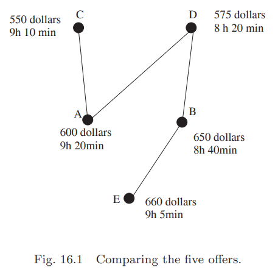

##  The Notion of Partially Ordered Set
假设你正在看航空公司的机票。除了机票的价格，时间也是需要考虑的因素。如果$X$航空公司提供的机票相较于$Y$航空公司的机票而言，既便宜时间又短，那么显然$X$是更好的选择。  
假设有如下五个航空公司的票可以选择
```
A 600 dollars, 9 hours 20 minutes,
B 650 dollars, 8 hours 40 minutes,
C 550 dollars, 9 hours 10 minutes,
D 575 dollars, 8 hours 20 minutes,
E 660 dollars, 9 hours 5 minutes.
```
$D$相比$E$是更好的选择，但是$C$和$D$之间就没有那么容易比较了。我们可以把整个场景表示成如下的图  
  
如果$X$比$Y$好，那么$X$在$Y$的上方，且有一条从$X$到$Y$的路径。  
这是一个偏序集合(`partially ordered set`)的例子。从名字我们可以看出，集合中的部分元素，不必是全部元素，可以相互比较。

**Definition 16.1.** 令$P$是一个集合，$\leq$是$P$上的关系，那么
(a) $\leq$是自反的，$x\leq x$  
(b) $\leq$是传递的，如果$x\leq y, y\leq z$，那么$x\leq z$  
(c) $\leq$是反对称的，如果$x\leq y, y\leq x$，那么$x=y$  
那么我们称$P_\leq =(P,\leq)$是偏序集，$\leq$是$P$上的偏序。  
如果在没有歧异的情况下，将$P_\leq$简写作$P$。如果$P$中的两个元素$x,y$，$x\leq y, y\leq$都不满足，我们称$x,y$是不可比较的。
