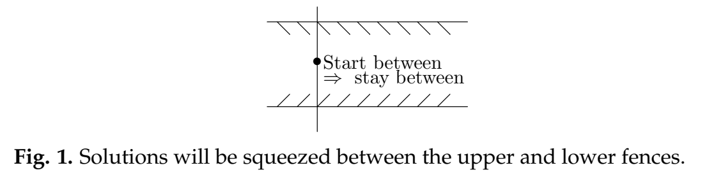

In the video on the Isoclines applet we studied some of the features of the long-term behavior of the integral curves; among others, the terms fence, funnel and separatrix were introduced.  
Fences and funnels are used to find out for certain where trajectories go at scales you can't see: small scales (where the picture is too small to decide on crossings) and the largest scales (off the screen) that are relevant to long-term behavior. Let us start by defining what a fence is.

### Fences
A lower fence for the equation $y' = f(x, y)$ is a curve that 'blocks' an integral curve from crossing from above. To find such a fence look for a curve so that all the direction field elements along the curve point up from it. The figure below shows two curves with the direction field sketched along them. The lower curve is a lower fence. Since any integral curve crossing the fence must cross tangent to the slope field it cannot cross it from above.  
Likewise an **upper fence** is a curve that blocks integral curves from crossing from below.  
  
Technically a lower fence is a curve $y = L(x)$ such that $L'(x) < f(x, L(x))$. (This may look difficult, but it just says the slope of the curve is always less than the slope of the direction field at each point.)  
**Remark 1.** Fences needn't be defined for all $x$; for instance, they could be defined only on an interval. The best sort of fences for understanding long-term behavior are defined for all $x \geq c$, for a fairly small constant $c$.  
**Remark 2.** Since integral curves can't cross an integral curve itself is both an upper and a lower fence.  
**Remark 3.** Of course, there are many ways of constructing pieces of fences. Two of the most useful are using pieces of isoclines and using straight line segments.  
**Example.** In the isoclines applet video we found fences for the equation
$$y' = y^2 - x$$
Here is a screenshot showing the isoclines $m = 0$ and $m = -1$ and some integral curves. (The isoclines are the yellow, sideways pointing parabolas.)  
  
Notice that the bottom half of the isocline $m = 0$ is a lower fence and for $x$ large enough the bottom half of the isocline $m = -1$ is an upper fence.  
Notice the bottom half of the isocline $m = -1$ becomes an upper fence only for $x$ is large enough. If you look carefully you'll see one of the integral curves crossing it from above near $x = 1$.

### Funnels

### Separatrices