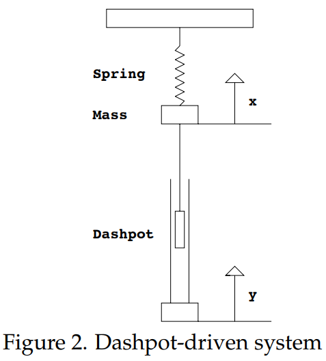

Now suppose instead that we fix the top of the spring and drive the system by moving the bottom of the dashpot instead.

Suppose that the position of the bottom of the dashpot is given by $y(t)$ and the position of the mass is given by $x(t)$, arranged so that $x = 0$ when the spring is relaxed. Then the force on the mass is given by
$$mx''=-kx+b\frac{d}{dt}(y-x)$$
since the force exerted by a dashpot is supposed to be proportional to the speed of the piston moving through it. This can be rewritten as
$$mx''+bx'+kx=by'\tag{1}$$

We will consider $x$ as the system response, and again on physical grounds we specify as the input signal the position $y$ of the back end of the dashpot. Note that the *derivative* of the input signal (multiplied by $b$) occurs on the right hand side of the equation.

Again we suppose that the input signal is of sinusoidal form
$$y=B_1\cos \omega t$$
We will now work out the frequency response analysis of this problem.  
First, $y=B_1\cos \omega t \Rightarrow y'=-\omega B_1\sin \omega t$, so our equation is
$$mx''+bx'+kx=-b\omega B_1\sin \omega t\tag{2}$$
We know that the periodic system response will be sinusoidal, and as usual we choose the amplitude-phase form with the cosine function
$$x_p=A\cos (\omega t - \phi)$$
Since $y=B_1\cos \omega t$ was chosen as the input, the gain $g$ is given by $g=\frac{A}{B_1}$.

As usual, we compute the gain and phase lag $\phi$ by making a complex replacement.

Instead we will go back to equation $(1)$ and complexify before taking the derivative of the right-hand-side. Our input $y=B_1\cos \omega t$ becomes $\widetilde{y} = B_1e^{i\omega t}$ and the DE becomes
$$mz''+bz'+kz=i\omega bB_1e^{i\omega t}\tag{3}$$

Since $y = Re(\widetilde{y})$ we have $x = Re(z)$; that is, the sinusoidal system response $x_p$ of $(2)$ is the real part of the exponential system response $z_p$ of $(3)$. The
Exponential Response Formula gives
$$z_p=\frac{i\omega bB_1}{p(i\omega)}e^{i\omega t}$$
where
$$p(s)=ms^2+bs+k$$
is the characteristic polynomial.

The complex gain (scale factor that multiplies the input signal to get the output signal) is
$$\widetilde{g}(\omega)=\frac{i\omega b}{p(i\omega)}$$
Thus,
$$z_p=B_1\widetilde{g}(\omega)e^{i\omega t}$$

We can write $\widetilde{g} = \lvert\widetilde{g}\rvert e^{-i\phi}$, where $\phi = -Arg(\widetilde{g})$. (We use the minus sign so $\phi$ will come out as the phase lag.) Substitute this expression into the formula for $z_p$ to get
$$z_p = B_1\lvert\widetilde{g}\rvert e^{i(\omega t-\phi)}$$
Taking the real part we have
$$x_p = B_1\lvert\widetilde{g}\rvert \cos(\omega t-\phi)$$

All that’s left is to compute the gain $g = \lvert\widetilde{g}\rvert$ and the phase lag  $\phi = -Arg(\widetilde{g})$. We have
$$p(i\omega)=m(i\omega)^2+bi\omega+k=(k-m\omega^2)+bi\omega$$
so
$$\widetilde{g}(\omega)=\frac{i\omega b}{p(i\omega)}=\frac{i\omega b}{(k-m\omega^2)+bi\omega}\tag{4}$$
This gives
$$g(\omega)=\lvert\widetilde{g}\rvert=\frac{\omega b}{\lvert p(i\omega)\rvert }=\frac{\omega b}{\sqrt{(k-m\omega^2)^2+b^2\omega^2}}$$
In computing the phase $\phi$ we have to be careful not to forget the factor of $i$ in the numerator of $\widetilde{g}$. After a little algebra we get
$$\phi(\omega)=-Arg(\widetilde{g})=tan^{-1}(-(k-m\omega^2)/(b\omega))$$
As with the system driven through the spring, we try to find the input frequency $\omega=\omega_r$ which gives the largest system response. In this case we can find $\omega_r$ without any calculus by using the following shortcut: divide the numerator and denominator in $(4)$ by $bi\omega$ and rearrange to get
$$\widetilde{g}=\frac{1}{1+(k-m\omega^2)/(i\omega b)}=\frac{1}{1-i(k-m\omega^2)/(\omega b)}$$
Now the gain $g = \lvert \widetilde{g} \rvert$ can be written as
$$g=\frac{1}{\sqrt{1+(k-m\omega^2)^2/(\omega b)^2}}$$
Because squares are always positive, this is clearly largest when the term $k-m\omega^2 = 0$. At this point $g = 1$ and $\omega_r = \sqrt{k/m} = \omega_0$, i.e. the resonant frequency is the natural frequency.

Since $\widetilde{g}(\omega_0)=1$, we also see that the phase lag $\phi=Arg(widetilde{g})$ is 0 at $\omega_r$
Thus the input and output sinusoids are in phase at resonance.

We have found interesting and rather surprising results for this dashpot-driven mechanical system, namely, that the resonant frequency occurs at the system’s natural undamped frequency $\omega_0$; that this resonance is independent of the damping coefficient $b$; and that the maximum gain which can be obtained is $g = 1$. We can contrast this with the spring-side driven system worked out in the previous note, where the resonant frequency certainly did depend on the damping coefficient. In fact, there was no resonance at all if the system is too heavily damped. In addition, the gain could, in principle, be arbitarily large.

Comparing these two mechanical systems side-by-side, we can see the importance of the choice of the specification for the input in terms of understanding the resulting behavior of the physical system. In both cases the right-hand side of the DE is a sinusoidal function of the form $B\cos \omega t$ or $B\sin \omega t$, and the resulting mathematical formulas are essentially the same. The key difference lies in the dependence of the constant $B$ on either the system parameters $m, b, k$ and/or the input frequency $\omega$. It is in fact the dependence of $B$ on $\omega$ and $b$ in the dashpot-driven case that results in the radically different result for the resonant input frequency $\omega_r$.
