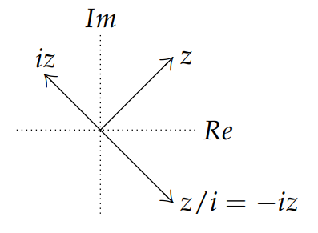

### Simple Complex Arithmetic Fact
You should be clear that in the complex plane multiplication by $i$ is the same as rotation by $\pi/2$. Likewise division by $i$ is the same as rotation by $-\pi/2$.  
The phase difference between two complex numbers $a$ and $b$ is simply the difference of their arguments, $Arg(a) - Arg(b)$. The simple arithmetic fact implies
$$z\text{ and }iz\text{ have a phase difference of }\pi/2\\
z\text{ and }z/i\text{ have a phase difference of }-\pi/2\tag{1}$$

### Complex Impedance
We repeat for reference some of the DE's given in the previous note.
$$LQ''+RQ'+\frac{1}{C}Q=V_{in}\tag{2}$$
$$LI''+RI'+\frac{1}{C}I=V_{in}'\tag{3}$$
Using complex arithmetic and the Exponential Response formula we can understand all the statements about impedance and phasors.  
First, note that if we remove the inductor and capacitor then $(2)$ is just Ohm's law, i.e. $RQ'=RI=V_{in}$.  
Now we make the crucial assumption of sinusoidal input (alternating current):
$$V_{in}(t)=V_0\sin \omega t$$
With this input we will solve equation (3).

First, complexify $(3)$: (Because of the tildes ($\tilde{I}$) we use prime instead of dot to indicate derivatives.)
$$L\tilde{I}''+R\tilde{I}'+\frac{1}{C}\tilde{I}=\tilde{V}_{in}'=i\omega V_0e^{i\omega t}, I=\text{Im}(\tilde{I})$$
The Exponential Response formula gives the periodic solution:
$$\tilde{I}=\frac{i\omega V_0}{P(i\omega)}e^{i\omega t}\tag{4}$$
A little algebra shows that the coefficient of $V_0e^{i\omega t}$ in $(4)$ is
$$\frac{i\omega}{P(i\omega)}=\frac{i\omega}{-L\omega^2+1/C+Ri\omega}=\frac{1}{iL\omega+1/iC\omega+R}$$
Accordingly we define the **complex impedance** as
$$\tilde{Z}=iL\omega+1/iC\omega+R\tag{5}$$
(Notice $\tilde{Z}$ depends on the input frequency $\omega$.)

We can now write the complex version of Ohm’s law (always assuming $\tilde{V}_{in}=V_0e^{i\omega t}$):
$$\tilde{I}=\frac{1}{\tilde{Z}}\tilde{V}_{in}\text{ or }\tilde{V}_{in}=\tilde{Z}\tilde{I}\tag{6}$$
We can associate a separate impedance to each circuit element:
$$\tilde{Z}_L=i\omega L,\tilde{Z}_R=R,\tilde{Z}_C=\frac{1}{i\omega C}\tag{7}$$
Comparing $(5)$ and $(7)$ we see that for a set of elements wired in series the total complex impedance is just the sum of the individual impedances. That is, impedance behaves just like resistance in series.

What's more, using the voltage drops across each element we see they individually satisfy a complex Ohm's Law.
$$\tilde{V}_L=L\tilde{I}'=Li\omega\tilde{I}=\tilde{Z}_L\tilde{I}\\
\tilde{V}_R=R\tilde{I}\\
\tilde{V}_C=\frac{1}{C}\tilde{Q}=\frac{1}{C}\int \tilde{I}=\frac{1}{iC\omega}\tilde{I}=\tilde{Z}_C\tilde{I}$$
Note: the formulas involving ω depend crucially on the assumption that the complex input is $V_0e^{i\omega t}$.

### Impedance in Parallel
It is also true and easy to show that for circuit elements in parallel the complex impedances combine like resistors in parallel. That is, if impedances $\tilde{Z}_1$ and $\tilde{Z}_2$ are in parallel then the total impedance of the pair, call it $\tilde{Z}$, satisfies
$$\frac{1}{\tilde{Z}}=\frac{1}{\tilde{Z}_1}+\frac{1}{\tilde{Z}_2}$$
To see this we use Ohm's law for a single circuit, KVL and Kirchoff's current law (KCL). They imply
$$I=I_1+I_2, \tilde{V}=\tilde{I}_1\tilde{Z}_1, \tilde{V}=\tilde{I}_2\tilde{Z}_2\\
\rArr \tilde{I}=\frac{\tilde{V}}{\tilde{Z}_1}+\frac{\tilde{V}}{\tilde{Z}_2}=\tilde{V}(\frac{1}{\tilde{Z}_1}+\frac{1}{\tilde{Z}_2})\\
\rArr \tilde{V}=\frac{1}{\frac{1}{\tilde{Z}_1}+\frac{1}{\tilde{Z}_2}}\tilde{I}$$

### Amplitude-Phase Form and Real Impedance
First we put the expression $(5)$ for complex impedance in the form we need
$$\tilde{Z}=iL\omega+\frac{1}{iC\omega}+R=i(L\omega-\frac{1}{C\omega})+R=iS+R$$
We call $S = L\omega-\frac{1}{C\omega}$ the **reactance**; note that $S = 0$ when $\omega^2 =1/(LC)$.  
In amplitude phase form $\tilde{Z}=|\tilde{Z}|e^{i\phi}$, where $|\tilde{Z}|=\sqrt{S^2+R^2}$ and $\phi=Arg(\tilde{Z})=\tan^{-1}(S/R)$  
TODO