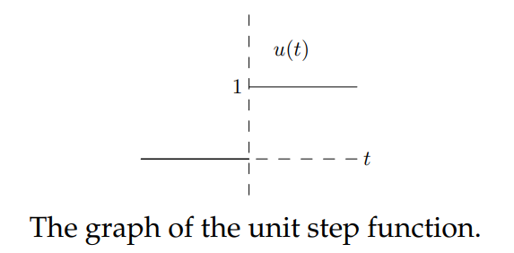

This session will make two additions to our mathematical modeling toolkit: step functions and delta functions. These are simple functions modeling idealized signals.

A step function represents an idealized signal that switches from off to on at a specific time. That is, its value jumps from 0 to 1. In the real world the signal would go through a transition phase, which would take a small amount of time to get from 0 to 1. We idealize it as making the transition instantaneously. The most basic step function is the unit or Heaviside step function, $u(t)$. It is 0 for $t < 0$ and 1 for $t > 0$. Its graph looks like  

A delta function represents an idealized input that acts all at once. If a finite force pushes on a mass it changes the momentum of the mass over time. We can achieve the same change in momentum with a small force acting over a long time or a large force acting over a short time. If the force acts over a very short time we call it an *impulse*. The unit delta function $\delta(t)$ (also called the unit impulse function) models an idealized impulse, which can be thought of as an infinite force acting over an infinitesimal amount of time and causes a unit change in the momentum of the mass.

In the above, the delta function represented an idealized impulsive force acting on a second order mechanical system. First order system, and indeed systems of any order, also have the notion of an impulse, which can also be modeled by a delta function.

Step functions and delta functions are not differentiable in the usual sense, but they do have what we call *generalized derivatives*. In fact, as a generalized derivative we have $u'(t) = \delta(t)$. Since step and delta functions can also be integrated they can used in DE’s.

Step and delta functions are of fundamental importance in our study of LTI systems. For example, if we know the response of such a system to either the unit delta or unit step function then we can compute its response to any input whatsoever.
