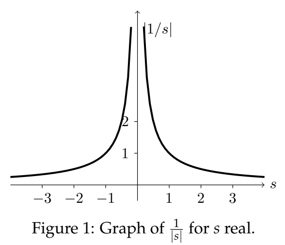
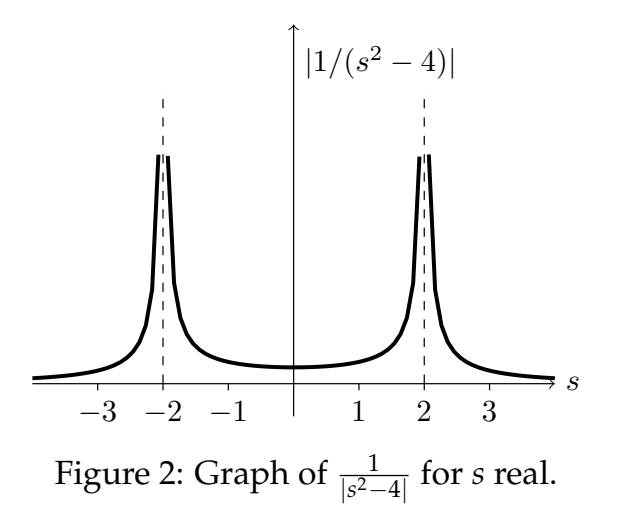
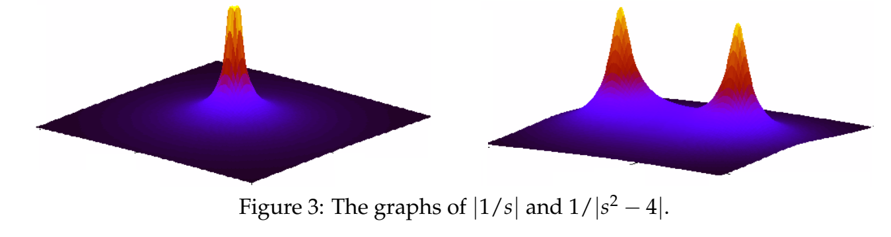

### Rational Functions
A **rational function** is a ratio of polynomials $q(s)/p(s)$.  
**Examples.** The following are all rational functions. $(s^2 + 1)/(s^3 + 3s + 1),1/(ms^2 + bs + k), s^2 + 1 + (s^2 + 1)/1$.  
If the numerator $q(s)$ and the denominator $p(s)$ have no roots in common, then the rational function $q(s)/p(s)$ is in **reduced form**.
**Example.** The three functions in the example above are all in reduced form.  
**Example.** $(s - 2)/(s^2 - 4)$ is not in reduced form, because $s = 2$ is a root of both numerator and denominator. We can rewrite this in reduced form as
$$\frac{s-2}{s^2-4}=\frac{s-2}{(s+2)(s-2)}=\frac{1}{s+2}$$

### Poles
For a rational function in reduced form the **poles** are the values of $s$ where the denominator is equal to zero; or, in other words, the points where the rational function is not defined. We allow the poles to be complex numbers here.  
**Examples.**  
a) The function $1/(s^2 + 8s + 7)$ has poles at $s = -1$ and $s = -7$.  
b) The function $(s - 2)/(s^2 - 4) = 1/(s + 2)$ has only one pole, $s = -2$.  
c) The function $1/(s^2 + 4)$ has poles at $s = \plusmn 2i$.  
d) The function $s^2 + 1$ has no poles.  
e) The function $1/(s^2 + 8s + 7)(s^2 + 4)$ has poles at $-1, -7, \plusmn 2i$. (Notice that this function is the product of the functions in (a) and (c) and that its poles are the union of poles from (a) and (c).)  
**Remark.** For ODE's with system function of the form $1/p(s)$, the poles are just the roots of $p(s)$. These are the familiar characteristic roots, which are important as we have seen.

### Graphs Near Poles
We start by considering the function $F_1(s) = 1/s$. This is well defined for every complex $s$ except $s = 0$. To visualize $F_1(s)$ we might try to graph it. However it will be simpler, and yet still show everything we need, if we graph $|F_1(s)|$ instead.  
To start really simply, let's just graph $|F_1(s)| = \frac{1}{|s|}$ for $s$ real (rather than complex).  
  
Now let's do the same thing for $F_2(s) = 1/(s^2 - 4)$. The roots of the denominator are $s = \plusmn 2$, so the graph of $F_2(s) = \frac{1}{|s^2-4|}$ has vertical asymp­totes at $s = \plusmn 2$.  
  
As noted, the vertical asymptotes occur at values of $s$ where the denominator of our function is 0. These are what we defined as the poles.
* $F_1(s)=\frac{1}{s}$ has a single pole at s = 0.
* $F_2(s)=\frac{1}{s^2-4}$ has two poles, one each at $s = \plusmn 2$.

Looking at Figures 1 and 2 you might be reminded of a tent. The poles of the tent are exactly the vertical asympotes which sit at the poles of the function.  
Let's now try to graph $|F_1(s)|$ and $|F_2(s)|$ when we allow $s$ to be complex. If $s = a + ib$ then $F_1(s)$ depends on two variables $a$ and $b$, so the graph requires three dimensions: two for $a$ and $b$, and one more (the vertical axis) for the value of $|F_1(s)|$. The graphs are shown in Figure 3 below. They are 3D versions of the graphs above in Figures 1 and 2. At each pole there is a conical shape rising to infinity, and far from the poles the function fall off to 0.  
  
Roughly speaking, the poles tell you the shape of the graph of a function $|F(s)|$: it is *large near the poles*. In the typical pole diagams seen in practice, the $|F(s)|$ is also small far away from the poles.

### Poles and Exponential Growth Rate
