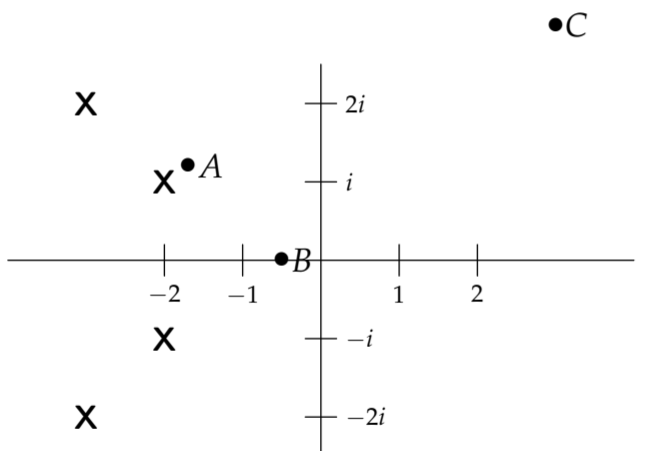
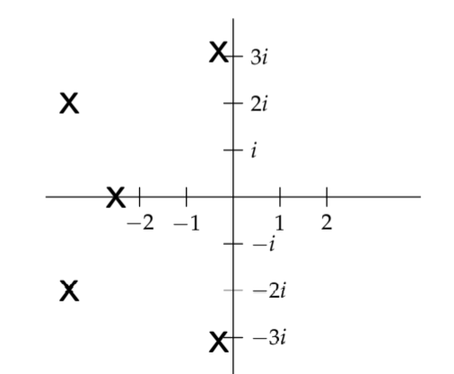

We started the session by considering the poles of functions $F(s)$, and saw that, by definition, the graph of $|F(s)|$ went off to infinity at the poles. Since it tells us where $|F(s)|$ is infinite, the pole diagram provides a crude graph of $|F(s)|$: roughly speaking, $|F(s)|$ will be large for values of $s$ near the poles. In this note we show how this basic fact provides a useful graphical tool for spotting resonant or near-resonant frequencies for LTI systems.  
**Example 1.** Figure 1 shows the pole diagram of a function $F(s)$. At which of the points A, B, C on the diagram would you guess $|F(s)|$ is largest?  
  
**Solution.** Point A is close to a pole and B and C are both far from poles so we would guess point $|F(s)|$ is largest at point A.  
**Example 2.** The pole diagram of a function $F(s)$ is shown in Figure 2. At what point $s$ on the positive imaginary axis would you guess that $|F(s)|$ is largest?  
  
**Solution.** We would guess that $s$ should be close to $3i$, which is near a pole. There is not enough information in the pole diagram to determine the exact location of the maximum, but it is most likely to be near the pole.

### Amplitude Response and the System Function
Consider the system
$$p(D)x=f(t)\tag{1}$$

