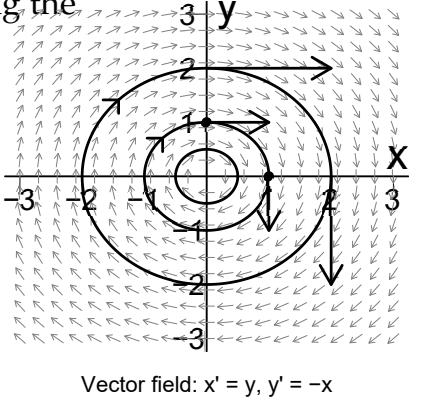
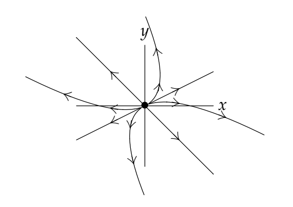

There are a number of public-domain computer programs which produce phase portraits for $2 \times 2$ autonomous systems. One has the option of displaying the trajectories with or without the "little" arrows of the vector direction field. We first give an example where the direction field is included, and then a portrait gallery with only the tractories themselves. In the pictures which illustrate these cases, only a few trajectories are shown, but these are sufficent to shown the qualitative behavior of the system.  
A much richer understanding of this gallery can be achieved using the Mathlets Linear Phase Portraits: Cursor Entry and Linear Phase Portraits: Matrix Entry.

**Example.** (direction field included).
$$\begin{pmatrix}
x\\y
\end{pmatrix}'=\begin{pmatrix}
y\\-x
\end{pmatrix}$$
General solution: $x = c_1 \cos t + c_2 \sin t, y = -c_1 \sin t + c_2 \cos t$  
As we saw before, the trajectories are circles. We know the direction is clockwise by looking at a single tangent vector.  

### The portrait gallery
1. A has real eigenvalues with two independent eigenvectors. Let $\lambda_1, \lambda_2$ be the eigenvalues and $\boldsymbol{v}_1$ and $\boldsymbol{v}_2$ the corresponding eigenvectors. $\rArr$ general solution to (*) is $\boldsymbol{x}=c_1e^{\lambda_1t}\boldsymbol{v}_1+c_2e^{\lambda_2t}\boldsymbol{v}_2$

i) $\lambda_1 > \lambda_2 > 0$.  
**Unstable nodal source**.  
As $t \to \infty$ the term $e^{\lambda_1t}\boldsymbol{v}_1$ dominates and $\boldsymbol{x} \to \infty$.  
As $t \to -\infty$ the term $e^{\lambda_2t}\boldsymbol{v}_2$ dominates and $\boldsymbol{x} \to 0$.  

ii) $\lambda_1 < \lambda_2 < 0$.  
**Stable nodal sink (asymptotically stable)**.  
(Simply reverse the arrows on case (i).)  
As $t \to \infty$ the term $e^{\lambda_2t}\boldsymbol{v}_2$ dominates and $\boldsymbol{x} \to 0$.  
As $t \to -\infty$ the term $e^{\lambda_1t}\boldsymbol{v}_1$ dominates and $\boldsymbol{x} \to \infty$.  

iii) 
