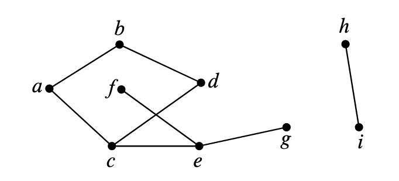
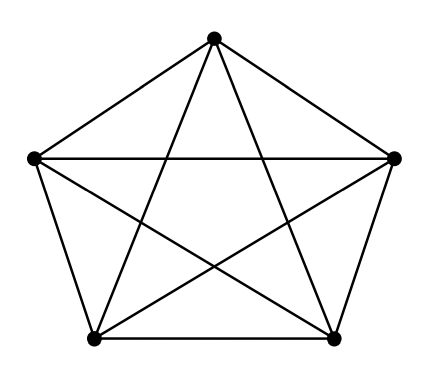
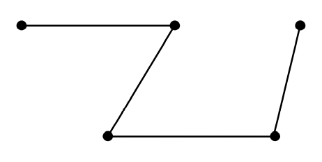
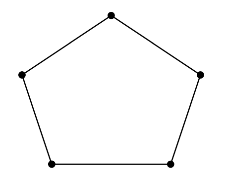
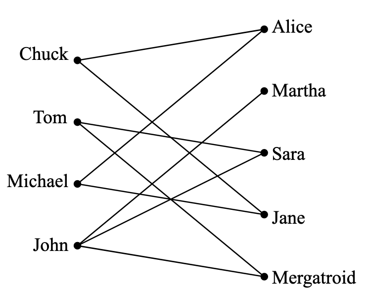
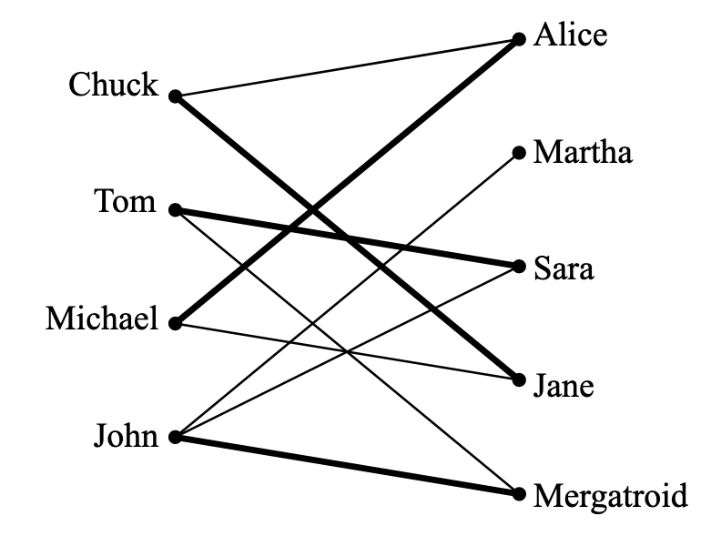
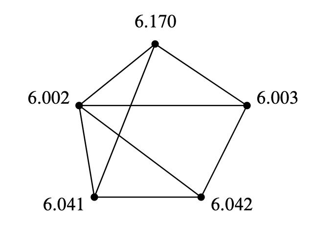
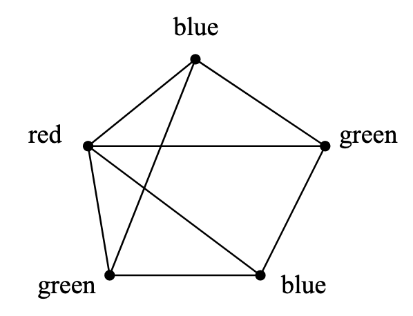

简单图(`simple graphs`)是对对称(`symmetric`)关系的建模，也就是说关系是相互的。比如婚姻关系、说同样的语言、说不同的关系、发生在重叠的时间区间、通过导线相连等等。在调度、约束问题、计算机图形学、通信等等方面都有很多应用，不过为了抓住大家的眼球，我们从专业的性行为调查来展开。准确的说是调查异性伴侣的个数。  
芝加哥大学(`University of Chicago`)的调查结果是男性的异性伴侣数比女性多74%。`ABC News`的结果比这个更夸张，男性平均有20个异性伴侣而女性平均有6个。纽约时报(`New York Times`)的结果是男性有7个女性有4个。你相信那个呢？  
本章的图论知识会告诉你这些调查距离真相都很远。

## Vertex Adjacency and Degrees
简单图的定义和有向图类似，除了边是无向的(`undirected`)，只是连接两点但没有方向。从$v$到$w$的有向边是$\langle v\to w\rangle$，而无向边的表示是$\langle v - w\rangle$。  
**Definition  12.1.1.** 一个简单图(`simple graph`)$G$包含一个非空集合$V(G)$，是$G$的顶点集合，和$E(G)$，是$G$的边的集合。$V(G)$每一个元素称为顶点(`vertex`)，$E(G)$每一个元素称为边(`edge`)。一条边有两个顶点$u\neq v$是其端点(`endpoints`)。这条边能用两个元素的集合$\{u,v\}$来表示。记号$\langle u - v\rangle$表示这条边。  
$\langle u - v\rangle$和$\langle v - u\rangle$表示的同一条边，其端点是$v$和$u$。

  
举个例子，令上图中的图是$H$，有9个点和8条边。  
点的集合$V(H)=\{a,b,c,d,e,f,g,h,i\}$  
边的集合$E(G)=\{\langle a - b\rangle,\langle a - c\rangle,\langle b - d\rangle,\langle c - e\rangle,\langle e - f\rangle,\langle c - d\rangle,\langle e - g\rangle,\langle h - i\rangle\}$

**Definition 12.1.2.** 简单图中两个顶点是邻接的(`adjacent`)当且仅当它们是同一条边的端点。这条边对每条边而言都是入射(`incident`)边。一个顶点$v$的入射边的数量称为度(`degree`)，记为$\deg(v)$。一个顶点的度等价于邻接点的个数。  
对于图$H$，$a$和$b$是邻接的，$b$是$d$的邻接点，边$\langle a - c\rangle$对于端点$a,c$都是入射边。$h$的度是1，$d$的度是2，$\deg(v)=3$。一个顶点的度可以是0，也就是说没有点和它相邻。一个简单图$G$可以一条边都没有，$|E(G)|=0$，也就是每个点的度都是0。不过简单图至少要有一个点，$|V(G)|$至少是1。  
简单图的两点之间的边数不能大于1，自循环(`self-loops`)（起点和终点是同一个点）也是不行的。  
本章说的图就是简单图。  

## Sexual Demographics in America
令$G$包含所有的的美国人，每个人是一个顶点$V$。我们将顶点分成两个子集$M,F$，前者包含所有的男人，后者包含所有的女人。如果两人是性伴侣，那么用一条边连接这连个点。如下图所示：  
  
每一条边的一个端点一定在$M$集合，另一个端点在$F$集合，所以
$$\sum_{x\in M}\deg(x)=\sum_{y\in F}\deg(y)$$
两边同时除以$|M|\cdot |F|$
$$\frac{\sum_{x\in M}\deg(x)}{|M|}\cdot\frac{1}{|F|}=\frac{\sum_{y\in F}\deg(y)}{|F|}\cdot\frac{1}{|M|}$$
等式左边第一项就是男性平均异性伴侣数，右边的第一项是女性平均异性伴侣数。所以
$$\text{Avg. deg in }M=\frac{|F|}{|M|}\text{Avg. deg in }F$$
那么男性和女性的一性伴侣数之比只取决于男女人数比。根据现有数据，$|F|/|M|$之比大约是1.035，也就是说，男性平均异性伴侣数比女性高3.5%，那么引言提到的调查结果都是不准确的。

### Handshaking Lemma
**Lemma 12.2.1.** 顶点的度之和是边数的两倍。  
**Proof.** 每一条边对顶点的度之和的贡献是2。

上面的引理称呼为握手定理(`Handshaking Lemma`)：一个聚会上每个人握手的次数之和是握手发生次数的两倍。

## Some Common Graphs
一些图出现的很频繁就给了命名了。完全图(`complete graph`)$K_n$有$n$个顶点，每两个顶点间都有一条边，共有$n(n-1)/2$条边。$K_5$如下图所示：  

空图(`empty graph`)表示没有任何边的图。五个顶点的空图如下图所示：  

包含$n$个顶点依序有$n-1$条边的图是线图(`line graph`)$L_n$。更正式的说，$L_n$有
$$V(L_n)=\{v_1,v_2,\cdots,v_n\}$$
$$E(L_n)=\{\langle v_1-v_2 \rangle,\langle v_2-v_2 \rangle,\cdots,\langle v_{n-1}-v_n \rangle\}$$
$L_5$如下图所示  
  
线图可以无穷长$L_\infty$，令顶点集合是非负整数集$\mathbb{N}$，那么边分别是$\langle k-(k+1) \rangle, k\in \mathbb{N}$。  
如果我们添加一条边$\langle v_n-v_1 \rangle$到图$L_n$，那么长度为$n$的环(`cycle`)$C_n$。长度为5的环如下图所示：  

## Isomorphism
两个图看起来不一样，但是某种形式上它们是相同的。比如下面两个图，都是有4个顶点和5条边，并且旋转$(a)$图90度就能得到$(b)$图。  

严格地讲，这些图是不同的数学上的对象，但是这种不同不能反映它们能被描述成同样的图片的事实——除了点的标签之外。  
**Definition 12.4.1.** 图$G$和$H$之间的同构是双射$f$：$V(G)\to V(H)$，对所有的$u,v\in V(G)$都有
$$\langle u-v \rangle \in E(G)\text{ IFF } \langle f(u)-f(v) \rangle \in E(G)$$
当两个图之间存在同构，那么这两个图是同构的(`isomorphic`)。  
上图中的两个图存在同构$f$：
$$f(a)=2,f(b)=3,f(c)=4,f(d)=1$$
两个同构的图可以画的差异很大，比如下图中的两个图都是$C_5$。  

如果$f$是$G$到$H$的同构，那么$f^{-1}$是$H$到$G$的同构。同构具有传递性。事实上，同构表示的是等价关系。  
同构保持的是图的连通性的属性。图的一个属性被称为同构保持(`preserved under isomorphism`)如果图$G$有该属性同时所有和$G$同构的图都有该属性。比如点的数量应该一样。点$v$和$f(v)$的度应该一样。如果一个图某个点的度是4，另一个图没有点的度是4，那么这两个图不可能是同构的。实际上，度4的点的个数不一样的话，也不可能是同构的。  
通过保持的属性很容易判断两个图不是同构，或者当同构存在时来指导如何找到。通常来讲，判断两个图是同构的也比较容易，但是，没有一个确定性的算法的时间复杂度是多项式时间。如果有这样的程序的话，很容易就能找到通过给定的分子键找到特殊的分子。  
同构的定义可以应用于无限图，同时本章剩余的大部分内容对无限图也是适用的。但是图论主要集中在对有限图的研究，本章也是。  
图论是对同构保持的属性的研究。

## Bipartite Graphs & Matchings
关于性行为调查的的例子中，所有的点分成了男女两类，且每条边都是从其中一类到另外一类。这样的图有个特殊的名字二分图(`bipartite graphs`)。

**Definition 12.5.1.** 一个二分图的顶点能够分成两个部分$L(G)$和$R(G)$，每条边的一个端点在$L(G)$另外一个端点在$R(G)$。

###  The Bipartite Matching Problem
假设有两个集合，一个男人的集合，一个大于等于男人集合人数的女人的集合。如果某个男的喜欢某个女的，那么两者之间就会有一条边。当前，这个喜欢是单向的，后面会考虑反向。下图是一个示例：  

一个匹配(`matching`)是指每一个男人都和一个女人配对，且不同的男人配对的是不同的女人。下图是其中一个例子：  

### The Matching Condition
`Hall's Matching Theorem`给出了二分图存在匹配的充要条件。  
为了证明这个定理，先定义一下被给定男人集合喜欢的女人集合中的每个女人至少被一个给定的男人集合的男人喜欢。比如男人集合是Tom和John，那么女人集合就是Martha，Sara和Mergatroid。  
匹配条件(`The Matching Condition`)：每一个男人的子集所喜欢的女人的集合至少和该子集一样大。  
举个例子：四个男人组成的集合，喜欢的女人数量是三个，显然不存在匹配。定理告诉我们这个必要条件是充分的，也就是说，匹配条件成立的话，那么该二分图肯定存在一个匹配。

**Theorem 12.5.2.** 对于一个男人集合$M$和女人合计$W$，存在一个匹配，当且仅当匹配条件成立。  
**Proof.** 上述的反例已经证明匹配条件不成立则匹配不存在，那么其逆否命题匹配存在则匹配条件成立也是成立的。下面用归纳法来证明匹配条件成立那么存在匹配。  
基础：$|M|=1$，匹配条件蕴含着这个男人至少喜欢一个女人，显然匹配存在。假设对于$|M|=m\geq 1$都是成立的，现在考虑$|M|=m+1\geq 2$的情况。  
(1) 对于所有至多有$m$个男人的非空子集，都严格地比对应女人的集合要大。显然，我们任意匹配一个男人和他喜欢的女人，那么移除他俩之后剩余的$m$个男人集合和对应的女人集合满足匹配条件，对应的匹配加上新加的一条边，构成了新的匹配。  
(2) 有一些至多有$m$个男人的集合$X$，和其对应的女人集合$Y$一样大。根据递归假设，$X$和$Y$之间存在匹配，那么问题变成了在$M-X$和$W-Y$上找到一个匹配。  
如果存在某个$M_0\subseteq M-X$，对应的女人集合$W_0\subseteq W-Y$人数更少，那么就有$M_0\cup X$的人数小于$W_0\cup Y$的人数，这违背假设。那么不存在某个$M_0$。所以$M-X$和$W-Y$之间的关系也是满足匹配条件的，那么根据递归假设，$M-X$和$W-Y$也存在匹配。

**Theorem 12.5.2**的证明过程给出了一个不高效的寻找匹配的算法。事实上，存在高效的寻找匹配的算法，所以如果一个问题能够转化为在二分图上找匹配这个已知问题的话，那么就能高效地处理了。

下面是匹配和`Hall's Theorem`的正式定义。  
**Definition 12.5.3.** 图$G$的匹配是一个边的集合$M\subseteq E(G)$没有两条边入射到同一个顶点。$M$的边的顶点成为被$M$覆盖(`covered`)。如果一个匹配覆盖了$V(G)$，那么成为完美匹配(`perfect`)。令$N(S)$是某个$S\subseteq V(G)$的邻接点(`neighbors`)集合，即
$$N(S)=\{r|\langle s—r\rangle \in E(G)\text{ for some } s\in S\}$$
$S$被称为瓶颈(`bottleneck`)如果
$$|S|>|N(S)|$$

**Theorem 12.5.4(`Hall's Theorem`).** $G$是二分图。存在一个匹配覆盖$L(G)$等价于$L(G)$的任意子集都不是瓶颈。

二分图的匹配条件要求每一个子集都要满足这个条件。但是子集的个数增长是指数级的，很快就不适用了。有一个关于顶点的度的属性就能确保二分图存在一个匹配。如果左半边的度至少和右半边的度一样大，那么称为度受限(`degree-constrained`)的二分图。  
**Definition 12.5.5.** 一个二分图$G$是度受限的如果有一个整数$d\geq 1$对于所有$l\in L(G),r\in R(G)$都有
$$\deg(l)\geq l\geq\deg(r)$$
**Theorem  12.5.6.** 如果$G$是度受限的二分图，那么存在一个匹配覆盖$L(G)$。  
**Proof** 令$S$是$L(G)$的一个子集，需要证明$S$满足`Hall's condition`：
$$|N|(S)\geq |S|$$
令$D_S$是端点在$S$中的边的集合，由于$S$中的点的度最小是$d$，那么
$$|D_S|\geq d|S|$$
$D_S$的另一个端点在$N(S)$中，而$N(S)$中的点的度最大是$d$，那么
$$d|N(S)|\geq |D_S|$$
所以
$$d|N(S)|\geq d|S|$$
$$|N(S)|\geq |S|$$

如果一个图所有点的度都一样，那么该图是规则的(`regular`)。根据定义，二分规则图满足上面描述的度受限图，所以存在一个完美匹配。

## Coloring
之前我们用边来表示喜欢的关系，下面的例子是表示冲突。

### An Exam Scheduling Problem
MIT教务处要安排考试，显然，不能让同一个学生选择的两门课程放在同一个时间考试，同时，不能一门课一门课的考试，时间太长了。要在尽可能短的时间内排除考试安排，同时保证没有冲突。  
这个问题可以用图来描述，点表示课程，如果有学生同时选择某两门课，则这两门课（点）之间用一条边连起来。下图是一个示例：  
  
接下来我们使用颜色来表示时间槽。比如红色表示星期一上午，蓝色表示星期一下午，绿色表示星期二上午等等。那么冲突就表示成同一条边的两个顶点不能是同一个颜色的，上述应用问题就转化为用尽可能少的颜色来填满整个图。下图是某种染色的例子。  
  
能比三种颜色更少吗？不能。因为图中有个三角形，必须用三种颜色。  
上述就是一个图染色(`graph coloring`)问题：给定一个图$G$，每个点都图一种颜色，合理染色是要保证一条边的两个顶点是不同颜色。可$k$染色($k$-`colorable`)图表示染色最多使用$k$个颜色。  
**Definition 12.6.1.** 图$G$的合理染色的数目最小值被称为染色数(`chromatic number`)，$\chi(G)$。  
可$k$染色图等价于$\chi(G)\leq k$。

### Some Coloring Bounds
有一些简单的属性能够给出染色数的限制。  
最简单的属性是环：偶数长度的环染色数是2，奇数长度的环染色数是3。  
$$\chi(C_{\text{even}})=2$$
$$\chi(C_{\text{odd}})=3$$
完全图$K_n$的染色数是$n$，因为任意两个点都是连接的，不能是同一个颜色。
$$\chi(K_n)=n$$