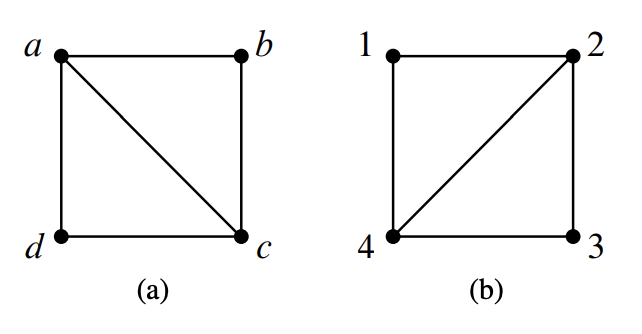

简单图(`simple graphs`)是对对称(`symmetric`)关系的建模，也就是说关系是相互的。比如婚姻关系、说同样的语言、说不同的关系、发生在重叠的时间区间、通过导线相连等等。在调度、约束问题、计算机图形学、通信等等方面都有很多应用，不过为了抓住大家的眼球，我们从专业的性行为调查来展开。准确的说是调查异性伴侣的个数。  
芝加哥大学(`University of Chicago`)的调查结果是男性的异性伴侣数比女性多74%。`ABC News`的结果比这个更夸张，男性平均有20个异性伴侣而女性平均有6个。纽约时报(`New York Times`)的结果是男性有7个女性有4个。你相信那个呢？  
本章的图论知识会告诉你这些调查距离真相都很远。

## Vertex Adjacency and Degrees
简单图的定义和有向图类似，除了边是无向的(`undirected`)，只是连接两点但没有方向。从$v$到$w$的有向边是$\langle v\to w\rangle$，而无向边的表示是$\langle v - w\rangle$。  
**Definition  12.1.1.** 一个简单图(`simple graph`)$G$包含一个非空集合$V(G)$，是$G$的顶点集合，和$E(G)$，是$G$的边的集合。$V(G)$每一个元素称为顶点(`vertex`)，$E(G)$每一个元素称为边(`edge`)。一条边有两个顶点$u\neq v$是其端点(`endpoints`)。这条边能用两个元素的集合$\{u,v\}$来表示。记号$\langle u - v\rangle$表示这条边。  
$\langle u - v\rangle$和$\langle v - u\rangle$表示的同一条边，其端点是$v$和$u$。

  
举个例子，令上图中的图是$H$，有9个点和8条边。  
点的集合$V(H)=\{a,b,c,d,e,f,g,h,i\}$  
边的集合$E(G)=\{\langle a - b\rangle,\langle a - c\rangle,\langle b - d\rangle,\langle c - e\rangle,\langle e - f\rangle,\langle c - d\rangle,\langle e - g\rangle,\langle h - i\rangle\}$

**Definition 12.1.2.** 简单图中两个顶点是邻接的(`adjacent`)当且仅当它们是同一条边的端点。这条边对每条边而言都是入射(`incident`)边。一个顶点$v$的入射边的数量称为度(`degree`)，记为$\deg(v)$。一个顶点的度等价于邻接点的个数。  
对于图$H$，$a$和$b$是邻接的，$b$是$d$的邻接点，边$\langle a - c\rangle$对于端点$a,c$都是入射边。$h$的度是1，$d$的度是2，$\deg(v)=3$。一个顶点的度可以是0，也就是说没有点和它相邻。一个简单图$G$可以一条边都没有，$|E(G)|=0$，也就是每个点的度都是0。不过简单图至少要有一个点，$|V(G)|$至少是1。  
简单图的两点之间的边数不能大于1，自循环(`self-loops`)（起点和终点是同一个点）也是不行的。  
本章说的图就是简单图。  

## Sexual Demographics in America
令$G$包含所有的的美国人，每个人是一个顶点$V$。我们将顶点分成两个子集$M,F$，前者包含所有的男人，后者包含所有的女人。如果两人是性伴侣，那么用一条边连接这连个点。如下图所示：  
  
每一条边的一个端点一定在$M$集合，另一个端点在$F$集合，所以
$$\sum_{x\in M}\deg(x)=\sum_{y\in F}\deg(y)$$
两边同时除以$|M|\cdot |F|$
$$\frac{\sum_{x\in M}\deg(x)}{|M|}\cdot\frac{1}{|F|}=\frac{\sum_{y\in F}\deg(y)}{|F|}\cdot\frac{1}{|M|}$$
等式左边第一项就是男性平均异性伴侣数，右边的第一项是女性平均异性伴侣数。所以
$$\text{Avg. deg in }M=\frac{|F|}{|M|}\text{Avg. deg in }F$$
那么男性和女性的一性伴侣数之比只取决于男女人数比。根据现有数据，$|F|/|M|$之比大约是1.035，也就是说，男性平均异性伴侣数比女性高3.5%，那么引言提到的调查结果都是不准确的。

### Handshaking Lemma
**Lemma 12.2.1.** 顶点的度之和是边数的两倍。  
**Proof.** 每一条边对顶点的度之和的贡献是2。

上面的引理称呼为握手定理(`Handshaking Lemma`)：一个聚会上每个人握手的次数之和是握手发生次数的两倍。

## Some Common Graphs
一些图出现的很频繁就给了命名了。完全图(`complete graph`)$K_n$有$n$个顶点，每两个顶点间都有一条边，共有$n(n-1)/2$条边。$K_5$如下图所示：  

空图(`empty graph`)表示没有任何边的图。五个顶点的空图如下图所示：  

包含$n$个顶点依序有$n-1$条边的图是线图(`line graph`)$L_n$。更正式的说，$L_n$有
$$V(L_n)=\{v_1,v_2,\cdots,v_n\}$$
$$E(L_n)=\{\langle v_1-v_2 \rangle,\langle v_2-v_2 \rangle,\cdots,\langle v_{n-1}-v_n \rangle\}$$
$L_5$如下图所示  
  
线图可以无穷长$L_\infty$，令顶点集合是非负整数集$\mathbb{N}$，那么边分别是$\langle k-(k+1) \rangle, k\in \mathbb{N}$。  
如果我们添加一条边$\langle v_n-v_1 \rangle$到图$L_n$，那么长度为$n$的环(`cycle`)$C_n$。长度为5的环如下图所示：  

## Isomorphism
两个图看起来不一样，但是某种形式上它们是相同的。比如下面两个图，都是有4个顶点和5条边，并且旋转$(a)$图90度就能得到$(b)$图。  

严格地讲，这些图是不同的数学上的对象，但是这种不同不能反映它们能被描述成同样的图片的事实——除了点的标签之外。  
**Definition 12.4.1.** 图$G$和$H$之间的同构是双射$f$：$V(G)\to V(H)$，对所有的$u,v\in V(G)$都有
$$\langle u-v \rangle \in E(G)\text{ IFF } \langle f(u)-f(v) \rangle \in E(G)$$
当两个图之间存在同构，那么这两个图是同构的(`isomorphic`)。  
上图中的两个图存在同构$f$：
$$f(a)=2,f(b)=3,f(c)=4,f(d)=1$$
两个同构的图可以画的差异很大，比如下图中的两个图都是$C_5$。  

如果$f$是$G$到$H$的同构，那么$f^{-1}$是$H$到$G$的同构。同构具有传递性。事实上，同构表示的是等价关系。  
同构保持的是图的连通性的属性。图的一个属性被称为同构保持(`preserved under isomorphism`)如果图$G$有该属性同时所有和$G$同构的图都有该属性。比如点的数量应该一样。点$v$和$f(v)$的度应该一样。如果一个图某个点的度是4，另一个图没有点的度是4，那么这两个图不可能是同构的。实际上，度4的点的个数不一样的话，也不可能是同构的。  
通过保持的属性很容易判断两个图不是同构，或者当同构存在时来指导如何找到。通常来讲，判断两个图是同构的也比较容易，但是，没有一个确定性的算法的时间复杂度是多项式时间。如果有这样的程序的话，很容易就能找到通过给定的分子键找到特殊的分子。  
同构的定义可以应用于无限图，同时本章剩余的大部分内容对无限图也是适用的。但是图论主要集中在对有限图的研究，本章也是。  
图论是对同构保持的属性的研究。

## Bipartite Graphs & Matchings
