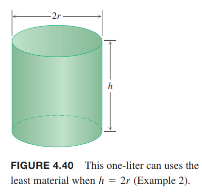

**解决应用优化问题**
1. 读懂问题。题目给了哪些条件？哪个未知变量需要优化？
2. 画图，标出重要的部分。
3. 引入变量。列出它们之间的关系。
4. 为未知量写方程。
5. 在定义域内测试临界点和边界点。

例1 12厘米见方的正方形减去四个角，组成一个开头的盒子。这个盒子体积最大是多少？  
解：如下图所示，减去的正方形边长是$x$。  
  
那么体积是
$$V(x)=x(12-2x)^2=144x-48x^2+4x^3$$
由于边长只有 12cm，那么$V$的定义域是$0\leq x\leq 6$。函数求导寻找临界点
$$\frac{dV}{dt}=114-96x+12x^2=12(12-8x+x^2)=12(2-x)(6-x)$$
$x=2$在内部是唯一临界点。$x=0,6$是端点。计算它们对应的体积。
$$V(2)=128,V(0)=V(6)=0$$
所以最大体积是 128$cm^3$，减去的正方形边长是 2cm。  

例2 设计一个一升的圆柱体。如下图所示。维度多少的时候用料最少？  
  
解：$r,h$用厘米作单位，那么体积是
$$\pi r^2h=1000$$
表面积是
$$A=2\pi r^2+2\pi rh$$
何为用料最少？我们忽略材料的厚度和裁剪时的损耗。最少就是表面积最小。  
为了用一个变量表示表面积，需要用体积公式计算出$r$或者$h$代入表面积公式。这里计算$h$比较简单
$$h=\frac{1000}{\pi r^2}$$
那么
$$\begin{aligned}
A&=2\pi r^2+2\pi rh\\
&=2\pi r^2+2\pi r(\frac{1000}{\pi r^2})\\
&=2\pi r^2+\frac{2000}{r}
\end{aligned}$$
我们的目标是寻找$r>0$使得$A$最小。下图说明这样的值是存在的。  
  
$r$非常小，是瘦高型的圆柱体，那么$2000/r$就会主导表面积，$A$会很大。如果$r$很大，非常扁的圆柱体，那么$2\pi r^2$会占主导地位，那么$A$也会非常大。  
$A$对$r$是可导的，同时区间没有端点，那么如果存在最小值，是导数为零的点。
$$\begin{aligned}
\frac{dA}{dr}&=4\pi r-\frac{2000}{r^2}\\
0&=4\pi r-\frac{2000}{r^2}\\
4\pi r^3&=2000\\
r&=\sqrt[3]{\frac{500}{\pi}}\approx 5.42
\end{aligned}$$
在$r=\sqrt[3]{\frac{500}{\pi}}$处函数行为如何呢？  
现在求二阶导
$$\frac{d^2A}{dt^2}=4\pi+\frac{4000}{r^3}>0$$
二阶导始终大于零，那么函数图像是上凹的，那么在$r=\sqrt[3]{\frac{500}{\pi}}$处有最小值。  
相应的高度
$$h=\frac{1000}{\pi r^2}=2\sqrt[3]{\frac{500}{\pi}}=2r$$
一升体积的圆柱体表面积最小时高度等于半径的两倍（高度等于直径），此时$r\approx 5.42 cm,h\approx 10.84 cm$。

### 来自数学和物理的例子

### 来自经济学的例子
