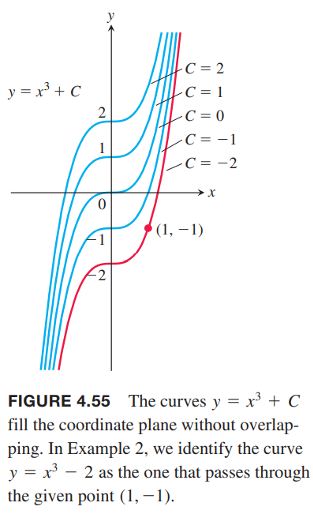

有时，我们需要从导数中恢复原函数。给定要给函数$f$，需要找到一个函数$F$，它的导数是$f$。如果这样的$F$存在，称为$f$的反导数（`antiderivative`）。反导数是倒数和不定积分的纽带。

### 求反导数
**定义** 如果在区间$I$上对所有$x$都有$F'(x)=f(x)$，那么我们称$F$是$f$（其定义域是$I$）的反导数（`antiderivative`）。

从导函数$f(x)$得到反导数$F(x)$过程称为反导函数（`antidifferentiation`）。我们使用大写字母表示反导数，比如$F$是$f$的反导数，$G$是$g$的反导数。

例1 求下面函数的反导数。  
（a）$f(x)=2x$  
（b）$g(x)=\cos x$  
（c）$h(x)=\frac{1}{x}+2e^{2x}$  
解：之前我们已经学过了哪些函数的导数是上面这些函数，所以
$$F(x)=x^2,G(x)=\sin x,H(x)=\ln |x|+e^{2x}$$

函数$F(x)=x^2$并不是唯一导数是$2x$的函数。函数$x^2+1$的导数也是。那么$x^2+C$呢？其中$C$是常数。  
4.2节中值定理推论2一个函数的任意两个反导数之间的差是常数。所以$x^2+C$，$C$是任意常数，是所有$f(x)=2x$的反导数函数。

定理8 如果在区间$I$上，$F$是$f$的反导数，$f$在区间$I$上的反导数一般形式是
$$F(x)+C$$
其中$C$是任意常数。

例2 求$f(x)=3x^2$的反导数，其满足$F(1)=-1$。  
解：由于$x^3$的导数是$3x^2$，那么一般地
$$F(x)=x^3+C$$
条件$F(1)=-1$导入
$$1+C=-1$$
所以$C=-2$，那么
$$F(x)=x^3-2$$
如下图所示，我们选择了一个具体的$C$，也就是从一族函数中挑出了经过点$(1,-1)$的函数。  

将导数规则反过来应用，可以推导出反导数的公式和规则。对于反导数我们需要加上常数$C$表示一族函数。下面给出了比较重要的反导数的公式。  
这里的规则都可以通过反向计算来验证。比如$(\tan kx)/k+C$的导数是$\sec^2 kx$，其中$k\neq 0$，$C$是任意常数，这就验证了下表的公式4。

| 函数 | 反导数 |
|--|--|
| $x^n$ | $\frac{1}{n+1}x^{n+1}+C,n\neq -1$ |
| $\sin kx$ | $-\frac{1}{k}\cos kx+C$ |
| $\cos kx$ | $\frac{1}{k}\sin kx+C$ |
| $\sec^2 kx$ | $\frac{1}{k}\tan kx+C$ |
| $\csc^2 kx$ | $-\frac{1}{k}\cot kx+C$ |
| $\sec kx\tan kx$ | $\frac{1}{k}\sec kx+C$ |
| $\csc kx\cot kx$ | $-\frac{1}{k}\csc kx+C$ |
| $e^{kx}$ | $\frac{1}{k}e^{kx}+C$ |
| $\frac{1}{x}$ | $\ln |x|+C,x\neq 0$ |
| $\frac{1}{\sqrt{1-k^2x^2}}$ | $\frac{1}{k}\sin^{-1}kx+C$ |
| $\frac{1}{\sqrt{1+k^2x^2}}$ | $\frac{1}{k}\tan^{-1}kx+C$ |
| $\frac{1}{x\sqrt{k^2x^2-1}}$ | $\sec^{-1}kx+C,kx>1$ |
| $a^{kx}$ | $(\frac{1}{k\ln a})a^{kx}+C,a>0,a\neq 1$ |

例3 求下面函数的一般反导数。  
（a）$f(x)=x^5$  
（b）$g(x)=\frac{1}{\sqrt{x}}$  
（c）$h(x)=\sin 2x$  
（d）$i(x)=\cos\frac{x}{2}$  
（e）$j(x)=e^{-3x}$  
（f）$k(x)=2^x$  
解：应用上面的表中的公式。  
（a）$F(x)=\frac{x^6}{6}+C$  
（b）$n=-1/2, G(x)=\frac{x^{1/2}}{1/2}+C=2\sqrt{x}+C$  
（c）$H(x)=-\frac{\cos 2x}{2}+C$  
（d）$I(x)=2\sin(\frac{x}{2})+C$  
（e）$J(x)=-\frac{1}{3}e^{-3x}+C$  
（f）$K(x)=\frac{1}{\ln 2}2^x+C$  

导数的规则也可以应用到反导数上。下面是加法、减法和常数倍相关的法则。证明也很简单，对反导数求导看是否等于原函数。

| | 函数 | 反导数 |
|--|--|--|
| 常数倍 | $kf(x)$ | $kF(x)+C$ |
| 加法和减法 | $f(x)\pm g(x)$ | $F(x)\pm G(x)+C$ |

例4 求函数
$$f(x)=\frac{3}{\sqrt{x}}+\sin 2x$$
的反导数。  
解：用例3中的函数改写得到$f(x)=3g(x)+h(x)$。我们知道$G(x)=2\sqrt{x}$是$g(x)=1/\sqrt{x}$的反导数，那么$3G(x)$的是$\frac{3}{\sqrt{x}}$的反导数，$H(x)=-\frac{\cos 2x}{x}$是$\sin 2x$的反导数。应用加法法则得到
$$F(x)=3G(x)+H(x)+C=6\sqrt{x}-\frac{1}{2}\cos 2x+C$$

### 初值问题和微分方程
在数学及其应用中反导数扮演重要角色。第八章会讨论很多求解方法。求函数$f(x)$的反导数等价于求解函数$y(x)$满足
$$\frac{dy}{dx}=f(x)$$
这称为微分方程（`differential equation`）。求解的过程就是找到$f(x)$的反导数。通过指定初始值我们可以求解常数
$$y(x_0)=y_0$$
上式意味着当$x=x_0$时，$y=y_0$。微分方程附带一个初始条件被称为初值问题（`initial value problem`）。这类问题在几乎所有科学领域都扮演重要角色。  
$f(x)$的一般地反导数$F(x)+C$是微分方程$dy/dx=f(x)$的通解（`general solution`）$y=F(x)+C$。通解是方程所有的解。通过求通解来求微分方程，接着解决初值问题来找到特解（`particular solution`），特解满足初始条件$y(x_0)=y_0$。在例2中，函数$y=x^3-2$是微分方程满足初始条件$y(1)=-1$的特解。

### 反导数和运动
对物体的位置函数求导可以得到速度，对速度求导可以得到加速度。反过来，对加速度求反导数可以得到速度，对速度求反导数可以得到位置。现在我们从微分方程的视角看这个问题。

例5 一个热气球在距离地面 24.5m 的地方丢了一个物体，此时速度是 3.6m/s。物体经过多久落到地面上？  
解：令在$t$时，距离地面高度是$s(t)$，速度是$v(t)$。

