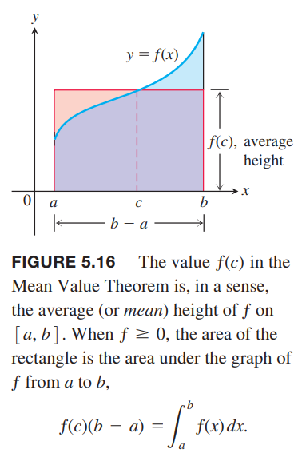
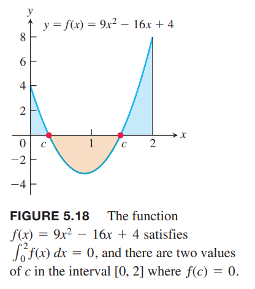

### 定积分的中值定理
上一节我们定义了在 $[a,b]$ 上的连续函数的均值是定积分 $\int_a^b f(x)dx$ 除以区间宽度 $b-a$。定积分的中值定理是说至少存在一个点其函数值等于均值。  
下图展示了一个正的定义在 $[a,b]$ 上的连续函数 $y=f(x)$。从几何角度看，中值定理是说在 $[a,b]$ 上存在一点 $c$，基底是 $b-a$ 高度是 $f(c)$ 的矩形面积恰好等于 $f$ 在 $[a,b]$ 区间上的下方区域的面积。

**定理3 定积分的中值定理**  
如果 $f$ 在 $[a,b]$ 上是连续的，那么在某点 $c\in [a,b]$ 使得
$$f(c)=\frac{1}{b-a}\int_a^bf(x)dx$$

证明：将上一节的定积分法则六（最大值最小值不等式）两边同时除以 $b-a$ 得到
$$\text{min }f\leq\frac{1}{b-a}\int_a^bf(x)dx\leq\text{max }f$$
由于 $f$ 是连续的，连续函数的中间值定理告诉我们 $f$ 的所有值都必须在最大值和最小值之间，那么存在点 $c\in [a,b]$ 的值恰好是 $\frac{1}{b-a}\int_a^bf(x)dx$。  
连续是必要条件。如下图所示。如果 $f$ 不是连续的，可能不存在一点的函数值等于均值。  

例1 证明如果 $f$ 在 $[a,b],a\neq b$ 上连续，并且如果
$$\int_a^bf(x)dx=0$$
那么在 $[a,b]$ 上，至少出现一个 $f(x)=0$。  
证明：$f$ 在 $[a,b]$ 上的平均值是
$$\text{avg($f$)}=\frac{1}{b-a}\int_a^bf(x)dx=0$$
那么根据中值定理，至少有一个 $c\in [a,b]$ 使得 $f$ 的值是零。下图展示了函数 $f(x)=9x^2-16x+4$ 在区间 $[0,2]$ 上存在两个点满足题意。  

### 
