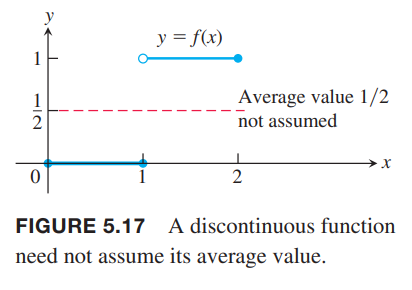
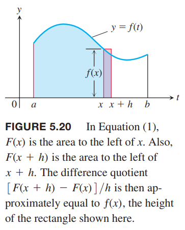

### 定积分的中值定理
上一节我们定义了在 $[a,b]$ 上的连续函数的均值是定积分 $\int_a^b f(x)dx$ 除以区间宽度 $b-a$。定积分的中值定理是说至少存在一个点其函数值等于均值。  
下图展示了一个正的定义在 $[a,b]$ 上的连续函数 $y=f(x)$。从几何角度看，中值定理是说在 $[a,b]$ 上存在一点 $c$，基底是 $b-a$ 高度是 $f(c)$ 的矩形面积恰好等于 $f$ 在 $[a,b]$ 区间上的下方区域的面积。

**定理3 定积分的中值定理**  
如果 $f$ 在 $[a,b]$ 上是连续的，那么在某点 $c\in [a,b]$ 使得
$$f(c)=\frac{1}{b-a}\int_a^bf(x)dx$$

证明：将上一节的定积分法则六（最大值最小值不等式）两边同时除以 $b-a$ 得到
$$\text{min }f\leq\frac{1}{b-a}\int_a^bf(x)dx\leq\text{max }f$$
由于 $f$ 是连续的，连续函数的中间值定理告诉我们 $f$ 的所有值都必须在最大值和最小值之间，那么存在点 $c\in [a,b]$ 的值恰好是 $\frac{1}{b-a}\int_a^bf(x)dx$。  
  
连续是必要条件。如下图所示。如果 $f$ 不是连续的，可能不存在一点的函数值等于均值。  

例1 证明如果 $f$ 在 $[a,b],a\neq b$ 上连续，并且如果
$$\int_a^bf(x)dx=0$$
那么在 $[a,b]$ 上，至少出现一个 $f(x)=0$。  
证明：$f$ 在 $[a,b]$ 上的平均值是
$$\text{avg($f$)}=\frac{1}{b-a}\int_a^bf(x)dx=0$$
那么根据中值定理，至少有一个 $c\in [a,b]$ 使得 $f$ 的值是零。下图展示了函数 $f(x)=9x^2-16x+4$ 在区间 $[0,2]$ 上存在两个点满足题意。  

### 基础定理（1）
利用黎曼和的极限来计算积分是比较困难的。这里引入一种新方法，通过反导数来求解。这种方法把微积分的两条主线结合在了一起。一条是导数和反导数，一条是通过有限和的极限得到积分。这就是微积分基础定理。我们从使用积分描述的函数的求导开始。  
如果 $f(t)$ 在有限区间 $I$ 上是可积函数，从任意固定点 $a\in I$ 开始到另一点 $x\in I$ 的积分定义了一个新函数 $F$ 是
$$F(x)=\int_a^xf(t)dt$$
如果函数 $f$ 是非负函数，且 $x$ 在 $a$ 的右侧，那么 $F(x)$ 是从 $a$ 到 $x$ 的曲线下的区域的面积。如下图所示。  
  
$x$ 是积分的上界，不过 $F$ 和一般的实函数一样。给定一个输入 $x$，有唯一的输出，是 $f$ 从 $a$ 到 $x$ 的积分。  
上面的方程是一种新的构造函数的方式，更重要的是它把微分和积分联系到了一起。如果 $f$ 是连续函数，基本定理是说 $F$ 是可导的，导数就是 $f$。对于每一个 $x\in [a,b]$ 有
$$F'(x)=f(x)$$
为了获得直观印象，我们先看下其几何意义。  
如果在 $[a,b]$ 上 $f(x)\geq 0$，可以通过定义计算 $F$ 的导数，它就是 $h\to 0$ 时差值的商的极限
$$\frac{F(x+h)-F(x)}{h}$$
如果 $h>0$，$F(x+h)$ 就是从 $a$ 到 $x+h$ 曲线下区域的面积，减去 $F(x)$，就是 $f(x)$ 在 $[x, x+h]$ 这个区间的面积。如下图所示。  
  
如果 $h$ 很小，那么这块面积就近似等于宽度 $h$ 高度 $f(x)$ 矩形的面积，即
$$F(x+h)-F(x)\approx hf(x)$$
两边同时除以 $h$ 得到差值的商接近 $f(x)$
$$\frac{F(x+h)-F(x)}{h}\approx f(x)$$
当 $h$ 趋于零时，差值的商的极限 $F'(x)$ 就等于 $f(x)$，即
$$F'(x)=\lim_{h\to 0}\frac{F(x+h)-F(x)}{h}=f(x)$$
这个方程在 $f$ 是负数是也是成立的。

**定理4 微积分基本定理（1）**  
如果 $f$ 在 $[a,b]$ 上是连续的，那么 $F(x)=\int_a^xf(t)dt$ 在 $[a,b]$ 上也是连续的，并且在 $(a,b)$ 上导数是 $f(x)$
$$F'(x)=\frac{d}{dx}\int_a^xf(t)dt=f(x)$$

在证明之前，我们也看几个例子。$x$ 可以是上界也可以是下界。$y$ 是 $x$ 的应变量，而 $t$ 只是虚拟变量罢了。

例2 使用基本定理求导。  
（a）$y=\int_a^x(t^3+1)dt$  
（b）$y=\int_x^53t\sin tdt$  
（c）$y=\int_1^{x^2}\cos tdt$  
（d）$y=\int_{1+3x^2}^4\frac{1}{2+e^t}dt$  
解：  
（a）
$$\frac{dy}{dx}=\frac{d}{dx}\int_a^x(t^3+1)dt=x^3+1$$
（b）
$$\begin{aligned}
\frac{dy}{dx}&=\frac{d}{dx}\int_x^53t\sin tdt\\
&=-\frac{d}{dx}\int_5^x3t\sin tdt\\
&=-3x\sin x
\end{aligned}$$
（c）积分上界是 $x^2$ 而不是 $x$，这使得 $y$ 是两个函数组合起来的
$$y=\int_1^u\cos tdt,u=x^2$$
那么需要使用链式法则
$$\begin{aligned}
\frac{dy}{dx}&=\frac{dy}{du}\frac{du}{dx}\\
&=(\frac{d}{du}\int_1^u\cos tdt)\frac{du}{dx}\\
&=\cos u(2x)\\
&=2x\cos x^2
\end{aligned}$$
（d）
$$\begin{aligned}
\frac{dy}{dx}&=\frac{d}{dx}\int_{1+3x^2}^4\frac{1}{2+e^t}dt\\
&=-\int_4^{1+3x^2}\frac{1}{2+e^t}dt\\
&=-\frac{1}{2+e^{1+3x^2}}\frac{d}{dx}(1+3x^2)\\
&=-\frac{6x}{2+e^{1+3x^2}}
\end{aligned}$$

证明定理4。通过定义来证明。差值的商是
$$\frac{F(x+h)-F(x)}{h}$$
根据定义求 $h\to 0$ 时上式的值。
$$\begin{aligned}
F'(x)&=\lim_{h\to 0}\frac{F(x+h)-F(x)}{h}\\
&=\lim_{h\to 0}\frac{1}{h}\bigg[\int_a^{x+h}f(t)dt-\int_a^xf(t)dt\bigg]\\
&=\lim_{h\to 0}\frac{1}{h}\int_x^{x+h}f(t)dt
\end{aligned}$$
根据定积分中值定理，在 $[x,x+b]$ 上至少存在一点 $c$ 使得 $f(c)$ 等于 $f$ 在这个区间的平均值，即
$$\frac{1}{h}\int_x^{x+h}f(t)dt=f(c)$$
随着 $h\to 0$，$x+h$ 趋于 $x$，那么 $c$ 也趋于 $x$，由于 $f$ 在 $x$ 处连续，所以 $f(c)$ 趋于 $f(x)$，即
$$\lim_{h\to 0}f(c)=f(x)$$
这就证明了对于任意 $x\in (a,b)$ 都有
$$F'(x)=f(x)$$
并且 $F(x)$ 在 $x$ 处是可导的。由于可导意味着连续，所以 $F$ 在 $(a,b)$ 上是连续的。为了完成证明，我们需要考察 $x=a,x=b$ 两个端点。类似的，在 $x=a$ 我们只需要考虑 $h\to 0^+$ 即可，在 $x=b$ 只需要考虑 $h\to 0^-$。这就证明了在两个端点存在单边极限，根据 3.2 节的定理1，蕴涵着在这两处也是连续的。

### 基础定理（2）
