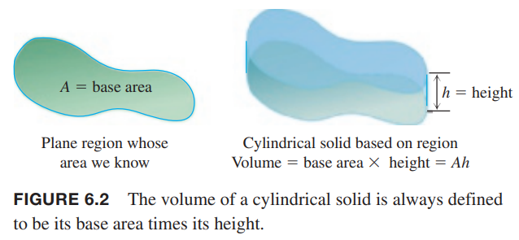
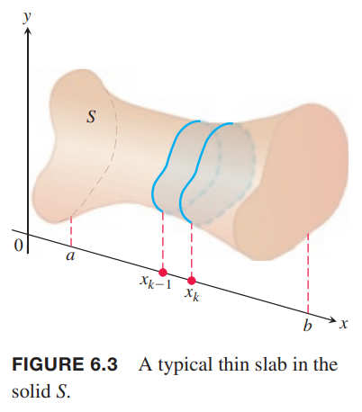
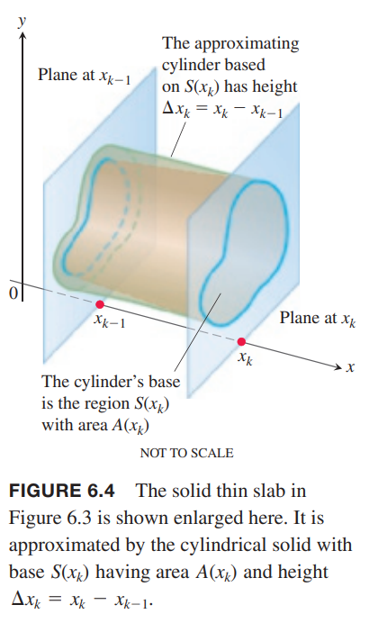
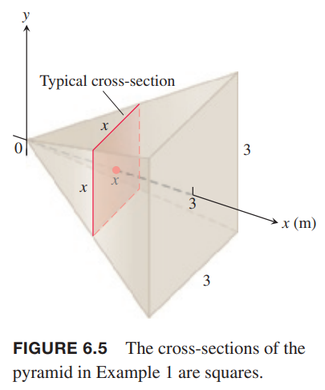
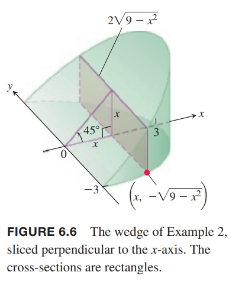
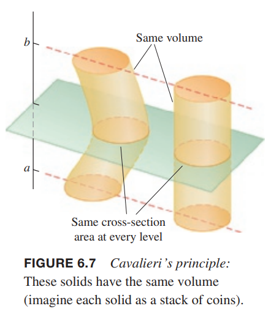

我们这里通过横截面的面积定义立体图形的体积。如下图所示。一个平面与立体图形 $S$ 相交得到了横截面。  
  
下面我们学习三种方法来计算体积：切片法、圆盘法和旋转体积法。  
我们计算上图立体图形 $S$ 的体积。在区间 $[a,b]$ 上的每一点 $x$，一个与 $x$ 轴垂直的平面与 $S$ 相交得到一个横截面，其面积是 $A(x)$。我们将会证明，如果 $A(x)$ 是 $x$ 的连续函数，那么 $A(x)$ 的定积分是 $S$ 的体积。  
我们将圆柱的定义拓展到基底形状更一般的圆柱状的立体图形。如下图所示。  
  
体积是
$$V=A\cdot h$$
在切片法中，我们将区间 $[a,b]$ 切割成若个区域，第 $k$ 个区间是 $[x_{k-1},x_k]$，横截面面积是 $A(x)$，高度是对应的宽度 $\Delta x_k$。

### 平行面切片
我们把 $[a,b]$ 切分成宽度是 $\Delta x_k$ 的厚片，对应 $x$ 轴的切分点分别是 $a=x_0<x_1<\cdots<x_n=b$。如下图所示。  
  
我们近似的认为 $x_{k-1},x_k$ 两个横截面之间的立体图形基底面积是 $A(x_k)$。如下图所示。  
  
那么体积是
$$V_k=A(x_k)\Delta x_k$$
整个立体图形 $S$ 的体积就是
$$V\approx\sum_{k=1}^nV_k=\sum_{k=1}^nA(x_k)\Delta x_k$$
这是函数 $A(x)$ 在 $[a,b]$ 上的黎曼和。当 $n\to\infty$ 时，黎曼和收敛于 $A(x)$ 的定积分。
$$\lim_{n\to\infty}\sum_{k=1}^nA(x_k)\Delta x_k=\int_a^bA(x)dx$$
这就是 $S$ 体积的定义。

这个定义适用于 $A(x)$ 是可积函数，特别是连续函数。

例1 一个高 3m 金字塔型，基底是 3m 的正方形。距离塔顶 $x$ 的平面也是边长为 $x$ 的正方形。求金字塔体积。  
解：首先画出草图。我们使用垂直于 $x$ 轴的平面与金字塔相交得到一系列横截面。如下图所示。  
  
在 $x$ 处的横截面是边长为 $x$ 的正方形，那么面积是
$$A(x)=x^2$$
积分的上下界是
$$x=0,x=3$$
所以体积是
$$V=\int_0^3x^2dx=\frac{x^3}{3}\bigg|_0^3=9$$

例2 使用两个截面切割半径为 3 的圆柱体得到一个楔形。一个平面与圆柱体的底平行，另一个平面经过圆柱体的中心且与第一个平面成 45° 角。求楔形的体积。  
解：楔形的底是一个半圆，圆方程是
$$x^2+y^2=9$$
$x$ 区间是 $[0,3]$，半圆上的 $y$ 值区间是 $[-\sqrt{9-x^2},\sqrt{9-x^2}]$。如下图所示。  
  
我们使用垂直于 $x$ 轴的平面切片，高度是 $x$，宽度是 $2\sqrt{9-x^2}$，所以面积是
$$A(x)=2x\sqrt{9-x^2}$$
那么体积是
$$\begin{aligned}
V&=\int_a^bA(x)dx\\
&=\int_0^32x\sqrt{9-x^2}dx\\
&=-\int_9^0\sqrt{u}du\\
&=\frac{2}{3}u^{3/2}\bigg|_0^9\\
&=18
\end{aligned}$$

例3 卡瓦列里原理是说如果有两个立方图形高度一样，且对应高度的横截面面积一样，那么两个图形体积是一样的。如下图所示。  
  
这很容易用体积的定义定积分证明。高度一样的意思是积分的上下界一样，横截面一样那么被积函数 $A(x)$ 一样。

### 旋转体：圆盘法

