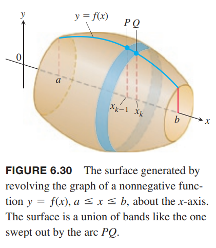
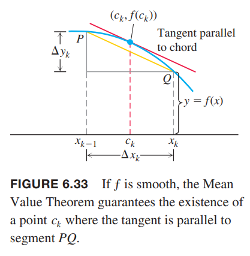

### 表面积定义
旋转一区间上函数围成的区域得到一个旋转体。如果只旋转函数曲线本身，得到一个曲面。我们使用上一节中定义和处理曲线的方法，这一节定义和处理曲面。  
考虑一般情况之前，我们先从水平线段和倾斜的线段开始。如下图所示。我们旋转长度为 $\Delta x$ 的线段 $AB$，得到一表面积为 $2\pi y\Delta x$ 的圆柱形。展开为下图右边所示。线段 $AB$ 上一点 $(x,y)$ 绕着 $x$ 轴旋转得到一个半径为 $y$ 的圆，$2\pi y$ 就是周长。  
  
假设线段是倾斜的而不是水平的。这样的线段 $AB$ 绕着 $x$ 轴旋转，得到圆锥体的平截头体，如下图左边所示。根据几何学可知这个平截头体的表面积是 $2\pi y^*L$，其中 $$y^*=(y_1+y_2)/2$ 是线段 $AB$ 的平均高度。表面积与长宽为 $2\pi y^*, L$ 的矩形面积一样大。如下图右边所示。  
  
现在考虑一般情况。计算非负函数 $y=f(x),a\leq x\leq b$ 的函数曲线绕着 $x$ 轴形成图形的表面积。和之前讨论一样，将区间 $[a,b]$ 切分成 $n$ 个子区间。如下图所示 $PQ$ 是其中一段弧。  
  
$PQ$ 绕 $x$ 轴旋转，扫过的平截头体的曲面如下图所示。  
  
表面积可以近似看作是 $2\pi y^*L$，其中 $y^*$ 是 $PQ$ 的平均高度。由于 $f\geq 0$，从下图可以看出平均高度是 $y^*=(f(x_{k-1})+f(x_k))/2$，线段长度是 $L=\sqrt{(\Delta x_k)^2+(\Delta y_k)^2}$。  
  
因此面积是
$$A=2\pi\frac{f(x_{k-1})+f(x_k)}{2}\cdot\sqrt{(\Delta x_k)^2+(\Delta y_k)^2}=\pi(f(x_{k-1})+f(x_k))\sqrt{(\Delta x_k)^2+(\Delta y_k)^2}$$
对 $n$ 个子区间求和得到平截头体的表面积
$$\sum_{k=1}^n\pi(f(x_{k-1})+f(x_k))\sqrt{(\Delta x_k)^2+(\Delta y_k)^2}$$
如果函数 $f$ 可导，中值定理告诉我们 $PQ$ 之间存在一点 $(c_k,f(c_k))$ 使得其切线平行于线段 $PQ$，如下图所示。  
  
在这一点上有
$$f'(c_k)=\frac{\Delta y_k}{\Delta x_k}$$
$$\Delta y_k=f'(c_k)\Delta x_k$$
代入上面的和式可以得到
$$\sum_{k=1}^n\pi(f(x_{k-1})+f(x_k))\sqrt{(\Delta x_k)^2+(\Delta y_k)^2}=\sum_{k=1}^n\pi(f(x_{k-1})+f(x_k))\sqrt{1+(f'(c_k))^2}\Delta x_k$$
注意，这不是黎曼和，因为 $x_{k-1},x_k,c_k$ 不相同。不过，它们距离非常近，所以我们期待（能够证明）随着 $[a,b]$ 的分区的模趋于零，和式收敛于
$$\int_a^b2\pi f(x)\sqrt{1+(f'(c_k))^2}dx$$
因此我们可以得到如下定义：

**定义** 如果函数 $y=f(x)$ 在 $[a,b]$ 上连续地可导，那么将其绕 $x$ 轴得到的图形的表面积是
$$S=\int_a^b2\pi y\sqrt{1+(\frac{dy}{dx})^2}dx=\int_a^b2\pi f(x)\sqrt{1+(f'(c_k))^2}dx$$

例1 
