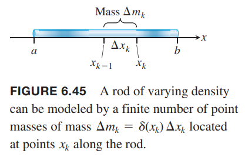
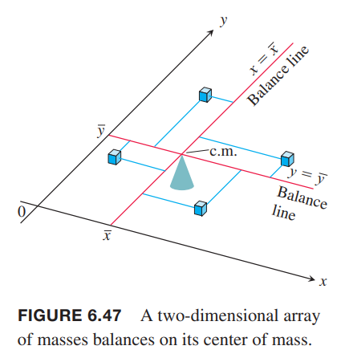

### 直线上的质量
如下图所示。三个质量 $m_1,m_2,m_3$ 的物体在一条直线上。支点位于原点。  
  
力矩是
$$m_kgx_k$$
一般地，力矩逆时针为正，顺时针为负。系统力矩是
$$m_1gx_1+m_2gx_2+m_3gx_3$$
将 $g$ 去掉 $m_1x_1+m_2x_2+m_3x_3$ 称为系统的矩。
$$M_0=\sum m_kx_k$$
通常，存在一个点 $\bar{x}$ 使得系统的矩为零。  
  
关于 $\bar{x}$ 的系统的力矩是
$$\sum(x_k-\bar{x})m_kg$$
现在求 $\bar{x}$
$$\begin{aligned}
\sum(x_k-\bar{x})m_kg&=0\\
\bar{x}&=\frac{\sum m_kx_k}{\sum m_k}
\end{aligned}$$
点 $\bar{x}$ 称为质心。

### 细线
如果一条细线不均匀。  
  
其中很短的一段长度 $\Delta x$，质量是 $\Delta m$，线密度是
$$\delta(x)=\lim_{n\to\infty}\frac{\Delta x}{\Delta x}$$
这里就不再给出具体推导。质量、矩和质心分别是
$$M=\int_a^b\delta(x)dx$$
$$M_0=\int_a^bx\delta(x)dx$$
$$\bar{x}=\frac{M_0}{M}=\frac{\int_a^bx\delta(x)dx}{\int_a^b\delta(x)dx}$$

例1 求一段线密度为 $\delta(x)=2+3x^2$ 从 $x=1$ 到 $x=2$ 的细线的质心。  
解：质量是
$$M=\int_1^2(2+3x^2)dx=\bigg[2x+x^3\bigg]_1^2=9$$
矩是
$$M_0=\int_1^2x(2+3x^2)dx=\bigg[x^2+\frac{3x^4}{4}\bigg]_1^2=\frac{57}{4}$$
所以质心是
$$\bar{x}=\frac{M_0}{M}=\frac{57}{4\cdot 9}=\frac{19}{12}$$

### 平面上的质量分布
如下图所示，点 $(x_k,y_k)$ 处的质量是 $m_k$，那么系统质量是
$$M=\sum m_k$$
  
每一个质量 $m_k$ 关于每个轴有对应的矩。关于 $x$ 轴是 $m_ky_k$，关于 $y$ 轴是 $m_kx_k$，那么系统的矩是
$$M_x=\sum m_ky_k$$
$$M_y=\sum m_kx_k$$
系统质心的 $x$ 坐标是
$$\bar{x}=\frac{M_y}{M}=\frac{\sum m_kx_k}{\sum m_k}$$
系统关于 $x=\bar{x}$ 平衡。如下图所示。  
  
同样地，系统质心的 $y$ 坐标是
$$\bar{y}=\frac{M_x}{M}=\frac{\sum m_ky_k}{\sum m_k}$$
系统关于 $y=\bar{y}$ 平衡。质量力矩左右抵消，仿佛质量集中于点 $(\bar{x}, \bar{y})$，这就是系统的质心。

### 薄的平板
如下图所示，我们把平板分割成若干条带子。带子的质心位于 $(\tilde{x},\tilde{y})$，即带子的质量 $\Delta m$ 都集中于 $(\tilde{x},\tilde{y})$。  
  
关于 $y$ 轴的矩是 $\tilde{x}\Delta m$，关于 $x$ 轴的矩是 $\tilde{y}\Delta m$。所以质心位于
$$\bar{x}=\frac{M_y}{M}=\frac{\sum \tilde{x}\Delta m}{\sum \Delta m}$$
$$\bar{y}=\frac{M_x}{M}=\frac{\sum \tilde{y}\Delta m}{\sum \Delta m}$$
随着带子的宽度越来越小，黎曼和的极限就是定积分。所以
$$\begin{aligned}
M_x&=\int\tilde{y}dm\\
M_y&=\int\tilde{x}dm\\
M&=\int dm\\
\bar{x}&=\frac{M_x}{M},\bar{y}\frac{M_y}{M}
\end{aligned}$$

微分 $dm$ 是这些带子的质量，比如平面密度 $\delta$ 是常数或者是 $x$ 的连续函数，那么 $dm=\delta dA$，其中 $dA$ 是带子的面积。  

例2 如下图所示，三角形的平面密度是常量 $\delta = 3 g/cm^2$，求  
（a）关于 $y$ 轴的矩 $M_y$  
（b）平面质量 $M$  
（c）质心的 $x$ 坐标  
  
解：方法一，垂直划分带子。  
  
（a）每条带子的质心是
$$(\tilde{x},\tilde{y})=(x,x)$$
长度是
$$2x$$
宽度是
$$dx$$
面积是
$$dA=2xdx$$
质量是
$$dm=\delta dA=3\cdot 2xdx=6x$$
带子关于 $y$ 轴的矩是
$$\tilde{x}dm=x(6xdx)=6x^2dx$$
积分
$$M_y=\int\tilde{x}dm=\int_0^16x^2dx=2x^3\bigg|_0^1=2g\cdot cm$$
（b）质量是
$$M=\int dm=\int_0^1 6xdx=3x^2\bigg|_0^1=3g$$
（c）质心的 $x$ 坐标是
$$\bar{x}=\frac{M_y}{M}=\frac{2}{3}cm$$
方法二，水平划分带子。  
  
（a）带子在 $y$ 轴上的质心是
$$\tilde{y}=y$$
带子在 $x$ 轴的左边界是 $y/2$，有边界是 $1$，所以
$$\tilde{x}=\frac{1+\frac{y}{2}}{2}=\frac{y+2}{4}$$
如图带子的长度是
$$1-\frac{y}{2}=\frac{2-y}{2}$$
宽度是
$$dy$$
面积是
$$dA=\frac{2-y}{2}dy$$
质量是
$$dm=\delta dA=3\cdot\frac{2-y}{2}dy$$
那么带子关于 $y$ 的矩是
$$\tilde{x}dm=\frac{y+2}{4}\cdot 3\cdot\frac{2-y}{2}dy=\frac{3}{8}(4-y^2)dy$$
求积分
$$M_y=\int\tilde{x}dm=\int_0^2\frac{3}{8}(4-y^2)dy=\frac{3}{8}\bigg[4y-\frac{y^3}{3}\bigg]_0^2\frac{3}{8}\frac{16}{3}=2g\cdot cm$$
（b）平面质量是
$$M=\int dm=\int_0^2\frac{3}{2}(2-y)dy=\frac{3}{2}\bigg[2y-\frac{y^2}{2}\bigg]_0^2=3g$$
（c）质心的 $x$ 坐标是
$$\bar{x}=\frac{M_y}{M}=\frac{2}{3}cm$$

如果质量分布关于某个轴对称，那么质心在这条轴上。如果关于两条轴对称，那么质心的两条轴的交点处。这可以用于简化计算。

例3 如下图所示。平面是由 $x$ 轴和 $y=4-x^2$ 围成的。平面密度 $\delta=2x^2$。求质心。  
  
解：平面和密度分布关于 $y$ 轴对称，所以 $\bar{x}=0$。垂直划分。所以带子的质心是
$$(\tilde{x},\tilde{y})=(x,\frac{4-x^2}{2})$$
长度是
$$4-x^2$$
宽度是
$$dx$$
面积是
$$dA=(4-x^2)dx$$
质量是
$$dm=\delta dA=2x^2(4-x^2)dx$$
关于 $x$ 轴的矩是
$$\tilde{y}dm=2x^2(4-x^2)\frac{4-x^2}{dx}=x^2(4-x^2)^2dx$$
积分
$$\begin{aligned}
M_x&=\int\tilde{y}dm\\
&=\int_{-2}^2x^2(4-x^2)^2dx\\
&=\int_{-2}^2(16x^2-16x^4+x^6)dx\\
&=\frac{2048}{105}
\end{aligned}$$
质量是
$$\begin{aligned}
M&=\int dm\\
&=\int_{-2}^22x^2(4-x^2)dx\\
&=\int_{-2}^2(8x^2-2x^4)dx\\
&=\frac{256}{15}
\end{aligned}$$
质心的 $y$ 坐标是
$$\bar{y}=\frac{M_x}{M}=\frac{2048}{105}\frac{15}{256}=\frac{8}{7}$$

