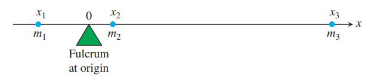

### 直线上的质量
如下图所示。三个质量 $m_1,m_2,m_3$ 的物体在一条直线上。支点位于原点。  
  
力矩是
$$m_kgx_k$$
一般地，力矩逆时针为正，顺时针为负。系统力矩是
$$m_1gx_1+m_2gx_2+m_3gx_3$$
将 $g$ 去掉 $m_1x_1+m_2x_2+m_3x_3$ 称为系统的矩。
$$M_0=\sum m_kx_k$$
通常，存在一个点 $\bar{x}$ 使得系统的矩为零。  
  
关于 $\bar{x}$ 的系统的力矩是
$$\sum(x_k-\bar{x})m_kg$$
现在求 $\bar{x}$
$$\begin{aligned}
\sum(x_k-\bar{x})m_kg&=0\\
\bar{x}&=\frac{\sum m_kx_k}{\sum m_k}
\end{aligned}$$
点 $\bar{x}$ 称为质心。

### 细线
如果一条细线不均匀。  
  
其中很短的一段长度 $\Delta x$，质量是 $\Delta m$，线密度是
$$\delta(x)=\lim_{n\to\infty}\frac{\Delta x}{\Delta x}$$
这里就不再给出具体推导。质量、矩和质心分别是
$$M=\int_a^b\delta(x)dx$$
$$M_0=\int_a^bx\delta(x)dx$$
$$\bar{x}=\frac{M_0}{M}=\frac{\int_a^bx\delta(x)dx}{\int_a^b\delta(x)dx}$$

例1 求一段线密度为 $\delta(x)=2+3x^2$ 从 $x=1$ 到 $x=2$ 的细线的质心。  
解：质量是
$$M=\int_1^2(2+3x^2)dx=\bigg[2x+x^3\bigg]_1^2=9$$
矩是
$$M_0=\int_1^2x(2+3x^2)dx=\bigg[x^2+\frac{3x^4}{4}\bigg]_1^2=\frac{57}{4}$$
所以质心是
$$\bar{x}=\frac{M_0}{M}=\frac{57}{4\cdot 9}=\frac{19}{12}$$
