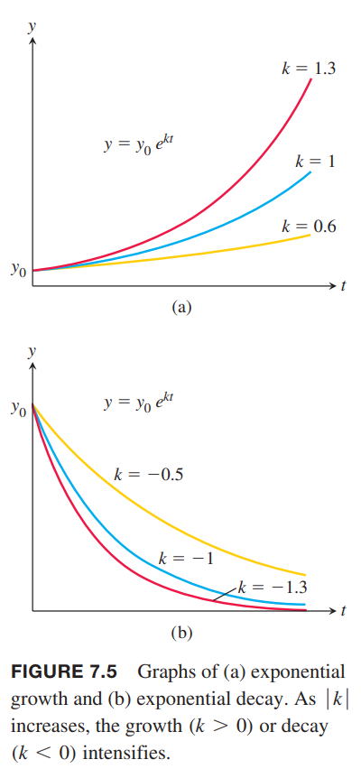

随着变量的变化，指数变化增加或者减小的非常快，能够描述很多自然和工业领域的场景，这也说明这些函数很重要。

### 指数变化
现实世界中，很多量 $y$ 在给定时间 $t$ 增长或衰减的部分正比如当前的量，比如人口的增长、放射性物质、温度的变化。这些量的变化称为指数变化（`exponential change`）。  
在 $t=0$ 时的量是 $y_0$，$y$ 关于 $t$ 的变化方程就是初始值问题
$$\frac{dy}{dt}=ky;y=y_0,t=0$$
如果 $y$ 是正数，$k$ 为正表示增长，$k$ 为负表示衰减。  
如果 $y_0=0$ 那么 $y=0$ 是方程的解。现在求解 $y_0\neq 0$ 的情况，方程两边同除 $y$
$$\begin{aligned}
\frac{1}{y}\frac{dy}{dx}&=k\\
\int\frac{1}{y}\frac{dy}{dx}dt&=\int kdt\\
\ln|y|&=kt+C\\
|y|&=e^{kt+C}\\
|y|&=e^{C}e^{kt}\\
y&=\pm e^Ce^{kt}\\
y&=Ae^{kt}
\end{aligned}$$
如果可能的话 $A=0$ 就是 $y=0$ 时的解。  
下面求初始值问题的 $A$
$$y_0=Ae^{k\cdot 0}=A$$
所以初始值问题
$$\frac{dy}{dx}=ky,y(0)=y_0$$
的解是
$$y=y_0e^{kt}$$
如果 $k>0$，那么指数增长，如果 $k<0$，那么指数衰减。如下图所示。  
  
上面的公式说明函数的导数是自身的函数只有指数函数（$k=1$）。

### 可分离微分方程
更一般的微分方程写作
$$\frac{dy}{dx}=f(x,y)$$
这里函数 $f$ 包含自变量和应变量。  
如果函数能写成如下形式，即 $f$ 写作 $x$ 的表达式乘以 $y$ 的表达式
$$\frac{dy}{dx}=g(x)H(y)$$
那么称为可分离（`separable`）的微分方程。  
将 $y,dy$ 和 $x,dx$ 分到两边得到
$$\frac{1}{H(y)}dy=g(x)dx$$
两边积分得到
$$\int\frac{1}{H(y)}dy=\int g(x)dx$$
通过代入法很容易验证
$$\begin{aligned}
\int\frac{1}{H(y)}dy&=\int\frac{1}{H(y)}\frac{dy}{dx}dx\\
&=\int\frac{1}{H(y)}g(x)H(y)dx\\
&=\int g(x)dx
\end{aligned}$$

例1 求
$$\frac{dy}{dx}=(1+y)e^x,y>-1$$
解：因为 $y>-1$ 所以 $1+y$ 不为零。分离变量
$$\begin{aligned}
\frac{dy}{dx}&=(1+y)e^x\\
\frac{dy}{1+y}&=e^xdx\\
\int\frac{dy}{1+y}&=\int e^xdx\\
\ln(1+y)&=e^x+C
\end{aligned}$$
