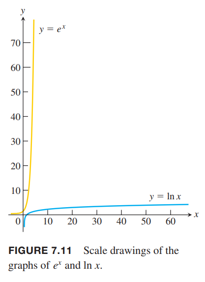

### 函数的增长速度
随着 $x$ 的增长，$2^x$ 和 $e^x$ 增长速度远远大于多项式函数。如下图所示，指数函数增长的更快。  
  
当 $x\to\infty$ 时，$2^x,e^x$ 比 $x$ 的任意次幂增长都快。相反，对数函数，如 $\log_2 x,\ln x$ 增长的要比 $x$ 的任意正数次幂都要慢。  
这里给出一个例子来解释 $e^x$ 增长的有多快。在一个黑板上有一个坐标系，当 $x=1 cm$ 时，高度只有 $e < 3 cm$；当 $x=6 cm$ 时，$e^6\approx 403 cm\approx 4m$，超过了一层楼的高度；当 $x=10 cm$ 时，$e^10\approx 22,026 cm\approx 220m$，这比绝大多数建筑都要高；当 $x=24 cm$ 时，高度达到了到月球距离的一半；当 $x=43 cm$ 时，高度足够达到距离太阳最近的恒星系统。相反，如果是对数函数 $\ln x$，在 $x$ 大约五光年的地方，高度才只有 43cm。如下图所示。  
  
下面是函数增长速度的精确定义。

**定义** 令 $f(x),g(x)$ 是正数且 $x$ 充分大。  
当 $x\to\infty$ 时，有
$$\lim_{x\to\infty}\frac{f(x)}{g(x)}=\infty$$
或
$$\lim_{x\to\infty}\frac{g(x)}{f(x)}=0$$
我们称 $f(x)$ 增长的比 $g(x)$ 更快，或 $g(x)$ 比 $f(x)$ 增长的更慢。  
当 $x\to\infty$ 时，有
$$\lim_{x\to\infty}\frac{f(x)}{g(x)}=L$$
其中 $L$ 是正数且有限，我们称 $f$ 和 $g$ 增长率一样。

根据定义，$y=2x$ 不比 $y=x$ 更快。因为增长率一样
$$\lim_{x\to\infty}\frac{2x}{x}=2$$
这里极限是正数且有限。脱离口语化的表达，这里 $f$ 比 $g$ 增长的更快意思是当 $x$ 变得充分大的时候，$g$ 相比 $f$ 可以忽略。

例1 

