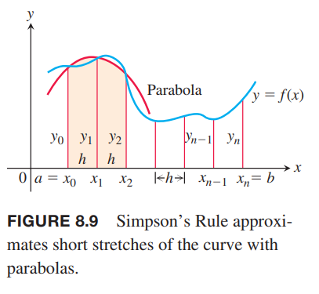
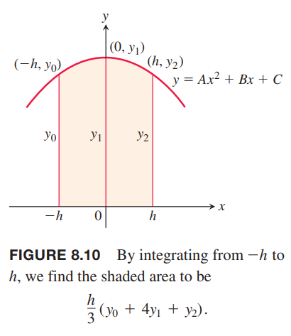

### 梯形近似
梯形近似方法使用梯形替换矩形来替代曲线对应的某一小段下的图形，如下图所示。

对于点 $x_0,x_1,x_2,\cdots,x_n$ 所对应的区间，不要求是等宽的，不过等宽的非常容易计算。因此对于等宽情况，宽度是
$$\Delta x=\frac{b-a}{n}$$
这个长度称为步长。第 $i$ 个梯形的面积是
$$\Delta x(\frac{y_{i-1}+y_i}{2})=\frac{\Delta x}{2}(y_{i-1}+y_i)$$
那么曲线 $y=f(x)$ 下方的面积近似于所有梯形之和。
$$\begin{aligned}
T&=\frac{1}{2}(y_0+y_1)\Delta x+\frac{1}{2}(y_1+y_2)\Delta x+\cdots+\frac{1}{2}(y_{n-2}+y_{n-1})\Delta x+\frac{1}{2}(y_{n-1}+y_n)\Delta x\\
&=\Delta x(\frac{1}{2}y_0+y_1+y_2+\cdots+y_{n-1}+\frac{1}{n}y_n)\\
&=\frac{\Delta x}{2}(y_0+2y_1+2y_2+\cdots+2y_{n-1}+y_n)
\end{aligned}$$

例1 使用 $n=4$ 的梯形近似法估算 $\int_1^2 x^2dx$。比较估算值于精确值。

解：如下图所示，区间 $[1,2]$ 平均分成四个子区间。

下表是对应的横纵坐标的值

| $x$ | $y=x^2$ |
|--|--|
| $1$ | $1$ |
| $\frac{5}{4}$ | $\frac{25}{16}$ |
| $\frac{4}{4}$ | $\frac{36}{16}$ |
| $\frac{7}{4}$ | $\frac{49}{16}$ |
| $2$ | $4$ |

代入公式
$$\begin{aligned}
T&=\frac{\Delta x}{2}(y_0+2y_1+2y_2+2y_3+y_4)\\
&=\frac{1}{8}(1+\frac{50}{16}+\frac{72}{16}+\frac{98}{16}+4)\\
&=\frac{75}{32}\\
&=2.34375
\end{aligned}$$
二次曲线是下凸的，所以梯形面积比曲线下的面积略微大一点点。精确积分是
$$\int_1^2 x^2dx=\frac{x^3}{3}\bigg|_1^2=\frac{7}{3}$$
误差比例是
$$(2.34375-\frac{7}{3})/\frac{7}{3}\approx 0.00446=0.446\%$$

### 辛普森法则：使用抛物线近似
另外一种求定积分的近似方式是使用抛物线替代梯形的直线。和之前一样，将 $[a,b]$ 分成 $n$ 个子区间，每个子区间长度 $h=\Delta x=(b-a)/n$，但是这次要求 $n$ 是偶数。在相邻的两个区间上，我们用抛物线近似曲线 $y=f(x)\geq 0$，如下图所示。一段抛物线穿过了连续的三个点 $(x_{i-1},y_{i-1}),(x_i,y_i),(x_{i+1},y_{i+1})$。

现在计算上图阴影部分的面积。简单起见，令 $x_0=-h,x_1=0,x_2=h$，如下图所示。

相当于图像沿着 $x$ 轴平移，面积不变。抛物线公式是
$$y=Ax^2+Bx+C$$
所有曲线下的面积是
$$\begin{aligned}
A_p&=\int_{-h}^h Ax^2+Bx+Cdx\\
&=\bigg[\frac{Ax^3}{3}+2Bx^2+Cx\bigg]_{-h}^h\\
&=\frac{2Ah^3}{3}+2Ch\\
&=\frac{h}{3}(2Ah^2+6C)
\end{aligned}$$
这个抛物线穿过三点 $(-h,y_0),(0,y_1),(h,y_2)$，所以
$$y_0=Ah^2-Bh+C,y_1=C,y_2=Ah^2+Bh+C$$
那么
$$\begin{aligned}
C&=y_1\\
Ah^2-Bh&=y_0-y_1\\
Ah^2+Bh&=y_2-y_1\\
2Ah^2&=y_0+y_2-2y_1
\end{aligned}$$
代入公式得到
$$\begin{aligned}
A_p&=\frac{h}{3}(2Ah^2+6C)\\
&=\frac{h}{3}(y_0+y_2-2y_1+6y_1)\\
&=\frac{h}{3}(y_0+4y_1+y_2)
\end{aligned}$$
同理，下一段抛物线穿过点 $(x_2,y_2),(x_3,y_3),(x_4,y_4)$，其下的面积是
$$\frac{h}{3}(y_2+4y_3+y_4)$$
累加得到积分的近似值
$$\begin{aligned}
\int_a^bf(x)dx&=\approx\frac{h}{3}(y_0+4y_1+y_2)+\frac{h}{3}(y_2+4y_3+y_4)+\cdots+\frac{h}{3}(y_{n-2}+4y_{n-1}+y_n)\\
&=\frac{h}{3}(y_0+4y_1+2y_2+4y_3+2y_4+\cdots+2y_{n-2}+4y_{n-1}+y_n)
\end{aligned}$$
这就是辛普森法则。函数可以是负数，但是 $n$ 必须是偶数，因为每段抛物线占用了两个子区间。

例2 使用 $n=4$ 时辛普森法则公式估算
$$\int_0^2 5x^4dx$$
解：将区间 $[0,2]$ 分成四个子区间，下表是对应的横纵坐标。

| $x$ | $y=5x^4$ |
|--|--|
| $0$ | $0$ |
| $\frac{1}{2}$ | $\frac{5}{16}$ |
| $1$ | $5$ |
| $\frac{3}{2}$ | $\frac{405}{16}$ |
| $2$ | $80$ |

$n=4,\Delta x=1/2$ 代入公式
$$\begin{aligned}
S&=\frac{\Delta x}{3}(y_0+4y_1+2y_2+4y_3+y_4)\\
&=\frac{1}{6}(0+4(\frac{5}{16})+2(5)+4\frac{405}{16}+80)\\
&=32\frac{1}{12}
\end{aligned}$$
精确值是 $32$，误差是 $1/12$，比百分之一的三分之一还小，而这个估算值只是用了四个区间。

### 误差分析
根据法则求得的近似值与定积分 $\int_a^b f(x)dx$ 之间的差值称为误差。

**定理1 梯形近似和辛普森法则的误差估计**
如果 $f''$ 是连续的且 $M$ 是 $|f''|$ 在区间 $[a,b]$ 上的任意上界，那么用 $n$ 步的梯形近似对函数 $f$ 从 $a$ 到 $b$ 的定积分进行估算，其误差
$$|E_T|\leq\frac{M(b-a)^3}{12n^2}$$

